<div dir="rtl">תכנות מערכות מבוזרות</div>

<div dir="rtl">מני אדלר</div>

<div dir="rtl">על הקורס</div>

<div dir="rtl">- תכנות מערכות מבוזרות</div>

<div dir="rtl">- הנושא של עיבוד big data על תשתית חישוב , בענן תחום , מתפתח , חיוני ואף אופנתי , במחקר (</div>

```
) תעשיה
```

<div dir="rtl">- עבודה על שירותי הענן של אמזון AWS . תקציב חינם לכל . סטודנט</div>

<div dir="rtl">o התמודדות עם שינויים תכופים</div>

```
- עבודה
מהבית
ואף ( עם Windows
)
```

<div dir="rtl">- התמודדות , עצמית תמיכה של משה</div>

<div dir="rtl">- הדוגמאות בקורס מתחום עיבוד ' שפה ' טבעית</div>

<div dir="rtl">- חובות ' :' הקורס</div>

<div dir="rtl">o 40% מבחן</div>

<div dir="rtl">o 60% . עבודות 3 : עבודות 20,20,42</div>

- <span dir="rtl">מבוא</span>

<div dir="rtl">1.1 מוטיבציה</div>

<div dir="rtl">1. עיבוד כמות גדולה של מידע</div>

<div dir="rtl">נדרש לכתוב תוכנית הסופרת כמה פעמים מופיעה כל מילה ברשת מידע ( סטטיסטי שכזה הינו חיוני עבור</div>

<div dir="rtl">אלגוריתמים שונים של עיבוד ) שפה</div>

<div dir="rtl">לשם , פשטות נניח כי כל קבצי ' הרשת ' מאוחסנים כבר על שרתי אחסון שונים ברחבי העולם נכנה ( כל שרת</div>

<div dir="rtl">שכזה data-point .)</div>

<div dir="rtl">ננסה לתאר תוכנית זו בכלים שיש לנו : היום</div>

For each data-point
For each doc in data-point
Download doc for each word in doc
inc word count in table

<div dir="rtl">חסרונות העיצוב : הנוכחי</div>

<div dir="rtl">- : תקשורת יש להוריד את כל הרשת למחשב שמריץ את התוכנית</div>

<div dir="rtl">- זמן : חישוב גם ללא , תקשורת נדרש זמן רב ביותר לעבור על הקבצים המקומיים</div>

<div dir="rtl">ניתן למקבל את החישוב י " ע , רדים ' ת אך זה מוגבל במחשב . בודד</div>

---

<div dir="rtl">🡸נבחן מודל אחר עבור משימה . זו</div>

<div dir="rtl">הרעיון : המרכזי במקום לשלוח את הנתונים קבצי ( ) הטקסט לחישוב המחשב ( שמריץ את</div>

<div dir="rtl">,) התוכנית נשלח את הקוד לכל שרת המאחסן . מידע</div>

For each data-point
Send and apply:

```
{
```

For each doc in [local] data-point
for each word in doc
inc word count in [local] table } Aggregate local tables

<div dir="rtl">: תקשורת שליחת קטע קוד זעיר לכל , השרתים שליחת טבלאות הסיכום המקומיות מכל שרת לא ( את</div>

```
הטקסטים .) עצמם
```

<div dir="rtl">: מקבול רמת המקבול תואמת לכמות המידע אותו יש . לעבד ככל שיש יותר קבצים , ברשת קטעי הקוד ירוצו</div>

<div dir="rtl">על יותר . מחשבים</div>

<div dir="rtl">. ב טיפול במספר רב של לקוחות</div>

<div dir="rtl">נדרש לכתוב אפליקציה עבור רשת חברתית עם מספר לקוחות גדול , פייסבוק ( , טוויטר )... יוטיוב</div>

<div dir="rtl">ניתן לממש בקלות את הפרוטוקול של טוויטר , התחברות ( הוספת , עוקב שליחת ,) הודעה , לדוגמא בעזרת</div>

<div dir="rtl">התבנית הגנרית של הריאקטור שנלמדה בתכנות . מערכות</div>

<div dir="rtl">החיסרון : המרכזי לא ניתן לטפל במספר רב של לקוחות בתהליך . אחד</div>

<div dir="rtl">גם במחשב עם חומרה , אינסופית לא ניתן לטפל ביותר מעשרת אלפים לקוחות - The C10K Problem –</div>

<div dir="rtl">בשל המוגבלות של מערכות ההפעלה הקיימות מגבלה ( על מספר סוקטים / הקבצים , הפתוחים מגבלה על</div>

```
מספר , המנעולים )' וכו
```

<div dir="rtl">🡨 נכתוב את מערכת ההפעלה מחדש</div>

```
עדיין
מוגבל
אין ( באמת
חומרה ) אינסופית
```

<div dir="rtl">🡨 נהפוך קבוצת מחשבים למחשב לוגי , אחד בעזרת מערכת הפעלה . ייעודית כמות המחשבים בקבוצה</div>

<div dir="rtl">תיקבע דינאמית על פי מספר הלקוחות המחוברים לשרת . כרגע</div>

<div dir="rtl">לא נעסוק בארכיטקטורה , זאת אך נצביע על הנקודות הזהות בשתי : הבעיות</div>

<div dir="rtl">- האלגוריתם הלוגי פשוט ספירת ( , מילים מימוש פרוטוקול של מספר קטן של סוגי ) הודעות</div>

<div dir="rtl">- רכיב של משהו שגדל כמות ( הנתונים , לעיבוד כמות הלקוחות ) לטיפול</div>

---

<div dir="rtl">- הפתרון המוצע מבוסס על ארכיטקטורה המשתמשת באופן דינאמי במלאי של מחשבים בהתאם</div>

```
לגודל , הנתונים (
) הלקוחות
```

<div dir="rtl">. ג מקבול אלגוריתם כבד עם מעט נתונים</div>

<div dir="rtl">המקרה מסורתי - הקלאסי של עיבוד . מבוזר</div>

<div dir="rtl">1.2 הצורך בעיבוד כמות גדולה של מידע</div>

<div dir="rtl">האם בכלל צריך לעבד כמויות גדולות של ? מידע</div>

<div dir="rtl">מסתבר ... שכן</div>

<div dir="rtl">צורך אפליקטיבי</div>

<div dir="rtl">: דוגמאות</div>

<div dir="rtl">- מנוע החיפוש של גוגל</div>

<div dir="rtl">o יש לעבור על הטקסטים ברשת כדי לבנות את ה אינדקס של מנוע החיפוש טבלה ( המציינת</div>

<div dir="rtl">עבור כל מילה את רשימת הדפים ברשת בהן היא ) מופיעה</div>

<div dir="rtl">o יש לעבור על כל הטקסטים ברשת כדי לקבוע את מידת החשיבות של כל דף , ברשת או</div>

<div dir="rtl">את מידת ההתאמה של מילה לדף , זה לשם דירוג תוצאות . החיפוש</div>

<div dir="rtl">- עיבוד נתוני לקוחות נניח ( של חברת , סלולר או של משתמש ברשת ) חברתית</div>

<div dir="rtl">- ריגול תעשייתי או מדיני</div>

<div dir="rtl">- עיר חכמה</div>

<div dir="rtl">- עיבוד אירוע חדשותי מתגלגל פ " ע הרשתות החברתיות</div>

<div dir="rtl">- עיבוד תמונות , ממצלמות מרשתות חברתיות</div>

<div dir="rtl">מדובר בכמות גדולה ביותר של מידע . לעיבוד</div>

<div dir="rtl">בכל המקרים , ל " הנ המידע , קיים , מאוחסן וכן קיימת תשתית חומרה לעבד אותו קלאסטרים ( עצומים של</div>

<div dir="rtl">,) מחשבים נדרשת רק ארכיטקטורה ותבנית תכנות המאפשרים לחבר . בינהם</div>

<div dir="rtl">צורך מחקרי</div>

<div dir="rtl">בשיטות מחקר , קלאסיות אוספים נתונים על הבעיה תצפיות ( , כוכבים התבוננות , במיקרוסקופ מדידות</div>

<div dir="rtl">, פיזיקאליות בלשן שאוסף ,)... טקסטים ולאחר מכן מנתחים את , התוצאות ,' אנליזה ' ומנסים למצוא את</div>

<div dir="rtl">, הכלל את , החוק את . התבנית מציעים ' מודל ' שמסביר את התופעות . הנצפות</div>

<div dir="rtl">בשיטות , מודרניות כמות המידע הנצפית היא עצומה הטלסקופ ( החדש ילה ' בצ מייצר מדי יום מיליוני</div>

<div dir="rtl">צילומים של השמיים ברזולוציה , מטורפת מאגרי גנים DNA/RNA , פרוייקט שחזור המפץ הגדול , נווה ' בז</div>

<div dir="rtl">מאגר כל הטקסטים שנכתבו אי ,)..., פעם ופותחו אלגוריתמי למידה המוצאים תבניות בכמויות מידע</div>

<div dir="rtl">עצומות . אלו</div>

---

<div dir="rtl">כדי ליישם מתודה מחקרית , זו נדרש שוב להריץ את האלגורתמים , הקיימים על המידע , הקיים בעזרת</div>

<div dir="rtl">מלאי מחשבים . זמין</div>

<div dir="rtl">ספציפית עבוד מדעי , המחשב קיימת טענה כי כאשר הקלט לאלגוריתם הינו , עצום האיכות של האלגוריתם</div>

<div dir="rtl">לא רלבנטית לאיכות . התוצאות במילים , אחרות כאשר יש כמות גדולה של , מידע אלגוריתם נאיבי ופשוט</div>

<div dir="rtl">יגיע לאותן תוצאות כמו אלגוריתמים מתוחכמים . ומסובכים</div>

<div dir="rtl">במילים , אחרות המוקד במדעי המחשב אינו פיתוח אלגורתמים מדוייקים יותר אלא איסוף מידע עבור</div>

<div dir="rtl">. הלמידה</div>

<div dir="rtl">דוגמאות</div>

- <span dir="rtl">בניית , מסווג classifier</span>

<div dir="rtl">מסווג הינו מכונה היודעת לענות על שאלה מסוימת נניח ( שאלה ) בינארית ביחס לאובייקט . נתון</div>

<div dir="rtl">: לדוגמא</div>

<div dir="rtl">o מסווג המקבל , פרי ועונה על : השאלה האם ' זה '? תפוח</div>

<div dir="rtl">o מסווג המקבל , דואר ועונה על : השאלה האם ' זה דואר '? זבל</div>

<div dir="rtl">כיצד בונים מכונה ? שכזו</div>

<div dir="rtl">הגישה של Machine Learning :</div>

<div dir="rtl">o איסוף דוגמאות</div>

<div dir="rtl">▪נבחר פרות , שונים ונבקש מבן אדם לציין עבור כל פרי האם הוא תפוח או . לא</div>

<div dir="rtl">▪נבחר מיילים , שונים ונבקש מבן אדם לציין עבור מייל האם הוא . ספאם</div>

<div dir="rtl">o ייצוג האובייקט של השאלה על ידי אוסף מאפיינים</div>

<div dir="rtl">▪כיצד מייצגים תפוח אי ( אפשר לשלוח לפונקציה בקוד ?)' תפוח '</div>

<div dir="rtl">יש אינספור מאפיינים לתפוח – נבדוק עם מומחה בתחום מה הם המאפיינים</div>

<div dir="rtl">החשובים / המרכזיים להחלטה האם פרי מסוים הוא : תפוח , גודל מרקם , חלק (</div>

```
, בינוני ,) מחוספס
צבע , ירוק (
,)..., אדום , משקל ...
```

<div dir="rtl">באופן ניתן לייצג כל פרי י " ע ווקטור של . מאפיינים</div>

<div dir="rtl">▪כיצד מייצגים ? דואר</div>

<div dir="rtl">, מילים הקטגוריות של המילים , פועל ( שם , עצם , תואר שם ,)... פרטי התפקיד</div>

```
התחבירי
של
המילים , נושא (
, נשוא ) מושא
```

<div dir="rtl">o אלגוריתם למידה</div>

<div dir="rtl">אלגוריתם המקבל אוסף דוגמאות - כאשר כל דוגמא היא אובייקט המיוצג ( י " ע אוסף</div>

<div dir="rtl">) מאפיינים ותשובה ידנית לשאלה – מוצא / מכליל / ולומד את השיטה כיצד לענות באופן</div>

<div dir="rtl">כללי לשאלה כזו עבור אובייקטים . חדשים</div>

---

<div dir="rtl">מבין שלושת החלקים / השלבים של בניית , המסווג נראה כי אלגוריתם הלמידה הוא , החשוב אחריו</div>

<div dir="rtl">הגדרת , המאפיינים כאשר בניית אוסף הדוגמאות נחשב לחלק הפשוט . ביותר</div>

<div dir="rtl">בנקו ( ובריל Scaling to Very Very Large Corpora for Natural Language Disambiguation , ACL 2001 ) הראו כי עבור בניית מסווג לדואר , זבל כל האלגוריתמים מגיעים לאותן תוצאות כאשר יש</div>

<div dir="rtl">אוסף עצום של . דוגמאות</div>

```
2. מענה
לשאלות (
Question Answering
)
```

<div dir="rtl">נתונה : שאלה מי רצח את ? לינקולן</div>

<div dir="rtl">יש לתת תשובה ון ' ג ( וילקס )' בות</div>

<div dir="rtl">כדי לבנות מערכת , שכזו יש אלגוריתמים מתוחכמים המבוססים על מאגרי מידע עצומים</div>

<div dir="rtl">, אנציקלופדיות ( , מילונים בסיסי ,) נתונים ועל כלים עיבוד . שפה</div>

<div dir="rtl">: דוגמא המחשב ווטסון שניצח בתכנית אלוף האלופים של " פארדי ' ג " ( הדיבייטר של IBM )</div>

<div dir="rtl">לין ( An Exploration of the Principles Underlying Redundancy-Based Factoid Question</div>

<div dir="rtl">Answering , 2007 ) הראה כי בהינתן כמות עצומה של , טקסט ניתן להסתפק באלגוריתם הפשוט</div>

<div dir="rtl">ביותר לבעיה : זו</div>

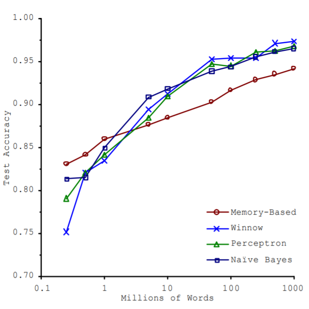

---

<div dir="rtl">מי רצח את ? לינקולן</div>

<div dir="rtl">נחפש במאגרי הטקסט העצומים את המחרוזת רצח ' את ,' לינקולן וניקח את המילה שמופיעה הכי</div>

<div dir="rtl">הרבה פעמים . לפניה</div>

<div dir="rtl">בהקשר , זה הטכניקות ליצירה מהירה של אוסף דוגמאות גדול התפתחה מאוד טכנולוגית בשנים</div>

<div dir="rtl">, האחרונות ואף הפכה לתחום מדעי . עצמו</div>

<div dir="rtl">: לדוגמא Amazon Mechanical Turk</div>

<div dir="rtl">, לעתים הדרך היחידה ללמוד נושא מסוים היא על ידי עיבוד גדול של : מידע , לדוגמא לימוד</div>

<div dir="rtl">אוטומטי של . שפה</div>

<div dir="rtl">אם רוצים לעמוד על כל השינויים המתרחשים , בשפה יש לעבד כל הזמן טקסטים . מתחדשים</div>

<div dir="rtl">כיצד מלמדים מערכת ממוחשבת שפה ? אנושית</div>

<div dir="rtl">- לימוד מונחה חוקים דומה ( ללימוד אנושי של שפה ) זרה</div>

<div dir="rtl">נזין למחשב את כל חוקי : השפה מה המילים בשפה ,) לקסיקוגרפיה ( מהו מבנה המילים בשפה</div>

```
,) מורפולוגיה ( מהו
מבנה
המשפט ,) תחביר ( מה
המשמעות
של
המשפט ) סמנטיקה (
```

<div dir="rtl">כדי לנתח , טקסט המערכת למעשה ' מקמפלת ' את הטקסט לאור . החוקים</div>

<div dir="rtl">: חסרונות מי יודע את ? החוקים כיצד ניתן לפרמל ? אותם החוקים משתנים כל ... הזמן</div>

<div dir="rtl">- לימוד פ " ע הסתברויות מהטקסטים עצמם דומה ( ללימוד שפת שם אצל בני ) אנוש</div>

<div dir="rtl">בשיטת לימוד זו מקנים למערכת הממוחשבת ,' אינטואיציה ' יש דברים שמסתברים ויש דברים</div>

<div dir="rtl">. שלא</div>

<div dir="rtl">* אני ללכת הביתה</div>

<div dir="rtl">נראה מקרים , שונים שבהם הלימוד האוטומטי דורש עיבוד חוזר ונשנה של טקסטים חדשים ביג =(</div>

```
) דאטה
```

<div dir="rtl">בניין הפעיל : דני ' משכיר ' דירה - מיהו ? המשכיר ? המשאיל</div>

<div dir="rtl">'X משכיר את '</div>

<div dir="rtl">'X משכיר ל '</div>

<div dir="rtl">יהוא , ירון זה לא זמן טוב לכתוב : שירים גרסה מוקדמת , גרסה מאוחרת</div>

---

<div dir="rtl">מעמד התחיליות : ' ה , הידיעה ' ב היחס</div>

<div dir="rtl">, ילד , הילד , חמוד החמוד</div>

<div dir="rtl">, בשביל X , הבשביל X הלא</div>

<div dir="rtl">הלאו " דווקא בלתי " מצוי</div>

<div dir="rtl">הבשביל " שלי נעשה חשוב " יותר</div>

<div dir="rtl">, ּבית , ּבְבַיִתְּב ּבַיִת</div>

<div dir="rtl">צורת הבינוני</div>

<div dir="rtl">דני ספר אותיות ] אתמול [</div>

<div dir="rtl">דני סופר אותיות ] כעת [</div>

<div dir="rtl">דני יספור אותיות ] מחר [</div>

<div dir="rtl">סופר</div>

<div dir="rtl">דני הזכיר לאכול</div>

<div dir="rtl">דני מזכיר לאכול</div>

<div dir="rtl">דני יזכיר לאכול</div>

<div dir="rtl">מזכיר</div>

<div dir="rtl">שולה הזכירה לאכול</div>

<div dir="rtl">שולה מזכירה לאכול</div>

<div dir="rtl">שולה תזכיר לאכול</div>

<div dir="rtl">מזכירה</div>

<div dir="rtl">מנגנון זה מייצר כל הזמן שמות חדשים מפעלים בצורת : בינוני , כותב , מטפס . לוכד</div>

<div dir="rtl">לוכד ' ' של</div>

<div dir="rtl">: אנקדוטה אני פרפר , אביב גפן</div>

<div dir="rtl">אני פרפר</div>

<div dir="rtl">שהיה פעם גולם</div>

---

<div dir="rtl">אז תפסיקי בכנפי לאחוז</div>

<div dir="rtl">את יכולה לארוז</div>

<div dir="rtl">מתרגם הסתברותי כמשקף תרבות על בסיס קורפוס : עכשווי</div>

I wash the car / I wash the floor / I am very nervous / I am very hysterical

<div dir="rtl">אני שוטף את האוטו / אני שוטפת רצפה / אני מאוד עצבני / אני מאוד היסטרית</div>

<div dir="rtl">1.2.2 בכמה דאטה ? מדובר</div>

2000 : 2EB

<div dir="rtl">2011 : 2EB ליום</div>

<div dir="rtl">2014 : 15 EB ליום</div>

2021 : ...

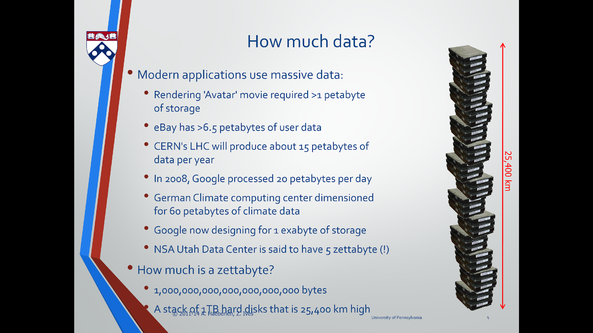

---

<div dir="rtl">1.3 תוכנית הקורס</div>

<div dir="rtl">- מבוא - תשתית o , חומרה AWS תרגיל [ 1 ]</div>

<div dir="rtl">o סביבת , ריצה Hadoop</div>

<div dir="rtl">- תבנית Map-Reduce o דוגמאות בסיסיות</div>

<div dir="rtl">- עיצוב ' אלגוריתמים ' בתבנית Map-Reduce o מודל שפה</div>

<div dir="rtl">o Join תרגיל [ 2 ]</div>

<div dir="rtl">o בעיות למידה</div>

<div dir="rtl">▪תיוג חלקי דיבר לימוד ( אוטומטי ) מונחה - לא</div>

<div dir="rtl">▪ניתוח תחבירי אימון ( מסווג ) מונחה</div>

<div dir="rtl">▪סיווג מסמכים</div>

```
▪מידול
נושאים
רשתות (
) נוירוניות
```

<div dir="rtl">תרגיל [ 3 ]</div>

<div dir="rtl">o מנוע חיפוש</div>

<div dir="rtl">כיצד לדרג את תוצאות החיפוש עיבוד ( מבוזר של ) גרף</div>

<div dir="rtl">2. תשתית - Cloud Computing</div>

<div dir="rtl">2.1 מבוא</div>

<div dir="rtl">- שובו של החישוב המקבילי</div>

- Scale Up Vs. Scale Out

<div dir="rtl">o באופן די ברור עדיפה כמות גדולה של מחשבים פשוטים ( out ) מאשר כמות קטנה של</div>

```
מחשבים
חזקים
מאוד (
up
)
▪אנרגיה , חשמל (
) קירור
```

<div dir="rtl">▪תחזוק ▪ ...</div>

<div dir="rtl">- מה זה קומפיוטינג - קלאוד</div>

<div dir="rtl">שכירת שירותי , חישוב על פי הצורך כרגע</div>

---

<div dir="rtl">באילו שירותים ? מדובר</div>

```
o
Infrastructure As Service (IaS
)
```

<div dir="rtl">שרותי : חומרה , מעבדים , זיכרון , אחסון תקשורת</div>

```
o
Platform As Service (PaS
)
```

<div dir="rtl">מה ' מותקן ' על : החומרה מערכת , הפעלה JVM , בסיס ... נתונים</div>

```
o
Software As Service (SaS
)
```

<div dir="rtl">שכירת שימוש בתוכנה שרצה בקלאוד</div>

Web Services

- <span dir="rtl">וירטואליזציה</span>

<div dir="rtl">- המחשה פיזית של אתר שכזה - . במצגת הניסיון של מיקרוסופט להטמין סנטר - דאטה מתחת</div>

<div dir="rtl">למים .</div>

<div dir="rtl">2.2 שירותי החישוב של אמזון Amazon Web Services (AWS)</div>

<div dir="rtl">1. שירותי חומרה ופלטפורמה</div>

```
Amazon Elastic Compute Cloud (EC2
)
```

<div dir="rtl">שכירת חומרה עם סט של תוכנות : מותקנות</div>

```
▪בחירת
תצורת
חומרה (
instance type
)
▪בחירת image מה (
' מותקן ' על , החומרה
תכולת ' כונן C', ami
)
```

<div dir="rtl">▪בחירת כמות מחשבים נדרשים</div>

<div dir="rtl">▪אבטחה ▪גמישות ▪בקרה ▪ ...</div>

AWS SDK for Java API Reference AWS SDK PROJECT ON GITHUB AWS SDK JAVA V2 EXAMLES

<div dir="rtl">דוגמת קוד : CreateInstance</div>

---

```
Ec2Client ec2 = Ec2Client.create();
String amiId = “ami-076515f20540e6e0b”; // Linux and Java 1.8
RunInstancesRequest runRequest = RunInstancesRequest.builder()
.instanceType(InstanceType.T1_MICRO)
.imageId(amiId)
.maxCount(1)
.minCount(1)
.userData(Base64.getEncoder().encodeToString(
/*your USER DATA script string*/.getBytes()))
.build();
RunInstancesResponse response = ec2.runInstances(runRequest);
List<Instance> instances = response.instances();
```

<div dir="rtl">אופציות : נוספות</div>

<div dir="rtl">o הוספת תגים למחשבים , השונים כדי לאפיין כל לפי הצורך נניח ( מי ' מנהל ' ומי )' עובד '</div>

```
CreateTagsRequest tagRequest = CreateTagsRequest.builder()
.resources(instanceId)
.tags(tag)
.build();
ec2.createTags(tagRequest);
```

<div dir="rtl">o מנגנונים המבטיחים גישה מאובטחת למידע</div>

keyName - public key cryptography to encrypt and decrypt login information, more .

```
.keyName(/*your KEY.PEM name*/)
```

iamInstanceProfile – AWS role define the permissions the instance will have, more .

```
.iamInstanceProfile(IamInstanceProfileSpecification.builder().arn(/* your
ROLE ARN */")
```

<div dir="rtl">o קביעת ברירת המחדל עבור פקודת shutdown</div>

```
instanceInitiatedShutdownBehavior – what the instance would do (stop or
terminate) then the cli command "shutdown -h now" preform.
.instanceInitiatedShutdownBehavior(/*"terminate" or "close"*/)
```

---

<div dir="rtl">2. שירותי אחסון</div>

<div dir="rtl">o אחסון רגיל במערכת קבצים - ' קי - און - דיסק ' Elastic Block Storage (EBS)</div>

<div dir="rtl">▪המידע הנשמר נגיש רק ממחשבי EC2</div>

<div dir="rtl">▪המידע הנשמר נגיש רק ממחשב אחד במקביל</div>

```
▪ה EBS הוא ' כונן ' במערכת
קבצים
ניתן ( לבצע mount
,) המידע
הוא ,' קובץ ' ניתן
```

<div dir="rtl">לחזור אליו . בהמשך</div>

<div dir="rtl">▪הגודל מוגבל</div>

<div dir="rtl">▪יש עלות</div>

<div dir="rtl">o מאגר של אובייקטים הניתנים לגישה פ " ע מפתח</div>

```
Amazon Simple Storage Service (S3
)
```

<div dir="rtl">▪ניתן לשמור אובייקטים ובפרט ( ) קבצים תחת מפתח נבחר</div>

<div dir="rtl">▪רמת היררכיה : אחת buckets</div>

<div dir="rtl">▪ניתן לגישה כמעט מכל דבר בפרט ( , מהרשת http ,) …אין צורך לגשת דווקא</div>

<div dir="rtl">ממחשב של EC2</div>

<div dir="rtl">▪גודל כמעט לא מוגבל</div>

<div dir="rtl">▪זול ▪אין סמנטיקה של מערכת קבצים</div>

<div dir="rtl">: דוגמא S3Operations.java</div>

```
S3Client s3 = S3Client.builder().region(Region.US_WEST_2).build();
s3.createBucket(CreateBucketRequest.builder().bucket(“dsp241”).build());
s3.putObject(PutObjectRequest.builder().bucket(“dsp222”).key(“ass1”).build(),new
File(“assignment1.pdf”));
S3Object ass1 = s3.getObject(GetObjectRequest.builder().bucket(“dsp222”).key(“ass1”).build());
s3.deleteObject(DeleteObjectRequest.builder().bucket(“dsp222”).key(“ass1”).build());
s3.deleteBucket(DeleteBucketRequest.builder().bucket(“dspp222”).build());
```

<div dir="rtl">o בסיס נתונים</div>

<div dir="rtl">: אפשרויות</div>

<div dir="rtl">▪נריץ מחשב ב EC2 , נתקין עליו תוכנה של SQLServer (MySql ,) לדוגמא נשמור את</div>

<div dir="rtl">הכל כ . image הרצה של מחשב EC2 אחר כך עם image זה תאפשר להריץ את</div>

---

<div dir="rtl">שרת בסיס הנתונים הנתונים ( עצמם של בסיס הנתונים – בפרט הטבלאות –</div>

<div dir="rtl">יישמרו ב EBS , כי S3 אינה מערכת , קבצים ומערכת ניהול בסיסי הנתונים מצפה</div>

<div dir="rtl">לקבל מסלול לספריה במערכת ) הקבצים</div>

<div dir="rtl">▪נשתמש בשירות של בסיסי נתונים ב cloud :</div>

<div dir="rtl">●בסיס נתונים רלציוני , טבלאות ( שדות )' וכו - RDB</div>

```
●בסיס
נתונים
שאינו
רלציוני (
no-sql db) – Simple/DynamoDB
```

- <span dir="rtl">תקשורת</span>

<div dir="rtl">o תור משותף בין , תהליכים המאפשר תקשורת ביניהם</div>

```
Amazon Simple Queue Service (SQS
)
```

<div dir="rtl">: דוגמא SQSExample</div>

```
SqsClient sqs = SqsClient.builder().region(Region.US_WEST_2).build();
CreateQueueResult queueRes =
sqs.createQueue(CreateQueueRequest.builder().queueName(“dsp-queue”).build());
String queueUrl = queueRes .getQueueUrl();
sqs.sendMessage(SendMessageRequest.builder().queueUrl(queueUrl).messageBody("hello
world").build());
List<Message> messages =
sqs.receiveMessage(ReceiveMessageRequest.builder().queueUrl(queueUrl).build()).messages();
for (Message m : messages)
sqs.deleteMessage(DeleteMessageRequest.builder().queueUrl(queueUrl).receiptHandle(
m.receiptHandle()).build());
sqs.deleteQueue(DeleteQueueRequest.builder().queueUrl(queueUrl).build());
```

<div dir="rtl">3. סביבת הריצה עבור תבנית Map-Reduce – Hadoop</div>

<div dir="rtl">3.1 מבוא</div>

<div dir="rtl">נחזור לתוכנית ספירת , המילים בה פתחנו את : הקורס</div>

For each data point
Send & apply:

```
{
```

For each doc
For each word
Inc word count

---

} Merge local counts

<div dir="rtl">ברצוננו להריץ את התוכנית על התשתית הענפה והגמישה של AWS .</div>

```
אפשרי
כמו ( בתרגיל 1
:)
```

<div dir="rtl">- " ר ' מנג " ה יריץ את התוכנית , הראשית וכל " וורקר " יבצע את הפעולה על data-point , נתון כאשר</div>

<div dir="rtl">התקשורת ביניהם תיעשה בעזרת SQS</div>

<div dir="rtl">- ר ' המנג בוחן את כמות הקבצים לספירה , במאגר ומחליט כמה וורקרז . נדרשים</div>

<div dir="rtl">- ר ' המנג שולח ב SQS לכל וורקר את ה data-point הוא עובד</div>

<div dir="rtl">- הוורקר סופר את המילים בקבצים ב data-point , שלו ומעלה ל 3S את הטבלה המקומית של , הספירה</div>

```
ומודיע
ר ' למנג
ב (
SQS
) שהוא . סיים
```

<div dir="rtl">- ר ' המנג מחכה שכל הוורקרז יסיימו</div>

<div dir="rtl">- ר ' המנג ממזג את כל הטבלאות המקומיות הנמצאות ב 3S</div>

<div dir="rtl">אך דורש התייחסות למגוון רחב של : נושאים</div>

<div dir="rtl">- איזה מחשב מעבד איזה קובץ רצוי ( שהוא יהיה סמוך לו כדי לחסוך ) בתקשורת</div>

<div dir="rtl">- העברת הקוד לביצוע לכל מחשב עבור ( המקרה ,) הכללי הרצת הקוד בכל מחשב</div>

<div dir="rtl">- העברת המידע עליו עובד כל מחשב למחשב זה מערכת '( קבצים )' מבוזרת</div>

<div dir="rtl">- ניהול שמירת הפלט המקומי של כל מחשב שלא ( דרך גורם שלישי כמו 3S )</div>

<div dir="rtl">- כיצד מתבצע בסוף איסוף ומיזוג התוצאות המקומיות מעבר ( ללוגיקה של פעולת המיזוג</div>

<div dir="rtl">,) לכשעצמה כיצד ניתן לבזר אותה ביעילות . ונוחות</div>

<div dir="rtl">- סנכרון - טיפול בנפילות , מחשבים שגיאות</div>

<div dir="rtl">- מידול , כללי , טיפוסים ועוד</div>

<div dir="rtl">🡸 נדרשת סביבת ריצה ייעודית עבור תבנית : זו Hadoop</div>

<div dir="rtl">נעבור על שני חלקים מרכזיים : בסביבה</div>

<div dir="rtl">- מערכת הקבצים המבוזרת</div>

<div dir="rtl">- מנגנון ההרצה של תוכניות Map-Reduce</div>

<div dir="rtl">עבודה מול סביבה שכזו תשחרר אותנו מהטיפול בכל ההבטים שצויינו , לעיל כך שנוכל להתמקד בלוגיקה</div>

<div dir="rtl">של פעולת ה map מה ( לבצע על המידע ) המקומי ובלוגיקה של פעולת ה reduce כיצד ( למזג את התוצאות</div>

```
.) המקומיות
```

<div dir="rtl">3.2 מערכת הקבצים המבוזרת</div>

<div dir="rtl">3.2.1 מבוא</div>

<div dir="rtl">מערכת קבצים מבוזרת מאפשרת גישה לקבצים מרוחקים המאוחסנים ( במחשב אחר ) ברשת באותו אופן</div>

<div dir="rtl">שבו אנחנו ניגשים לקובץ . מקומי</div>

---

<div dir="rtl">קיימות מערכות שונות , שכאלה בפרט Network File System (NFS ) של Linux :</div>

<div dir="rtl">חסרונות עבור המקרה : שלנו</div>

<div dir="rtl">o נפילת מחשבי האחסון</div>

<div dir="rtl">o זמן העברה כאשר הלקוח מרוחק מדי ממקום האחסון</div>

<div dir="rtl">🡸נדרשת מערכת קבצים ייעודית עבור התבנית בה אנחנו . עוסקים</div>

<div dir="rtl">אפיון השימוש במידע בקבצים בתבנית Map-Reduce :</div>

<div dir="rtl">●קבצים גדולים</div>

<div dir="rtl">●המעבר על הקבצים הינו סדרתי</div>

<div dir="rtl">●או שקוראים קובץ או שמייצרים קובץ עם תוכן חדש לא ( מעדכנים מידע בקובץ ) קיים</div>

<div dir="rtl">●התמודדות עם נפילות</div>

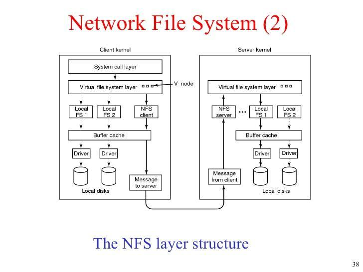

---

<div dir="rtl">●תקשורת יעילה עבור העברת big data</div>

🡸

<div dir="rtl">o עותקים באופן , מובנה כל בלוק של קובץ נשמר בכמה עותקים במחשבים . שונים</div>

<div dir="rtl">▪כאשר מחשב המחזיק בעותק של בלוק , נופל קיימת . אלטרנטיבה</div>

<div dir="rtl">▪הלקוח ייגש לעותק הקרוב אליו . ביותר</div>

o Immutability

<div dir="rtl">לא ניתן לשנות . קובץ או שקוראים או שכותבים . חדש</div>

<div dir="rtl">משחרר את הצורך לנעול / לסנכרן</div>

<div dir="rtl">o קבצים סדרתיים</div>

<div dir="rtl">הקבצים נשמרים , מראש כברירת , מחדל באופן כמה שיותר , סדרתי במבנה של רשומות</div>

```
מקודדות
בינארית
כ <
key,value
>
```

<div dir="rtl">o העדפת קבצים גדולים ) להלן (</div>

<div dir="rtl">o שירותים מצומצמים - לא כל פעולה במערכת קבצים רגילה ממומשת ב HDFS</div>

<div dir="rtl">ארכיטקטורה</div>

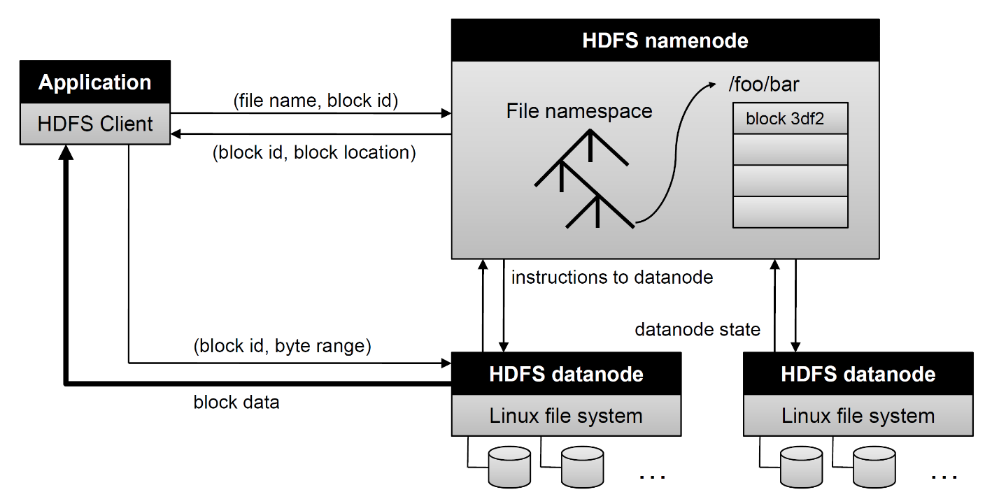

---

<div dir="rtl">דוגמת קוד ) באתר ( : תוכנית המקבלת כקלט ספריה במערכת הקבצים , המקומית קוראת את הקבצים</div>

<div dir="rtl">שורה , ושורה ושומרת אותם כקובץ מאוחד אחד במערכת הקבצים . המבוזרת</div>

```
public class MergeFiles {
```

// Concatenates files from a given input local directory into a given local output file public static void main(String[] args) throws Exception {

```
Configuration conf = new Configuration();
FileSystem hdfs = FileSystem.get(conf);
FileSystem local = FileSystem.getLocal(conf);
String inDirname = args[0];
String outFilename = args[1];
//File outFile = new File(outFilename);
Path outFile = new Path(outFilename);
//OutputStream outstream = new FileOutputStream(outFile);
OutputStream outstream = hdfs.create(outFile);
PrintWriter writer = new PrintWriter(outstream);
//File inDir = new File(inDirname);
Path inDir = new Path(inDirname);
//for (File inFile : inDir.listFiles()) {
for (FileStatus inFile : local.listStatus(inDir)) {
//InputStream instream = new FileInputStream(inFile);
InputStream instream = local.open(inFile.getPath());
BufferedReader reader = new BufferedReader(
new InputStreamReader(instream));
String line=null;
while ((line = reader.readLine()) != null)
writer.println(line);
reader.close();
}
writer.close();
```

---

```
}
}
```

<div dir="rtl">3.3 מנגון ההרצה של תוכניות map-reduce</div>

<div dir="rtl">ניזכר תחילה בפעולות Map,Reduce בתכנות : פונקציונאלי</div>

map((x) => x*x, [1,2,3]); 🡺 [1,4,9]
reduce((x,y) => x+y,0,[1,2,3]) 🡺6
reduce((x,y) => x+y,0, map((x) => x*x, [1,2,3])) 🡺14

<div dir="rtl">יש להכליל פונקציות אלו למקרה : המבוזר</div>

<div dir="rtl">- כאשר אין זיכרון , משותף ' וכו</div>

<div dir="rtl">- , מידול , טיפוסים הפשטה של קריאת ... הקלט</div>

<div dir="rtl">🡸 כפי שכבר , ציינו נדרשת לשם כך סביבת ריצה ייעודית</div>

<div dir="rtl">נכתוב תחילה תוכנית map-reduce . לדוגמא תוכנית הסופרת את מספר מופעי המילים השונות בקבצי</div>

<div dir="rtl">טקסט רבים הניתנים . בקלט</div>

<div dir="rtl">התוכנית WordCount באתר . הקורס</div>

<div dir="rtl">נבחן כיצד רצה התוכנית שכתבנו י " ע Hadoop במקרה : המבוזר</div>

<div dir="rtl">- וב ' הג שהגדרנו מכיל את ההגדרות : הבאות</div>

<div dir="rtl">o מחלקת ה Mapper , הקובעת את יחידת המידע לפעולה , המקומית ואת הפעולה המקומית</div>

<div dir="rtl">מספר ( שורה ותוכן שורה בקובץ , קלט ספירת המילים בשורה הנתונה תוך יצור פלט של</div>

```
זוגות , מילה <
1 )>
```

<div dir="rtl">o מחלקת ה Reducer , הקובעת כיצד ממזגים לערך אחד את הערכים השונים שנוצרו י " ע ה</div>

<div dir="rtl">Mappers עבור מפתח אחד נתון כיצד ( ממזגים את מספרי המופעים של מילה נתונה</div>

```
לסכום ) אחד
```

<div dir="rtl">o רשימת קבצי הקלט במערכת ( הקבצים ) המבוזרת</div>

<div dir="rtl">o ספריית הפלט במערכת ( הקבצים ) המבוזרת</div>

<div dir="rtl">o האופן שבו מחולקים קבצי הקלט ליחידות קטנות ,* יותר והאופן שבו מומרים יחידות אלו</div>

<div dir="rtl">לרשימת הזוגות K-V המהווים את הפרמטרים של מתודת ה map. (InputFormat )</div>

---

<div dir="rtl">o האופן שבו נכתב הפלט . לקובץ ( OutputFormat )</div>

<div dir="rtl">קבצי * הקלט מפורקים ליחידות קטנות . יותר אופן פירוק מוגדר במחלקת ה InputFormat . מחלקה</div>

<div dir="rtl">זו כוללת מתודה בשם getSplits המקבלת את רשימת קבצי הקלט ומחזירה רשימה של חלקי</div>

<div dir="rtl">קבצים המכונים Splits שיטת ( חלוקה סטנדרטית תבוסס על גודל ה Split )</div>

<div dir="rtl">וב ' הג שהוגדר מוגש לסביבת Hadoop . לביצוע</div>

<div dir="rtl">הארכיטקטורה של יחידת הביצוע / ההרצה של Hadoop מורכבת משני סוגים של : רדים ' ת / תהליכים</div>

<div dir="rtl">- JobTracker , " ר ' מנג " ה של מנגנון ההרצה</div>

<div dir="rtl">- TaskTracker , ים " וורקר " ה של מנגנון ההרצה</div>

<div dir="rtl">נבחן את דפוס הפעולה של כל אחד : מהם</div>

JobTracker

<div dir="rtl">- בהינתן Job o מחלק את קבצי הקלט ליחידות קטנות יותר של , ספליטים על פי מתודת - ה getSplits )(</div>

<div dir="rtl">במחלקה InputFormat הנתונה . וב ' בג</div>

<div dir="rtl">o מגדיר עבור כל Split וב ' בג משימה לביצוע עבור TaskTracker . משימה זו מוגדרת פ " ע</div>

<div dir="rtl">הנתונים : הבאים</div>

<div dir="rtl">▪ה split עליו הוא עובד</div>

<div dir="rtl">▪מכשיר ההופך את המידע לרשימה של key-value פ " ע הנדרש במתודת ה map .</div>

<div dir="rtl">' מכשיר ' , זה המכונה RecordReader , ניתן על ידי מחלקת ה InputFormat</div>

```
המתודה (
createRecordReader
)
▪מחלקת
ה Mapper מה ( לבצע
על
כל key-value
)
```

<div dir="rtl">o השמת כל משימה לביצוע י " ע ה TaskTracker הזמין והמתאים . ביותר</div>

<div dir="rtl">o המתנה לאישור ביצוע המשימה י " ע ה כל TaskTrackers .</div>

<div dir="rtl">o החלטה כמה TaskTrackers נדרשים עבור השלב הבא של מיזוג . התוצאות</div>

<div dir="rtl">o בחירת TaskTrackers לביצוע שלב , המיזוג עם משימת המיזוג . עבורם</div>

<div dir="rtl">o הנחיית ה TaskTrackers של שלב ה Map להעביר את ה key-value שהם יצרו למחשבים</div>

<div dir="rtl">שנחברו לבצע את מיזוג . התוצאות אופן הפיזור נקבע על פי המדיניות הממומשת</div>

```
במחלקה Partitioner המתודה (
getPartition
)
```

<div dir="rtl">o בקשה מה TaskTrackers שנבחרו להרצת משימות ה Reduce להתחיל לעבוד</div>

<div dir="rtl">▪במחשבים אלו מחכים כבר על זוגות ה K-V שיוצרו כפלט י " ע ה Mappers ונשלחו</div>

<div dir="rtl">אליהם</div>

<div dir="rtl">▪כל אחד מה TaskTrackers מקבל גם מה JobTracker את משימת המיזוג שהוא</div>

<div dir="rtl">נדרש לבצע המחלקה ( Reducer שהוגדרה ,) וב ' בג וכן את האופן שבו יש לכתוב</div>

<div dir="rtl">את הפלט הסופי לקבוץ הפלט המחלקה ( OutputFormat שהוגדרה ) וב ' בג</div>

<div dir="rtl">o מחכה שכל ה TaskTrackers יסיימו את משימות המיזוג . שלהם</div>

<div dir="rtl">TaskTracker המבצע משימת Map</div>

---

<div dir="rtl">- מקבל משימה , לביצוע : הכוללת Split, RecordReader מכשיר ( המפרק את ה Split ל רשימת</div>

<div dir="rtl">key-value ,) ואובייקט מטיפוס Mapper</div>

<div dir="rtl">- מבצע את הלולאה הבאה mapper.setup(context); while (rr.nextKeyValue())</div>

```
mapper.map(rr.getCurrentKey(), rr.getCurrentValue(), context);
mapper.cleanup(context);
```

<div dir="rtl">- עדכון ה JobTracker על סיום ביצוע השלב המרכזי של . המשימה והמתנה להנחיות על השלב</div>

<div dir="rtl">האחרון של : המשימה כמה Reducers . נדרשים</div>

<div dir="rtl">- Shuffle : שליחת ה key-value שנוצרו בהפעלות מתודת ה map למחשבים שיבצעו את מיזוג</div>

```
התוצאות
פ " ע ( המדיניות
המוגדרת
במחלקת
ה Partitioner הניתנת ) וב ' בג
```

<div dir="rtl">TaskTracker המבצע משימת Reduce</div>

<div dir="rtl">- במחשב ה של TaskTracker יש ) קובץ ( עם רשימת key-value שהתקבלו כפלט של TaskTrackers</div>

<div dir="rtl">משלב ה Map .</div>

<div dir="rtl">- ה Tasktracker מקבל אובייקט מטיפוס Reducer המגדיר את פעולת המיזוג הנדרשת מימוש (</div>

<div dir="rtl">מתודת ה reduce )</div>

<div dir="rtl">- הפעולה שהוא מבצע</div>

<div dir="rtl">o Sort ▪ארגון חדש במבנה נתונים יעיל וקומפקטי של רשימת : הזוגות</div>

```
, כסא <
1 >
, שולחן <
1 >
, כסא <
1 >
```

🡨

<div dir="rtl">{ שולחן : [ 1 ,]</div>

<div dir="rtl">כיסא : [ 1,1 }]</div>

<div dir="rtl">▪מיון השורות בטבלה פ " ע ה compareTo של מחלקת . המפתח</div>

🡨

<div dir="rtl">{ כיסא : [ 1,1 ,]</div>

<div dir="rtl">שולחן : [ 1 }]</div>

<div dir="rtl">o ביצוע הקוד הבא על ( הטבלה המפתחות והערכים ' table :)'</div>

```
reducer.setup(context);
for (Entry entry : table.entrySet())
reducer.reduce(entry.getKey(), entry.getValue());
reducer.cleanup(context);
```

<div dir="rtl">הפלט רשימת ( key-value ) שכל משימת Reduce מייצרת נכתב לקובץ פלט בספריית הפלט</div>

<div dir="rtl">המוגדרת , וב ' בג פ " ע הפורמט המוגדר במחלקת ה OutputFormat הניתנת ( במסגרת ) וב ' הג</div>

---

<div dir="rtl">דוגמא</div>

<div dir="rtl">: קלט פזמון שירו של יהוא ירון :' זוכרים '</div>

zochrim.txt

<div dir="rtl">בבטן השכחה</div>

<div dir="rtl">זוכרים אותך זוכרים</div>

<div dir="rtl">בבטנה של אמא</div>

<div dir="rtl">זוכרים אותך זוכרים</div>

<div dir="rtl">נניח כי getSplits החליטה לחלק את הקובץ לשני Splits :</div>

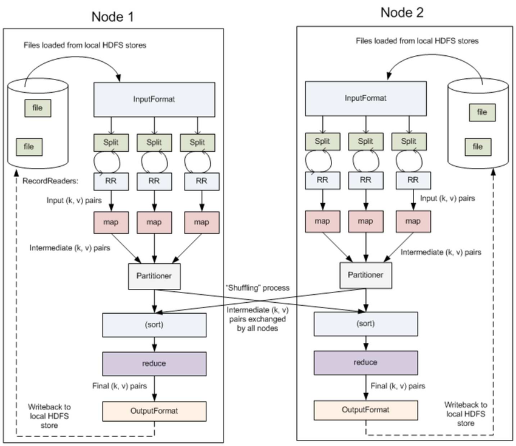

---

<div dir="rtl">a. בבטן השכחה</div>

<div dir="rtl">זוכרים אותך זוכרים</div>

<div dir="rtl">b. בבטנה של אמא</div>

<div dir="rtl">זוכרים אותך זוכרים</div>

<div dir="rtl">, כלומר רצים שני TaskTrackers במשימת ה Map , אחד על ספליט a, והשני על ספליט b.</div>

TaskTracker1

```
מקבל
מה RR את
הזוג <
1, בבטן "
>" השכחה
```

<div dir="rtl">קורא למתודת ה map , המייצרת את : הזוגות</div>

```
, בטן <
1 >
, שכחה <
1 >
מקבל
מה RR את
הזוג <
2, זוכרים " אותך >" זוכרים
```

<div dir="rtl">קורא למתודת ה map , המייצרת את : הזוגות</div>

```
, זוכרים <
1 >
, אותך <
1 >
, זוכרים <
1 >
```

TaskTracker2

```
מקבל
מה RR את
הזוג <
1, בבטנה " של >" אמא
```

<div dir="rtl">קורא למתודת ה map , המייצרת את : הזוגות</div>

```
, בטן <
1 >
, של <
1 >
, אמא <
1 >
מקבל
מה RR את
הזוג <
2, זוכרים " אותך >" זוכרים
```

<div dir="rtl">קורא למתודת ה map , המייצרת את : הזוגות</div>

```
, זוכרים <
1 >
, אותך <
1 >
, זוכרים <
1 >
```

<div dir="rtl">שלב הניתוב :</div>

<div dir="rtl">במחשב של TaskTracker1 יש בקובץ ( ) זמני את הזוגות : הבאים</div>

```
, בטן <
1 >
, שכחה <
1 >
, זוכרים <
1 >
, אותך <
1 >
```

---

```
, זוכרים <
1 >
```

<div dir="rtl">במחשב של TaskTracker2 יש בקובץ ( ) זמני את הזוגות : הבאים</div>

```
, בטן <
1 >
, של <
1 >
, אמא <
1 >
, זוכרים <
1 >
, אותך <
1 >
, זוכרים <
1 >
```

<div dir="rtl">נניח ה כי JobTracker החליט שנדרשים שני TaskTrackers למיזוג התוצאות . המקומיות</div>

<div dir="rtl">נניח כי שיטת הניתוב כלומר ( מימוש מתודת getPartition במחלקה Partitioner ) שהוגדרה , וב ' בג</div>

<div dir="rtl">היא חלוקת המפתחות פ " ע האות : הראשונה , כ - א . ת - ל</div>

🡸

<div dir="rtl">TaskTracker3 יקבל משימת מיזוג עבור מילים המתחילות : כ - בא</div>

```
, בטן <
1 >
, זוכרים <
1 >
, אותך <
1 >
, זוכרים <
1 >
, בטן <
1 >
, אמא <
1 >
, זוכרים <
1 >
, אותך <
1 >
, זוכרים <
1 >
```

Sort

<div dir="rtl">} : אותך [ 1,1 ]</div>

<div dir="rtl">: אמא [ 1 ]</div>

<div dir="rtl">בטן : [ 1,1 ]</div>

<div dir="rtl">: זוכרים [ 1,1,1,1 ]</div>

```
}
reducer.setup();
reducer.reduce(
[, אותך 1,1
]);
reducer.reduce( [, אמא 1
]);
reducer.reduce(
[, בטן 1,1
]);
reducer.reduce(
[, זוכרים 1,1,1,1
]);
reducer.cleanup();
, אותך <
2 >
, אמא <
1 >
```

---

```
, בטן <
2 >
, זוכרים <
4 >
```

<div dir="rtl">זוגות אלו ייכתבו לקובץ פלט בספריית הפלט במערכת הקבצים המבוזרת שהגדרנו , וב ' בג פ " ע</div>

<div dir="rtl">הפורמט שהוגדר במחלקה OutputFormat :</div>

<div dir="rtl">אותך 2</div>

<div dir="rtl">אמא 2</div>

<div dir="rtl">בטן 2 זוכרים 4</div>

<div dir="rtl">TaskTracker4 יקבל משימת מיזוג עבור מילים המתחילות : ת - בל</div>

```
, שכחה <
1 >
, של <
1 >
```

Sort

<div dir="rtl">} : שכחה [ 1 ]</div>

<div dir="rtl">: של [ 1 ]</div>

```
}
reducer.setup();
reducer.reduce( [, שכחה 1
]);
reducer.reduce( [, של 1
]);
reducer.cleanup();
, שכחה <
1 >
, של <
1 >
```

<div dir="rtl">זוגות אלו ייכתבו לקובץ פלט בספריית הפלט במערכת הקבצים המבוזרת שהגדרנו , וב ' בג פ " ע</div>

<div dir="rtl">הפורמט שהוגדר במחלקה OutputFormat :</div>

<div dir="rtl">שכחה 1</div>

<div dir="rtl">של 1</div>

<div dir="rtl">דוגמא קוד נוספת : תוכנית המבצעת ניתוחים ופילוחים סטטיסטיים על נתוני חברת . סלולר</div>

<div dir="rtl">כמו בכל עיצוב של , קוד נקבע תחילה את הטיפוסים הנדרשים . למתודות במקרה זה נגדיר שני סוגי</div>

<div dir="rtl">: טיפוסים User, Action</div>

<div dir="rtl">, כלומר פרטי , הלקוח ופרטים של פעולה אחת שהוא . ביצע</div>

---

<div dir="rtl">- הגדרת המחלקות User, Action</div>

<div dir="rtl">- הגדרת משימות שונות על נתוני המשתמשים ופעולותיהם בתבנית Map-Reduce</div>

<div dir="rtl">o ייצור גרף נמען - מתקשר מי ( התקשר ) למי</div>

<div dir="rtl">o ייצור גרף מתקשר - נמען עבור ( כל , נמען מי התקשר ) אליו</div>

<div dir="rtl">o ייצור טבלה המציינת כמה פעמים התקשרו לכל לקוח בכל . שנה</div>

<div dir="rtl">o היסטוגרמת שיחות שנתית</div>

<div dir="rtl">- התאמת פורמט הקלט של חברת הסלולר לייצוג כ User,Action על ידי מימוש RecordReader</div>

<div dir="rtl">. מתאים</div>

<div dir="rtl">o מבוא נבחן , תחילה כיצד ממומש ה TextInputFormat בו השתמשנו בתכנית ה WordCount</div>

<div dir="rtl">, כזכור הממשק InputFormat כולל שתי מתודות : למימוש</div>

<div dir="rtl">getSplits – קובעת את מדיניות חלוקת קבצי הקלט ליחידות של splits</div>

<div dir="rtl">createRecordReader – קובעת כיצד לקרוא split נתון כרשימה של Key-Value</div>

<div dir="rtl">מימוש getSplits במחלקה TextInputFormat מוגדר במחלקת האב שלה</div>

FileInputFormat .

<div dir="rtl">מימוש createRecordReader במחלקה TextInputFormat מבוסס למעשה על המחלקה</div>

LineRecordReader .

<div dir="rtl">o הגדרת UserActionRecordReader , על בסיס LineRecordReader הקיים ב Hadoop על (</div>

<div dir="rtl">בסיס ההנחה שנתוני לקוח ופעולה אחת מרוכזים בכל שורה בקבצי הקלט של .) החברה</div>

<div dir="rtl">▪החברה נדרשת רק לממש את המתודות האבסטרקטיות parseUser,</div>

<div dir="rtl">parseAction , המקבלות שורה מהקלט ומחזירות אובייקט User/Action</div>

<div dir="rtl">. בהתאמה</div>

<div dir="rtl">הערה : בעיצוב , הקוד נתקלנו במקרים שבהם נדרש לשרשר שני ובים ' ג של map-reduce . : לדוגמא</div>

<div dir="rtl">o ספירת כמות השיחות לשנה עבור כל לקוח ( GenerateRecipientCallsPerYear )</div>

<div dir="rtl">o יצירת היסטוגרמת שיחות , בשנה פ " ע נתוני מספר השיחות לשנה של הלקוחות השונים</div>

```
(
GenerateRecipientCallsPerYearHistogram
)
```

<div dir="rtl">כיצד ניתן לבצע שרשור ? שכזה</div>

<div dir="rtl">1. נריץ שתי תוכניות , שונות בזו אחר , זו תוך התאמת ספריות הפלט של הראשונה והקלט של</div>

<div dir="rtl">. השניה</div>

<div dir="rtl">2. נגדיר ב main של התוכנית שני , ובים ' ג האחד עבור המשימה הראשונה והשניה עבור</div>

<div dir="rtl">המשימה , השניה ונגיש אותם לסביבה ( job.waitForCompletion ) בזה אחר , זה תוך התאמת</div>

<div dir="rtl">הקלט . והפלט</div>

<div dir="rtl">3. מנגנון JobControl 4. מנגנון ייעודי ב Amazon Elastic Map-Reduce</div>

---

<div dir="rtl">חלק שני : עיצוב אלגוריתמים בתבנית Map-Reduce</div>

<div dir="rtl">בחלק זה נעבור על בעיות שונות בעיבוד ( ,) שפה ונבחן כיצד לעצב מחדש את האלגוריתם הסדרתי</div>

<div dir="rtl">שלהן כאלגוריתם מבוזר בתבנית Map-Reduce .</div>

<div dir="rtl">נחדד , תחילה אלו דברים נמצאים בשליטתנו ואלו דברים נקבעים על ידי : הסביבה</div>

<div dir="rtl">o סביבה ▪היכן ירוצו ה Mappers וה Reducers</div>

<div dir="rtl">▪מתי יתחילו להתבצע המשימות השונות</div>

<div dir="rtl">▪איזה key-value יעובדו על איזה מחשב כ " סה ( קובעים את קבוצות ) הניתוב</div>

<div dir="rtl">o מעצבי הקוד</div>

<div dir="rtl">▪הגדרה מהם המפתחות ומהם , הערכים וכן מה הטיפוסים שלהם</div>

<div dir="rtl">▪הגדרת קריטריון מיון המפתחות ( compareTo )</div>

<div dir="rtl">▪הגדרת קריטריון הניתוב של זוגות הפלט ה של Mapper (getPartition )</div>

<div dir="rtl">▪הגדרת קוד אתחול וסיום לכל משימה ( setup, cleanup )</div>

<div dir="rtl">▪שמירת מצב בזיכרון של אובייקט ה Mapper/Reducer</div>

<div dir="rtl">▪שכפול מידע</div>

<div dir="rtl">▪ : וכמובן מימוש מתודות ה - map, reduce</div>

<div dir="rtl">הקוד שנעצב יבוסס על ארגז ' ' הכלים . ל " הנ</div>

<div dir="rtl">4. מודל שפה</div>

<div dir="rtl">4.1 מוטיבציה</div>

```
1. זיהוי
דיבור (
Speech Recognition
)
```

<div dir="rtl">: קלט ערוץ סאונד</div>

<div dir="rtl">: פלט טקסט של מה שנאמר</div>

<div dir="rtl">: אפליקציות הפעלת מחשב בעזרת קול ניהול ( עם שיחה עם , רובוט Saya ,) , מודיעין תרגום</div>

<div dir="rtl">... סימולטני</div>

<div dir="rtl">: מימוש</div>

<div dir="rtl">o דגימת גלי הקול לסדרת ווקטורים עם מאפייני הצליל ) מספרים ( הנדסת [ ] חשמל</div>

<div dir="rtl">o המרת ווקטורי הצליל ל הברות</div>

<div dir="rtl">ני א תו לה ש ל טים</div>

<div dir="rtl">o שרשור ההברות לכדי מילים</div>

<div dir="rtl">אני תולה שלטים</div>

---

<div dir="rtl">אני תולש שלטים</div>

<div dir="rtl">אני תולש לטים</div>

...
?
🡸

```
P( אני
תולה
שלטים )
P( אני
תולש
שלטים )
P( אני
תולש
לטים )
```

...

<div dir="rtl">חישוב הסתברות , זו המבוססת על מאגר גדול של טקסטים מכונה מודל שפה</div>

```
2. Optical Character Recognition (OCR
)
```

<div dir="rtl">: קלט תמונה עם טקסט</div>

<div dir="rtl">: פלט הטקסט בתמונה</div>

<div dir="rtl">: אפליקציות סריקת ספרים עבור ( מנוע , חיפוש מערכות . למידה , בוקס - גוגל הגניזה , הקהירית</div>

<div dir="rtl">מגילות ,) קומראן מודיעין</div>

<div dir="rtl">: בעיה לעתים יש כמה אפשרויות לתעתק את הטקסט המצולם</div>

```
P( פורסים
על
שפע )
P( פורסים
על
שמע )
3. ניבוי
מילים (
Word Prediction
)
```

<div dir="rtl">תקשורת תומכת וחליפית P( קפה חזק חלש | או ) P( קפה חזק חם | או ) ...</div>

<div dir="rtl">4. תרגום אוטומטי</div>

---

- <span dir="rtl">תרגום : חוקים - מונחה</span>

<div dir="rtl">- ניתוח של הרמות השונות של הטקסט בשפת המקור - , מילים , משפטים משמעות🡨עד כדי</div>

<div dir="rtl">מבנה נתונים המייצג את משמעות המשפט באופן שאינו תלוי . שפה</div>

<div dir="rtl">- ייצור של המשפט בשפת היעד ממבנה הנתונים המייצג את משמעותו – על פי חוקי הקובעים</div>

<div dir="rtl">איך מתנסחים מילים ומשפטים בשפת . היעד</div>

<div dir="rtl">* תרגום : סטטיסטי מבוסס על , הסתברויות ובפרט ההסתברות של התרגום המוצע Danny went home ... P( דני הלך הביתה ) P( דני הלך לביתו ) ...</div>

<div dir="rtl">🡸מודל שפה הינו רכיב מרכזי ביותר בכל אלגוריתם של לימוד . שפה</div>

<div dir="rtl">4.2 חישוב הסתברות של רצף מילים</div>

```
Maximum Likelihood Estimation (MLE)
```

P MLE (W 1 … W n ) = C(W 1 … W n ) / N Where N is number of word sequences of size n in the corpus

```
P MLE ( דני
הלך
הביתה ) = C( דני
הלך
הביתה ) / N
Where N is number of triple words in the corpus
```

<div dir="rtl">: חסרון דלילות . מידע אם סדרת המילים לא הופיע אפילו פעם , אחת ההסתברות תהיה 0.</div>

<div dir="rtl">P MLE ( דני הלך הביתה שלשום ולא היה לו מפתח להיכנס )</div>

<div dir="rtl">: פיתרון החלקה ( smoothing ) – שערוך הסתברות למשפטים שלא נאמרו תוך ( וויתור מה על</div>

<div dir="rtl">הדיוק עבור משפטים ) שנאמרו</div>

<div dir="rtl">: לדוגמא back-off P bo ( דני הלך הביתה שלשום ולא היה לו מפתח להיכנס ) = α 1 P MLE ( דני ) + α 2 P MLE ( דני הלך ) + α 3 P MLE ( דני הלך הביתה ) + α 4 P MLE ( דני הלך הביתה שלשום ) + α 5 P MLE ( דני הלך הביתה שלשום ולא ) +</div>

---

<div dir="rtl">α 6 P MLE ( דני הלך הביתה שלשום ולא היה ) + α 7 P MLE ( דני הלך הביתה שלשום ולא היה לו ) + α 8 P MLE ( דני הלך הביתה שלשום ולא היה לו מפתח ) + α 9 P MLE ( דני הלך הביתה שלשום ולא היה לו מפתח להיכנס )</div>

```
Where ∑ α i = 1
```

<div dir="rtl">מטרתנו בפרק : זה לחשב נוסחאות , שכאלה פ " ע קורפוס נתון מאגר ( טקסט ,) גדול באופן</div>

<div dir="rtl">מבוזר – בתבנית Map-Reduce .</div>

<div dir="rtl">נבחן בעיה זו בשלושה : שלבים</div>

<div dir="rtl">o ספירת מילים בודדות</div>

<div dir="rtl">o ספירת סדרות מילים</div>

<div dir="rtl">o חישוב ההסתברות</div>

<div dir="rtl">4.3 ספירת מילים בודדות</div>

<div dir="rtl">מימשנו כבר תוכנית לספירת מילים בודדות ( WordCount )</div>

<div dir="rtl">לשם , נוחות נציג תוכניות שכאלה : קוד - בפסאודו</div>

Class Mapper

```
Method Map(lineId, line)
```

For w in line

```
Emit(w,1)
```

Class Reducer

```
Method Reduce(w, counts)
sum := 0
for (count in counts)
sum := sum + count
Emit(w, sum)
```

<div dir="rtl">: חסרון המאפר מייצר כמות עצומה של זוגות , מילה < 1 > : בעיית תקשורת , גדולה ארגון מיון ומיזוג</div>

<div dir="rtl">כבדים ב Reducer</div>

<div dir="rtl">🡸 local aggregation , לפני העברת , הזוגות נבצע סיכום מקומי במחשב ( הנתון או בספליט ) הנתון</div>

<div dir="rtl">של . התוצאות</div>

<div dir="rtl">: מימוש</div>

---

<div dir="rtl">1. שמירת מצב , בזיכרון כחלק מלוגיקת הקוד שאנחנו מממשים במחלקת ה Mapper .</div>

Class Mapper

```
Method Initialize()
H := new Table
Method Map(lineId, line)
```

For w in line

```
H{w} := H{w}+1
Method Close()
For <w,count> in Table
Emit<w,count>
```

<div dir="rtl">2. כמנגנון של : הסביבה Combiner</div>

Class Mapper

```
Method Map(lineId, line)
```

For w in line

```
Emit(w,1)
```

Class Combiner

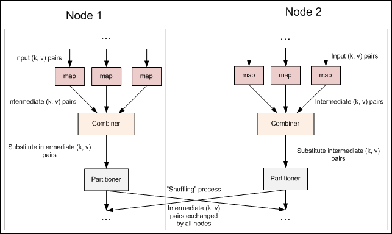

---

```
Method Reduce(w, counts)
sum := 0
for (count in counts)
sum := sum + count
Emit(w, sum)
```

<div dir="rtl">במקרה זה ספירת ( ,) מילים הקוד של מחלקת ה combiner זהה לחלוטין לקוד של מחלקת ה Reducer .</div>

<div dir="rtl">האם זה תמיד ? כך</div>

<div dir="rtl">: דוגמא חישוב ממוצע יומי של שיחות פר לקוח</div>

Class Mapper

```
method Map(userId, callPerDay)
Emit(userId, callPerDay)
```

Class Reducer

```
Method Reduce(userId, callPerDays)
sum := 0
days := 0
for (callPerDay : callPerDays)
sum := sum + callPerDay
days := days + 1
Emit(userId, sum / days)
```

<div dir="rtl">באופן , זה עבור לקוח ששוחח 10,15,20 שיחות נקבל ממוצע : של 15 שיחות . ביום</div>

<div dir="rtl">אם נשתמש בקומביינר שהקוד שלו זהה לקוד , הרדיוסר ייתכן שקומביינר אחד ימזג את 10,15 במחשב</div>

<div dir="rtl">אחד ל 12.5 , והשני את 20 ל 20 , כך שהרדיוסר יקבל 12.5,20 ונקבל ממוצע סופי של 16.25 ממוצע [ אינו</div>

<div dir="rtl">ממוצע של ממוצעים ] בהכרח</div>

<div dir="rtl">🡸 אם פעולת המיזוג אינה אסוציטיבית וקומוטטיבית יש להגדיר קוד מיוחד . לקומביינר</div>

Class Combiner

```
Method Reduce(userId, callPerDays)
sum := 0
days := 0
for (callPerDay : callPerDays)
sum := sum + callPerDay
```

---

```
days := days + 1
Emit(userId, >sum,days< )
```

Class Reducer

```
Method Reduce(userId, callsDaysPairs )
sum := 0
days := 0
for (callsDaysPair : callsDaysPairs )
sum := sum + callsDaysPair.first
days := days + callsDaysPair.second
Emit(userId, sum / days)
```

<div dir="rtl">: בעיה שלב הקומביינר הינו אופטימיזציה , כלומר הוא ייתקיים אם הדבר מתאפשר מבחינת , הסביבה אך</div>

<div dir="rtl">לא . בהכרח במקרה שבו אין , קומביינר טיפוס הפלט של הממאפר אינו תואם את טיפוס הקלט של</div>

<div dir="rtl">. הרדיוסר</div>

<div dir="rtl">🡨 יש לדאוג לפלט אחיד מבחינת הטיפוסים עבור המאפר והקומביינר</div>

Class Mapper

```
method Map(userId, callPerDay)
Emit(userId, >callPerDay,1> )
```

Class Combiner

```
Method Reduce(userId, callPerDays)
sum := 0
days := 0
for (callPerDay : callPerDays)
sum := sum + callPerDay .first
days := days + 1
Emit(userId, >sum,days<)
```

<div dir="rtl">יתרונות וחסרונות של שתי שיטות הקיבוץ : המקומי שמירת מצב בזיכרון – שימוש בקומביינר</div>

<div dir="rtl">- שמירת מצב בזיכרון עשויה להיות לא סקלבילית</div>

---

<div dir="rtl">, לדוגמא עבור ספירת מילים יש לשמור בזיכרון את כל המילים השונות . בשפה האם זה ? סקלבילי</div>

<div dir="rtl">, כלומר האם ניתן להניח שכל המילים השונות בשפה נכנסות ? לזיכרון האם הם ייכנסו לזיכרון גם</div>

<div dir="rtl">כאשר הקורפוס יגדל ? מאוד</div>

<div dir="rtl">במקרה , שלנו השאלה : היא עד כמה גדל אוצר המילים השונות עם גידול מאגר ? הטקסט</div>

<div dir="rtl">יש לבדוק זאת : מראש תיאורטית או . מעשית</div>

<div dir="rtl">תיאורטית , : לדוגמא חוק Heap קובע את היחס בין גודל גודל הקורפוס מאגר ( ) הטקסטים לבין</div>

<div dir="rtl">גודל אוצר המילים המילים ( השונות ) בקורפוס</div>

```
V = kT b
```

<div dir="rtl">כאשר V הוא מספר המילים השונות אוצר ( ,) המילים T גודל , הקורפוס ו k,b . פרמטרים</div>

```
30<=k<=100, b ~ 0.5
```

<div dir="rtl">מעשית , ניתן להריץ ניסויים על מאגרים שונים כדי לבדוק את קצב גידול המילים החדשות ביחס</div>

<div dir="rtl">לגודל . הקורפוס</div>

<div dir="rtl">: לדוגמא</div>

[ Searchable words on the Web, Hugh E. Williams, Justin Zobel, International Journal on Digital
[Libraries 2003

---

<div dir="rtl">מהן אותן מילים ? חדשות</div>

[ Unsupervised Lexicon-Based Resolution of Unknown Words for Full Morphological Analysis, Adler et al, ACL 2008]

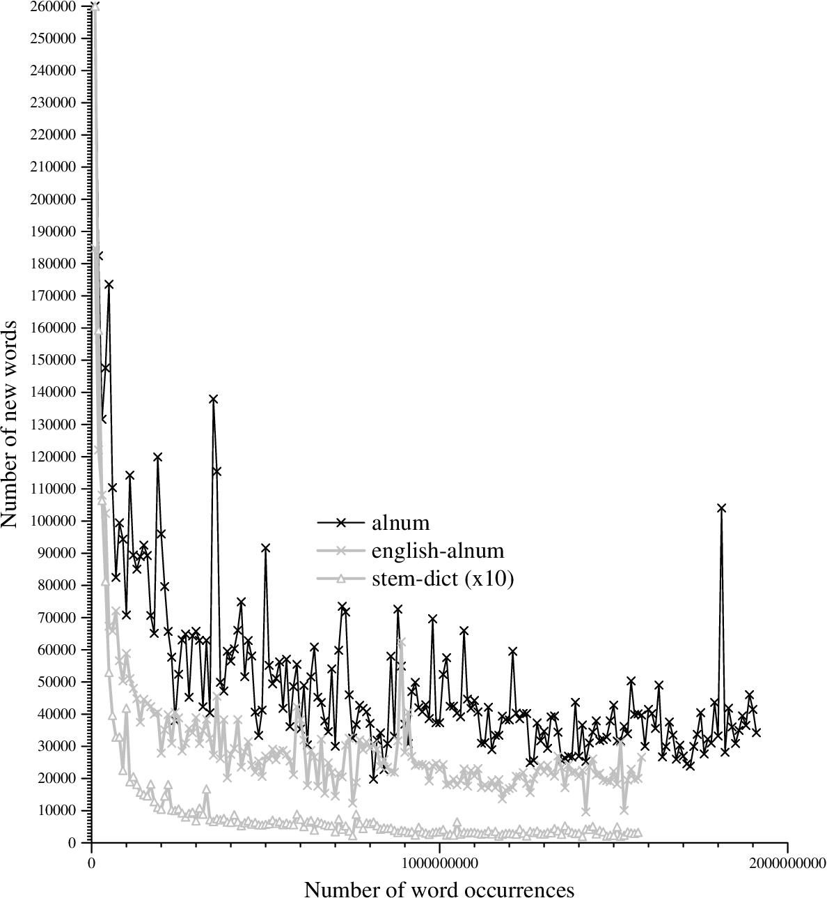

---

<div dir="rtl">בגישת , הקומביינר שאלה זו לא , עולה כי לא שמרנו דבר . בזיכרון</div>

<div dir="rtl">ניתן אגב לאחסן מידע , בזיכרון ולשחרר אותו בכל פעם שיש אינדיקציה שהזיכרון קטן . משמעותית</div>

<div dir="rtl">- שמירת מידע בזיכרון ותחזוקו לאורך ביצוע מתודות ה map אינו תואם את הרוח ' ' הפונקציונאלית</div>

<div dir="rtl">של map-reduce .</div>

<div dir="rtl">- בשיטת הקומביינר יש overhead . הסביבה צריכה להפעיל שלב , נוסף לקרוא את הזוגות מהדיסק</div>

<div dir="rtl">, המקומי לבצע לוקאלית shuffle & sort , .' וכו</div>

<div dir="rtl">- הקומביינר הוא רק , אופטימיזציה כלומר לא בהכרח . יתרחש</div>

<div dir="rtl">, ניתן , אגב לשלב בין : השניים</div>

<div dir="rtl">- השימוש בזיכרון יסכם את כל המופעים של מפתח אחד בספליט נתון לזוג אחד של K-V</div>

<div dir="rtl">- הקומביינר ימזג את מופעי המפתח הנתון שמספרם ( כמספר ) הספליטים וממזג אותם לזוג פלט</div>

<div dir="rtl">אחד שיצא מהמחשב הנתון</div>

<div dir="rtl">4.4 ספירת סדרות</div>

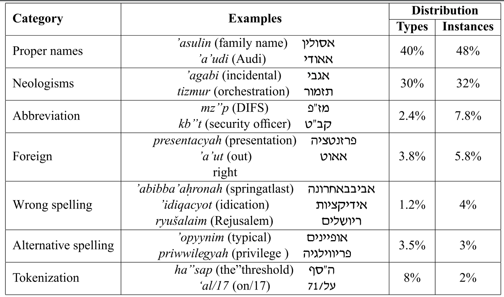

---

<div dir="rtl">נתמקד בספירה של זוגות מילים</div>

<div dir="rtl">ניתן להרחיב את התוכנית לספירת מילים בודדות לספירת זוגות : מילים</div>

Class Mapper

```
Method Map(lineId, line)
```

For w 1 in line

```
For w 2 in context(w 1 ) // the words around w 1
Emit (<w 1 ,w 2 > ,1)
```

Class Reducer

```
Method Reduce( pair , counts)
sum := 0
for (count in counts)
sum := sum + count
Emit( pair , sum)
```

<div dir="rtl">גישה זו עשויה לייצר פלט לא ' קומפקטי ' של ( גוף לולאה אחד במתודת ה map :)</div>

```
ילד <
, אסור 1
>
ילד <
, מותר 1
>
ילד <
, טוב 1
>
ילד <
, אסור 1
>
ילד <
, טוב 1
>
ילד <
, טוב 1
>
ילד <
, רע 1
>
```

<div dir="rtl">ניתן לארגן פלט זה באופן : אחר</div>

```
, ילד <
: אסור {
2,
: מותר 1,
: טוב 3,
: רע 1
>}
```

Class Mapper

```
Method Map(lineId, line)
```

For w 1 in line

```
H := new Table
For w 2 in context(w 1 )
```

---

```
H{w 2 } := H{w 2 } +1
Emit (w 1 ,H )
```

Class Reducer

```
Method Reduce( w , Hs )
Hsum := new Table
for (H in Hs)
add(Hsum,H)
Emit( w , Hsum)
```

<div dir="rtl">בשיטה אחת ‘( pairs ,)’ המפתח הוא זוג , מילים והערך הוא מספר המופעים של זוג . המילים</div>

<div dir="rtl">בשיטה השניה ‘( stripes ,)’ המפתח הוא מילה , בודדת והערך הוא טבלה עם מספר מופעי המילים . השכנות</div>

<div dir="rtl">איזו שיטה ? עדיפה</div>

<div dir="rtl">נבחן שאלה זו במספר : היבטים</div>

<div dir="rtl">1. מספר המפתחות השונים וכן ( מספר ה k-v ) הנוצרים י " ע המאפר</div>

```
Pairs: O(n 2
,) כמספר
זוגות
המילים
Stripes: O(n
,) כמספר
המילים
הבודדות
```

<div dir="rtl">🡸בגישת Pairs צריך לשלוח יותר k-v , צריך למיין , יותר ' וכו</div>

<div dir="rtl">2. כמות המידע הנוצר</div>

<div dir="rtl">בגישת pairs הייצוג לא קומפקטי כפי ( ,) שראינו בפרט יש חזרה שוב ושוב על המילה . הראשונה</div>

<div dir="rtl">גישת stripes אמנם יותר , קומפקטית אך נדרשת סראליזציה מורכבת . יותר</div>

<div dir="rtl">🡸 נראה שבגישת Pairs נדרש להעביר ברשת הרבה יותר . מידע</div>

- <span dir="rtl">סקלביליות</span>

<div dir="rtl">ב pairs אין שמירה של מידע בזיכרון</div>

<div dir="rtl">ב stripes יש שמירה בזיכרון של טבלה קטנטנה המכילה את המילים השכנות למילה , הראשונה באותה</div>

<div dir="rtl">. שורה . זניח - ב Reducer נדרש למזג את כל הטבלאות כך שזה עשוי להגיע - ל O(N )</div>

<div dir="rtl">4. אפקטיביות הקיבוץ המקומי</div>

---

<div dir="rtl">באיזו , שיטה ביצוע קיבוץ מקומי י " ע ( , קומביינר או שמירת מצב ) בזיכרון תהיה אפקטיבית ? יותר</div>

<div dir="rtl">מילה בודדת חוזרת על עצמה הרבה יותר , פעמים מאשר זוג מילים חוזר על . עצמו כך שקיבוץ מקומי</div>

<div dir="rtl">של מפתח המבוסס על מילה בודדת כמו ( ב stripes ) יצמצם הרבה יותר את מספר ה k-v שיוצאים</div>

<div dir="rtl">ממחשב , בודד מאשר קיבוץ מקומי של מפתח המבוסס על שתי מילים כמו ( ב pairs .)</div>

<div dir="rtl">בדיקה ניסויית : ניסוי של לין 2008</div>

<div dir="rtl">לין השווה את שתי , השיטות עבור ספירה של זוגות מילים במאגר של - כ 2.5 מיליון מסמכים ( 19</div>

<div dir="rtl">, מחשבים כל אחד עם שני ) מעבדים</div>

<div dir="rtl">1. מספר ה k-v הנוצרים י " ע המאפר</div>

<div dir="rtl">Pairs : נוצרו 2.6 מיליארד k-v Stripes : נוצרו 653 מיליון k-v</div>

<div dir="rtl">2. גודל המידע הנוצר י " ע המאפר ונשלח ( ) לרדיוסר</div>

<div dir="rtl">Pairs: GB32 Stripes: GB48 , מוזר [ כי המילה הראשונה לא חוזרת על . עצמה : לין בגלל סראליזציה ] גרועה</div>

<div dir="rtl">3. סקלביליות לא היתה . בעיה</div>

<div dir="rtl">o התגלה יחס הפוך בין מספר המחשבים לזמן הריצה</div>

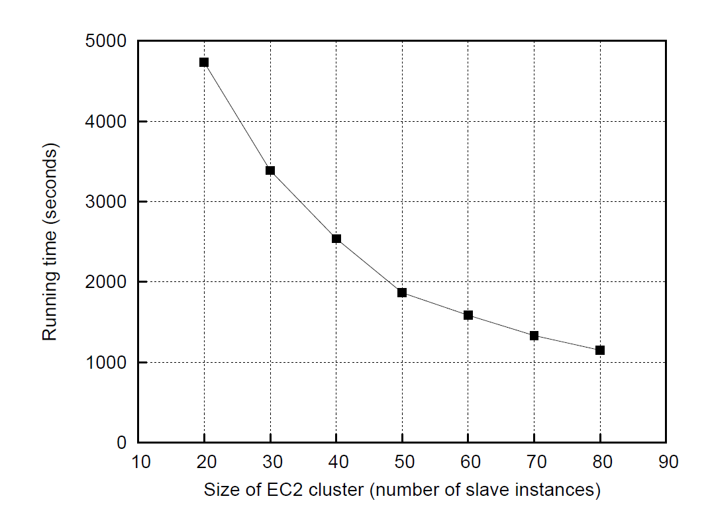

---

<div dir="rtl">o התגלה יחס ישר בין גודל הקורפוס לזמן הריצה</div>

<div dir="rtl">4. אפקטיביות השימוש בקומביינר</div>

<div dir="rtl">Pairs: 2.6 מיליארד🡨 1.1 מיליארד</div>

<div dir="rtl">Stripes: 653 מיליון🡨 29 מיליון</div>

<div dir="rtl">זמן הריצה הכולל :</div>

Pairs: 62 min
Stripes: 11 min

<div dir="rtl">מוזרות : התוצאה</div>

<div dir="rtl">מדוע נוצר יותר מידע ב stripes ? : לין בגלל הסראליזציה</div>

<div dir="rtl">כיצד ייתכן שהשיטה שיצרה יותר מידע רצה הרבה יותר ? מהר צוואר הבקבוק תמיד הוא ! התקשורת</div>

<div dir="rtl">- : לין יש , אופטימיזציה בה נשלח ה k-v לרדיוסר תוך כדי עבודת המאפר</div>

<div dir="rtl">- ייתכן )?( ששליחת כמות גדולה של מידע תחת מספר קטן של , שליחות יעילה יותר משליחה של</div>

<div dir="rtl">כמות קטנה יותר של מידע תחת מספר רב של . שליחות</div>

<div dir="rtl">- ייתכן שבניסוי , הספציפי כל המחשבים ישבו על אותו , מדף כך שהתקשורת לא הייתה . רלבנטית</div>

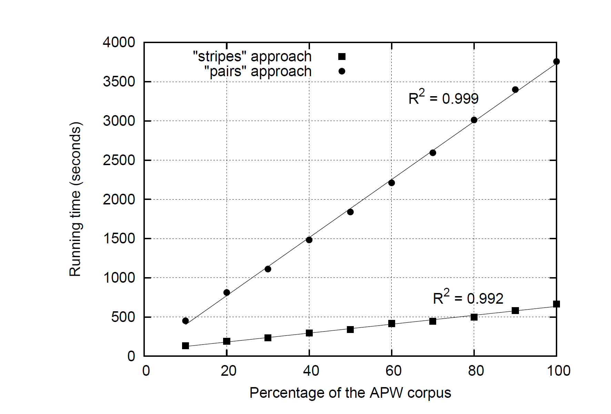

---

<div dir="rtl">4.5 חישוב ההסתברות חלוקת ( המונה ) במכנה</div>

<div dir="rtl">, כזכור אנו מעוניינים לחשב את נוסחת מודל : השפה</div>

```
P MLE )w 1 … w n ) = c(w 1 … w n ) / N
```

<div dir="rtl">נתמקד לשם פשטות בסדרות של שתי : מילים</div>

```
P MLE )w 1 w 2 ) = c(w 1 w 2 ) / N
```

<div dir="rtl">נתמקד בווריאציה בה נדרשת ההסתברות : המותנית מה ההסתברות ש W 2 יופיע אחרי W 1</div>

```
P MLE )w| 2 w 1 ) = c(w 1 w 2 ) /
```

𝑗 ∑𝑐(𝑤 1 𝑤 𝑗 )

<div dir="rtl">בגישת stripes חישוב נוסחה זו פשוט , למדי כי למתודת הרדיוס מתקבל כל המידע הנדרש לחישוב</div>

<div dir="rtl">הנוסחה , שהרי הסביבה מרכזת למתודת ה reduce את כל המידע הקשור למפתח – במקרה שלנו את כל</div>

<div dir="rtl">המידע הקשור למילה , בודדת ובפרט את מספרי המופעים של כל המילים שהופיעו . אחריה</div>

Class Mapper

```
Method Map(lineId, line)
```

For w 1 in line

```
H := new Table
For w 2 in context(w 1 )
H{w 2 } := H{w 2 } +1
Emit(w 1 ,H)
```

Class Reducer

```
Method Reduce(w1, Hs)
```

// 1. Merge counts

```
Hsum := new Table
for (H in Hs)
add(Hsum,H)
// 2. Calculate the den
den :=0
for (<w2,count> in Hsum)
den := den + count
```

---

// 3. Calculate the probabilities for (<w2,count> in Hsum)

```
Emit(<w1,w2>, count / den)
```

<div dir="rtl">עבור המפתח ,' ילד ' נניח כי אחרי המיזוג שלב ( 1 ) : מתקבל : אסור { 4, : מותר 7, : טוב 9, : רע 1 } = Hsum</div>

```
חישוב
המכנה
שלב (
2 :)
den = 21
חישוב
ההסתברויות
שלב (
3 :)
```

<div dir="rtl">ילד אסור 4/21 , ילד מותר 7/21 , ילד טוב 9/21 , ילד רע 1/21</div>

<div dir="rtl">בגישת pairs לעומת , זאת המידע המתקבל במתודת הרדיוס הינו חלקי עבור הנוסחה , מתייחס למפתח</div>

<div dir="rtl">שהוא זוג מילים אחד , בלבד כך שלא ניתן לחשב את : הנוסחה</div>

Class Mapper

```
Method Map(lineId, line)
```

For w 1 in line

```
For w 2 in context(w 1 )
Emit(<w 1 ,w 2 >,1)
```

Class Reducer

```
Method Reduce(pair, counts)
```

// 1. Merge counts

```
sum := 0
for (count in counts)
```

sum := sum + count ???

<div dir="rtl">אנחנו יודעים כמה פעמים הופיע w1 עם w2 המונה ( בנוסחת ,) ההסתברות אך לא כמה פעמים</div>

<div dir="rtl">הופיע w1 עם מילים אחרות .) המכנה (</div>

<div dir="rtl">פיתרון א לא [ לנסות :]! בבית נשמור את המונים של כל הזוגות , בזיכרון ונחשב את ההסתברויות</div>

<div dir="rtl">רק בסוף , המשימה על בסיס המידע שנאגר . בזיכרון</div>

<div dir="rtl">o נדאג לכך שכל הזוגות המתחילים באותה מילה יגיעו לאותו Reducer</div>

<div dir="rtl">על ידי מימוש partitioner המבוסס על המילה הראשונה . בזוג [return key .first .hashCode() % iReducers]</div>

<div dir="rtl">o נשמור בטבלה בזיכרון את כל הזוגות</div>

<div dir="rtl">o נחשב את ההסתברויות בסוף</div>

---

Class Reducer

```
Method Initialize()
H := new Table
Method Reduce(pair, counts)
```

// 1. Merge counts

```
sum := 0
for (count in counts)
sum := sum + count
H{pair.first}{pair.second} := count
Method Close()
for (<w1,H2> in H)
//2. Calculate den
den : = 0
for (<w2,count> in H2)
den := den + count
// 3. Calculate the probabilities
for (<w2,count> in H2)
Emit(<w1,w2>, count / den)
```

<div dir="rtl">: חיסרון שמירה בזיכרון של כל זוגות המילים שהופיעו במאגר ונותבו ( לרדיוסר , הנוכחי O(N 2 .))) בעיית</div>

<div dir="rtl">. סקלביליות</div>

<div dir="rtl">פיתרון ב : שימוש במיון לשם צמצום המידע הנשמר בזיכרון</div>

<div dir="rtl">נממש את מתודת ה compareTo של המחלקה Pair ,) המפתח ( כך שכל הזוגות הפותחים באותה מילה</div>

<div dir="rtl">יופיעו . ברצף</div>

<div dir="rtl">במקום לדוגמא מיון בו זוגות המילים אינן מופיעות ברצף כך ( שנדרש לשמור הכל :) בזיכרון</div>

<div dir="rtl">{ ילד : אסור [ 2,2 ,]</div>

<div dir="rtl">כסא : ירוק [ 2,5 ,]</div>

<div dir="rtl">ילד : מותר [ 3,4 ,]</div>

<div dir="rtl">ילד : טוב [ 5,4 ,]</div>

<div dir="rtl">כסא : רעוע [ 1 ,]</div>

<div dir="rtl">ילד : רע [ 1 ]</div>

---

```
}
```

<div dir="rtl">נקבל במיון החדש רשימה בה כל הזוגות הפותחים באותה מילה מופיעים : ברצף</div>

<div dir="rtl">{ ילד : אסור [ 2,2 ,]</div>

<div dir="rtl">ילד : טוב [ 5,4 ,]</div>

<div dir="rtl">ילד : מותר [ 3,4 ,]</div>

<div dir="rtl">ילד : רע [ 1 ]</div>

<div dir="rtl">כסא : ירוק [ 2,5 ,]</div>

<div dir="rtl">כסא : רעוע [ 1 ]</div>

```
}
```

<div dir="rtl">🡸 כאשר מתחלפת המילה , הראשונה אנחנו יכולים להיות בטוחים שלא יופיעו בהמשך זוגות הפותחים</div>

<div dir="rtl">במילה , הקודמת כך שניתן כבר לחשב את ההסתברויות של הזוגות שפתחו במילה , הקודמת ולשחרר את</div>

<div dir="rtl">. הזיכרון</div>

Class Reducer

```
Method Initialize()
H := new Table
lastW1 := null
Method Reduce(pair, counts)
```

// 1. Merge counts

```
sum := 0
for (count in counts)
sum := sum + count
if (pair.first <> lastW1) // the first word was changed
```

//2. Calculate den

```
den : = 0
for (<w2,count> in H)
den := den + count
// 3. Calculate the probabilities
for (<w2,count> in H)
Emit(<lastW1,w2>, count / den)
H.clear()
lastW1 = pair.first
H {pair.second} := sum
```

---

```
Method Close()
//2. Calculate den (for the last w1)
den : = 0
for (<w2,count> in H)
den := den + count
```

// 3. Calculate the probabilities for (<w2,count> in H)

```
Emit(<w1,w2>, count / den)
```

<div dir="rtl">בגישה , זו נדרש לשמור בזיכרון רק את זוגות המילים הפותחות במילה מסוימת אחת ( O(N ))</div>

<div dir="rtl">פתרון ג : אי שימוש , בזיכרון בעזרת טכניקות של שכפול מידע ו היפוך סדר .</div>

<div dir="rtl">הרעיון : הכללי נדאג , לכך שמתודת ה reduce תקבל קודם את המכנה של זוגות מילים הפותחות באותה</div>

<div dir="rtl">, מילה ומיד אחר את הזוגות , האלה בזה אחר . זה</div>

<div dir="rtl">} ילד :* [ 2,2,3,4,5,4,1 ,]</div>

<div dir="rtl">ילד : אסור [ 2,2 ,]</div>

<div dir="rtl">ילד : טוב [ 5,4 ,]</div>

<div dir="rtl">ילד : מותר [ 3,4 ,]</div>

<div dir="rtl">ילד : רע [ 1 ,]</div>

<div dir="rtl">כסא ,* [ 2,5,1 ,]</div>

<div dir="rtl">כסא : ירוק [ 2,5 ,]</div>

<div dir="rtl">כסא : רעוע [ 1 ]</div>

```
{
```

<div dir="rtl">באופן , זה מתודת רדיוס המקבלת מילה בודדת תחשב את , המכנה בעוד שמתודת רדיוס שמקבל זוג</div>

<div dir="rtl">מילים מחשבת מיד את ההסתברות שלהן פ " ע המכנה . הנתון</div>

<div dir="rtl">: מימוש</div>

<div dir="rtl">- המאפר ייצר גם מונים עבור מילים בודדות שכפול ( , מידע עבור כל זוג מילים שני k-v )</div>

<div dir="rtl">- המיון יעדיף תמיד * על פני כל מילה אחרת היפוך ( ) סדר</div>

Class Mapper

```
Method Map(lineId, line)
```

For w 1 in line

---

```
For w 2 in context(w 1 )
Emit(<w 1 ,w 2 >,1)
Emit(<w 1 ,*>,1)
```

Class Reducer

```
Method Initialize()
den := 0
Method Reduce(pair, counts)
```

// 1. Merge counts

```
sum := 0
for (count in counts)
sum := sum + count
if (pair.second = ‘*’) /// den info
```

den := sum else /// pair info

```
Emit(pair, sum / den)
```

<div dir="rtl">: יתרון אין שימוש בזיכרון</div>

<div dir="rtl">: חסרון הכפלת התקשורת</div>

<div dir="rtl">נספח : מיון משני</div>

<div dir="rtl">: דוגמא נתונים חיישנים רבים בעיר . שיקאגו כל חיישן מייצר מידע כל פרק זמן . קצר</div>

s1 t1 data1 s2 t1 data17 s1 t4 data80 s17 t3 data5 … .

<div dir="rtl">נניח כי אנו מעוניינים לעבד / לבחון את כל מה שקרה לכל חיישן על ציר : הזמן</div>

Class Mapper

```
method Map (s,<t,d>)
Emit(s,<t,d>)
```

Class Reducer

```
Method Reduce(s,[<t,d>])
```

---

… . // process data

<div dir="rtl">: חיסרון הסביבה כזכור ממיינת את , המפתחות אך לא את רשימת הערכים המתקבלת במתודת ה</div>

```
reduce במערכת ( של
גוגל
אגב
היא .) ממויינת
```

<div dir="rtl">פיתרון : א נמיין בעצמנו . בזיכרון</div>

Class Reducer

```
Method Reduce(s,[<t,d>])
sort([<t,d>])
```

… . // process data

<div dir="rtl">: חיסרון לא סקלבילי</div>

<div dir="rtl">פיתרון : ב נמיין ... בדיסק</div>

<div dir="rtl">פיתרון : ג נגרום לסביבה , למיין על ידי העברת קריטריון המיון מהערך למפתח ( value2key )</div>

Class Mapper

```
method Map (s,<t,d>)
Emit( >s,t>,d )
```

Class Reducer

```
Method Reduce( <s,t>,[d] )
```

… .

<div dir="rtl">באופן , זה סדר הפעלת מתודת הרדיוס : יהיה</div>

```
reduce(<s1,t1>,[d1])
reduce(<s1,t2>,[d2])
reduce(<s1,t3>,[d3])
…
reduce(<s1,t786>,[d786])
reduce(<s2,t1>,[d943])
reduce(<s2,t2>,[d12])
…
```

<div dir="rtl">כך שנצטרך לנסח את אלגוריתם העיבוד כמתבסס על הפעלות קודמות של מתודת ה reduce עם (</div>

<div dir="rtl">הנתונים עבור החיישן הנתון בנקודות הזמן ) שקדמו</div>

---

<div dir="rtl">: חיסרון הגדלה מסיבית של מספר המפתחות , השונים ממספר החיישנים למספר החיישנים בכל</div>

<div dir="rtl">נקודת . זמן</div>

- Join

<div dir="rtl">5.1 מבוא</div>

<div dir="rtl">פעולת ה Join , כזכור משדכת נתונים ממקורות שונים על פי קריטריונים . מוגדרים</div>

<div dir="rtl">, לדוגמא בבסיס נתונים : רלציוני</div>

Table Users
Id, name, phone
Table Actions
Id, userId, type, date, …

<div dir="rtl">ניתן בעזרת פעולת Join לשדך נתוני לקוח עם פרטי הפעולות : שלו</div>

Select users.name, users.phone, actions.date, actions.type From users inner join actions on users.id = actions.userId

<div dir="rtl">בפרק , זה נבחן כיצד ניתן לבצע שידוך נתונים , שכזה כאשר הנתונים אינם מאוחסנים בבסיס</div>

<div dir="rtl">נתונים רלציוני אלא מפוזרים בקבצים שונים של . דאטה - ביג</div>

<div dir="rtl">: דוגמא</div>

Users1.txt 7 danny 9 yossi
Users2.txt 7 44598977 9 14305523
Actions1.txt 1 7 click 1/1/18 2 9 call 9/9/88
Actions2.txt

---

3 9 browse 16/3/19 4 7 call 8/5/20

<div dir="rtl">ברצוננו לכתוב תוכנית map-reduce המחזירה את פרטי כל לקוח , שם ( מספר ) טלפון עם פרטי כל</div>

```
אחת
המפעולות
אותן
ביצע , סוג (
:) תאריך
```

danny 445989 1/1/18 click danny 445989 8/5/20 call yossi 143055 9/9/88 call yossi 143055 16/3/19 browse

<div dir="rtl">5.2 Join של שתי ' טבלאות '</div>

- Mapper-Side Join

<div dir="rtl">אבחנה : האופי של שתי ' טבלאות ' ה קבצי ( users וקבצי actions ) : שונה</div>

<div dir="rtl">▪אחת הטבלאות ( users ) קטנה יותר באופן משמעותי מהטבלה השניה ( actions .)</div>

<div dir="rtl">▪קצב הגידול של הטבלה הקטנה איטי הרבה יותר מקצב הגידול של הטבלה</div>

<div dir="rtl">. הגדולה</div>

<div dir="rtl">🡸 נניח כי ניתן לאחסן את כל נתוני הטבלה הקטנה . בזיכרון</div>

<div dir="rtl">עיצוב התוכנית :</div>

<div dir="rtl">▪כל אחד מהמאפרים יטען לזיכרון בשלב האתחול שלו את כל נתוני הטבלה הקטנה</div>

<div dir="rtl">, כלומר ( יקרא את השורות בקבצי ה users ממערכת הקבצים , המבוזרת ויטען</div>

<div dir="rtl">אותן לטבלה .) בזיכרון</div>

<div dir="rtl">לדבר זה יש מחיר של , תקשורת וחשש לבעיית . סקליביליות</div>

<div dir="rtl">▪הקלט וב ' לג יהיו קבצי הטבלה . הגדולה</div>

<div dir="rtl">●משימת המאפר מקבלת ספליט של אחד הקבצים של הטבלה הגדולה</div>

```
אחד ( מקבצי
ה actions
)
```

<div dir="rtl">●מתודת ה map מקבלת תיאור של רשומה אחת בטבלה הגדולה תיאור (</div>

<div dir="rtl">של פעולה ) אחת</div>

<div dir="rtl">●מתודת ה map מבצעת שידוך של הרשומה הנתונה מהטבלה הגדולה עם</div>

<div dir="rtl">הרשומה המתאימה של הטבלה הקטנה המאוחסנת בזיכרון שידוך ( של</div>

<div dir="rtl">פעולת לקוח עם פרטי הלקוח המאוחסנים , בזיכרון פ " ע מספר .) הלקוח</div>

<div dir="rtl">בגישה זו השידוך נעשה כבר בשלב ה Map , כך שאין צורך כלל ב Reduce .</div>

Class Mapper

---

Method Initialize

```
T1 := new Table
table1dir = conf.get(“table_1_dir”)
for file in table1dir
```

for line in file

```
record1 := parse(line)
T1{record1.getJoinKey()} = record11
Method Map(id2, record2)
id1 := record2.getForeignKey()
record1 := T1{id1}
Emit(id1, crossProduct(record1,record2))
```

<div dir="rtl">לשם , בהירות נכתוב שוב את הקוד באופן ספציפי עבור המקרה של Users, Actions :</div>

Class Mapper
Method Initialize

```
TUsers := new Table
usersDir = conf.get(“table_users_dir”)
for usersFile in usersDir
```

for line in file

```
user := parse(line)
TUsers{user.getJoinKey()} := user //user.getJoinKey() implemented as returning userId
Method Map(actionId, action)
userId := action.getJoinKey()
// implemented as returning userId field of Action class
user := TUsers{userId}
Emit(userId, crossProduct(user,action))
```

<div dir="rtl">הפרודצורה crossProduct ממומשת בהתאם לשדות שנבחרו להצגה ב ' Select .' בדוגמא שלנו היא</div>

<div dir="rtl">תמומש כמחזירה את הרביעיה user.name, user.phone, action.type, action.date</div>

<div dir="rtl">יתרון : חיסכון בתקשורת – אין צורך לשלוח את נתוני הטבלאות מהמאפר לרדיוסר</div>

<div dir="rtl">חסרון : תקשורת בהעברת קבצי הטבלה הקטנה כל ל המאפרים . הנחה על . הזיכרון</div>

- Reducer-Side Join

<div dir="rtl">אם לא ניתן להניח שאפשר לאחסן בזיכרון את נתוני הטבלה . הקטנה</div>

---

<div dir="rtl">חלק מהמאפרים יקבלו ספליט מהטבלה , הראשונה וחלק מהמאפרים יקבלו ספליט של הטבלה</div>

<div dir="rtl">. השניה , כלומר מתודת ה map עשויה לקבל לעתים פרטי , לקוח ולעתים פרטי . פעולה</div>

Mapper1 – Users1.txt
Mapper2 – Actions1.txt
Mapper3 – Actions2.txt
Mapper4 – Users2.txt

<div dir="rtl">הרעיון : הכללי מתודת ה map תעביר את המידע שהיא קיבלה , כערך כאשר המפתח הוא ה</div>

<div dir="rtl">foreign key , כלומר ( בין אם היא קיבלה פרטי , לקוח ובין אם היא קיבלה פרטי , פעולה הם יישלחו</div>

<div dir="rtl">תחת המפתח של מספר .) הלקוח באופן , זה מתודת הרדיוס תקבל עבור מספר לקוח , נתון את כל</div>

<div dir="rtl">פריטי המידע הרלבנטיים עבורו פרטי ( הלקוח וכל הפעולות שהוא ) ביצע כך שהיא תוכל לשדך</div>

<div dir="rtl">. ביניהם</div>

<div dir="rtl">: בעיה כדי לבצע את , השידוך יש להבחין במקור של כל ערך ברשימת הערכים שהגיעו למתודת</div>

<div dir="rtl">. הרדיוס</div>

<div dir="rtl">: לדוגמא</div>

```
Mapper1 – Users1
<7, <7, danny>>
<9, <9, yossi>>
🡪
<7, <7,danny>>
<9, <9,Yossi>>
Mapper2 – Actions1
<1, <1 7 click 1/1/18>>
<2, <2 9 call 9/9/88>>
🡪
<7, <1,7, click 1/1/18>>
<9, <2,9 call, 9/9/88>>
Mapper3 - Actions2.txt
<3, <3 9 browse 16/3/19>>
<4, <4 7 call 8/5/20>>
🡪
<9, <3,9, browse, 16/3/19>>
<7, <4,7, call, 8/5/20>>
```

Mapper4 - Users2.txt

---

```
7 445989
9 143055
🡪
<7 ,<7, 445989>>
<9, <9, 143055>>
```

Reducer1:

```
<7, [<7,danny>, <4 , 7, call, 8/5/20>, <7, 445989>, <1,7, click 1/1/18>
]>
```

<div dir="rtl">יש לשדך את " danny 445989 " פרטי ( ) המשתמש עם " call, 8/5/20 " פרטי ( פעולה .) אחת</div>

<div dir="rtl">ואחר כך יש לשדך את " danny 445989 " פרטי ( ) המשתמש עם " click 1/1/18 " פרטי ( הפעולה</div>

```
.) השניה
```

<div dir="rtl">אך איננו , יודעים מאין בא כל . ערך</div>

Reducer2:

```
<9, [<9,Yossi>, <3, 9, browse, 16/3/19>, <9, 143055>, <2, 9, call, 9/9/88>]>
```

<div dir="rtl">יש לשדך את " Yossi 143055 " פרטי ( ) המשתמש עם " call, 9/9/88 " פרטי ( פעולה .) אחת</div>

<div dir="rtl">ואחר כך יש לשדך את " Yossi 143055 " פרטי ( ) המשתמש עם browse, 16/3/19 "” פרטי (</div>

```
הפעולה .) השניה
```

<div dir="rtl">אך איננו , יודעים מאין בא כל . ערך</div>

<div dir="rtl">🡨נוסיף לכל ערך תג ' ,' זיהוי ונסווג את הערכים בזיכרון פ " ע תג זה במתודת הרדיוס לפני . השידוך</div>

Class Mapper
Method Initialize

```
tag := pickTag(split.name)
Method Map(key, record)
Emit(record.getJoinKey(), < tag ,record>)
Method Reduce(id, tagged Racords)
// classify values to 2 groups (table1, table2)
H := new Table
for taggedRecord in taggedRecords
H{taggedRecord.tag} 🡨 taggedRecord.record
// cross product of the data for the given id of the two tables
crossProduct(H)
```

---

```
<7, [<’u’,<7,danny>>,<’a’, <4, call, 8/5/20>>, <’u’,<7, 445989>, <’a’, <1, click 1/1/18>>]>
H: { ‘u’ : [danny, 445989], ‘a’ : [1 click 1/1/18, 4 call 8/5/20] }
```

<div dir="rtl">: יתרון</div>

<div dir="rtl">- אין צורך להניח שהטבלה הראשונה נכנסת לזיכרון</div>

<div dir="rtl">- אין צורך להעביר את קבצי הטבלה הקטנה לכל . המאפרים</div>

<div dir="rtl">: חיסרון</div>

<div dir="rtl">- יש יותר , תקשורת שליחת זוגות מה Mappers ל Reducers כמספר ( כל הרשומות ) בטבלאות</div>

<div dir="rtl">- בעיית , סקלביליות אנו מניחים שניתן לאחסן בזיכרון את כל הפרטים של מפתח בודד את ( פרטי</div>

<div dir="rtl">הלקוח כל ו הפעולות אותן ביצע ) מעולם</div>

<div dir="rtl">3. Reducer-Side Join עם מיון משני</div>

<div dir="rtl">הרעיון : הכללי נמיין את רשימת הערכים המגיעה למתודת , הרדיוס כך שקודם יופיעו ברצף כל</div>

<div dir="rtl">הערכים מהטבלה , הקטנה ורק כ " אח הערכים בטבלה . הגדולה</div>

```
<7, [<’u’,<7,danny>>, <’u’, <7, 445989>>, <’a’ , <4, call, 8/5/20>>,<’a’,< 1, click 1/1/18>>]
```

<div dir="rtl">באופן , זה נדרש לאחסן בזיכרון רק את הנתונים מהטבלה הקטנה עבור מפתח . אחד</div>

H: [danny, 445989]

<div dir="rtl">כיצד נמיין ? דאטה - ביג בטכניקת value-to-key , כלומר על ידי העברת קריטריון ) התג ( . למפתח</div>

```
{
>’u’,7>: [danny, 445989[
<’a’,7>: ]<4, call, 8/5/20>, <1, click 1/1/18>[
<’u’,9>: [yossi, 143055 [
<’a’,9>: ]< 3, browse, 16/3/19>, <2, call, 9/9/88>[
}
```

Class Mapper
Method Initialize

```
tag := pickTag(split.name)
Method Map(key, record)
Emit(< tag ,record.getJoinKey()>,record)
Class Reduce( tagged Id, values)
```

---

Method Initialize

```
lastId := -1
record1 := null
Method Reduce ( tagged Id, records)
If (taggedId.id != lastId) // table one (users)
record1 = records
Else // table two (actions)
```

For record2 in records

```
crossProduct(record1, record2)
lastId = taggedId.id
```

<div dir="rtl">: יתרון שימוש מינימאלי בזיכרון רק ( נתוני הטבלה הקטנה עבור מפתח ) אחד</div>

<div dir="rtl">: חיסרון פי שניים זוגות אותה ( כמות ( מידע</div>

<div dir="rtl">5.3 Join של שלוש טבלאות</div>

<div dir="rtl">: דוגמא נתוני סטודנטים באוניברסיטה</div>

Students
17 danny 248 yossi
Courses
925 spl 10 os
StudentsCourses
17 925 90 248 10 80

<div dir="rtl">ברצוננו לשדך נתונים משלושת : הטבלאות</div>

Danny, spl, 90 Yossi, os, 80

<div dir="rtl">אפשרות ראשונה : נבצע שני סיבובים של שידוך שתי . טבלאות</div>

---

<div dir="rtl">- שידוך הטבלאות Students ו StudentsCourses , בעזרת המפתח הזר studId :</div>

danny 925 90 yossi 10 80

<div dir="rtl">- שידוך הטבלה Courses עם הטבלה שנוצרה בשלב , הקודם בעזרת המפתח הזר courseId :</div>

Danny, spl, 90 Yossi, os, 80

<div dir="rtl">אפשרות שניה : נשדך את כל שלוש הטבלאות בסיבוב אחד של Map-Reduce</div>

<div dir="rtl">בעיה : מרכזית שידוך שלושת הטבלאות מבוסס על שני מפתחות זרים . שונים</div>

<div dir="rtl">, כלומר</div>

<div dir="rtl">מאפר שמקבל נתונים של סטודנט ספליט ( של Students ,) אינו יכול ' לשלוח ' אותם לקורס</div>

<div dir="rtl">, המתאים כי הוא לא מקבל את מספרי הקורסים שהסטודנט . לומד</div>

<div dir="rtl">מאפר שמקבל נתונים של קורס ספליט ( של Courses ,) אינו יכול לשלוח ' אותם ' לסטודנט , המתאים</div>

<div dir="rtl">כי הוא לא מקבל את מספרי הסטודנטים שלוקחים את . הקורס</div>

<div dir="rtl">מאפר [ שמקבל ציון של סטודנט בקורס ספליט ( של StudentsCourses ) יכול לשלוח לסטודנט או / ו</div>

<div dir="rtl">לקורס ] המתאים</div>

🡨

<div dir="rtl">- מאפר שמקבל נתוני סטודנט ישלח אותם לכל הקורסים גם ( לכאלה שהסטודנט לא ) לומד</div>

<div dir="rtl">- מאפר שמקבל נתוני קורס ישלח אותם לכל הסטודנטים גם ( לכאלה שלא לומדים את ) הקורס</div>

<div dir="rtl">בעיה : כיצד נדע מה - ה id של כל הסטודנטים ? והקורסים</div>

<div dir="rtl">🡨 נמפה אותם בעזרת פונקציית hash , ייחודית לתחום 1 ... N/M , כאשר N/M הוא המספר הנתון של</div>

<div dir="rtl">. הקורסים / הסטודנטים</div>

<div dir="rtl">: לדוגמא</div>

<div dir="rtl">נגדיר פונקציית האש h1 הממפה מספר סטודנט לתחום 1 .. 2:</div>

```
h1(248) = 1
h1(17) = 2
```

<div dir="rtl">נגדיר פונקציית האש h2 הממפה מספר קורס לתחום 1 .. 2:</div>

```
h2(925) = 1
h2(10) = 2
```

---

<div dir="rtl">עיצוב :</div>

<div dir="rtl">בהינתן שלוש טבלאות R,S,T עם קשרי היחס הבאים כל ( שתיים מהן קשורות על ידי מפתח זר :) משותף</div>

```
R)A,B)
Students(studName, studId)
S(B,C,E)
StrudentsCourses (studId, courseId, grade)
T(C,D)
Courses(courseId, courseName)
```

<div dir="rtl">כאשר נתון כי מספר ערכי B,C מספרי =( הרשומות בטבלאות R,T ) הם N,M בהתאמה ( ידוע כמה</div>

<div dir="rtl">סטודנטים וקורסים קיימים ,) ונתונות פונקציות האש הממפה את הערכים באופן ייחודי לתחומים</div>

```
אלו (
h1,h2
.)
```

<div dir="rtl">- : מפתחות נגדיר כל מפתח כזוג < i,j ,> כאשר i מייצג אינדקס של מפתח מהטבלה R ( אינדקס של</div>

<div dir="rtl">סטודנט ,) ו j מייצג אינדקס של מפתח מהטבלה T ( אינדקס של קורס .)</div>

```
בדוגמא : שלנו
<1,1> : yossi,spl
<2,1> : danny, spl
<1,2> : yossi, os
<2,2> : danny, os
```

<div dir="rtl">- נגדיר את פעולות המאפרים באופן : הבא</div>

```
o המאפר
שמקבל
רשומה
מהטבלה R: <a,b
>
: לדוגמא <
studeName,studeId
> מ Students
’ שולח ‘ כלומר (
emit
) את
הערך <
a,b
> תחת
המפתחות <
h1(b),y
> עבור
כל y בתחום
```

1 ... M

```
<17,danny>
```

🡪

```
<2,1>,<17,danny>
<2,2>,<17, danny>
<248,yossi>
```

🡪

---

```
<1,1>,<248,yossi>
<1,2>,<248,Yossi>
o המאפר
שמקבל
רשומה
מהטבלה S: <b,c,e
>
: לדוגמא <
studentId, courseId, grade
> מ StudentsCourses
שולח
את
הערך <
b,c,e
> תחת
המפתחות <
h1(b),h2(c
>)
<17,925,90>
🡪
<2,1>,<17,925,90>
<248,10,80>
🡪
<1,2>,<248,10,80>
o המאפר
שמקבל
רשומה
מהטבלה T: <c,d
>
: לדוגמא <
courseId,courseName
> מ Courses
שולח
את
הערך <
c,d
> תחת
המפתחות <
x,h2(c
>) עבור
כל x בתחום 1
...
N
<925,spl>
```

🡪

```
<1,1>,<925,spl>
<2,1>,<925,spl>
<10,os>
🡪
<1,2>,<10,os>
<2,2>,<10,os>
```

<div dir="rtl">באופן , זה הרדיוסר יקבל תחת מפתח המייצג שידוך בין הנתונים , בטבלאות את כל המידע הרלבנטי</div>

<div dir="rtl">לשידוך . זה במידה והתקבל ערכים / מידע רק משתי טבלאות סטודנט ( שלא לומד ,) קורס אין . שידוך</div>

<div dir="rtl">בדוגמא , שלנו הזוגות שהמאפרים יצרו : הם</div>

---

```
<2,1>,<17,danny>
<2,2>,<17, danny>
<1,1>,<248,yossi>
<1,2>,<248,Yossi>
<2,1>,<17,925,90>
<1,2>,<248,10,80>
<1,1>,<925,spl>
<2,1>,<925,spl>
<1,2>,<10,os>
<2,2>,<10,os>
```

<div dir="rtl">לאחר ה shuffle & sort תתקבל ברדיוסר הטבלה : הבאה</div>

```
} <1,1> : [<248,yossi>, <925,spl>],
<1,2> : [<248,Yossi>, <248, 10, 80>, <10,os>],
<2,1> : [<17,danny>, <17,925,90>, <925,spl>],
<2,2> : [<17, danny>, <10,os>] }
reduce(<1,1>, [<248,yossi>, <925,spl>]) 🡪\
reduce(<1,2>, [<248,Yossi>, <248, 10, 80>, <10,os>]) 🡪“Yossi,os,80”
reduce(<2,1>,[<17,danny>, <17,925,90>, <925,spl>]) 🡪“Danny,spl,90”
reduce(<2,2>,[<17, danny>, <10,os>]) 🡪\
```

<div dir="rtl">הגדרת מרחב המפתחות כפרמטר :</div>

<div dir="rtl">בעיצוב , הנוכחי קיים מפתח שונה לכל קומבינציה של שני המפתחות הזרים ( לכל קומבינציה של</div>

```
קורס - סטודנט .)
```

<div dir="rtl">נגדיר החלטה זו : כפרמטר ניתן לקבוע מראש את מספר המפתחות . השונים במידה ומספר המפתחות קטן</div>

<div dir="rtl">ממספר הקומבינציות האפשריות בין המפתחות הזרים ( מספר המפתחות קטן ממספר הסטודנטים X</div>

<div dir="rtl">מספר הקורסים ,) פונקציית ההאש תמפה כמה קומבינציות למפתח . אחד</div>

<div dir="rtl">הגדרת מרחב המפתחות , כפרמטר מאפשר מצד אחד לקבוע מה רמת המקביליות המקסימאלית משימת (</div>

<div dir="rtl">רדיוסר מוגדרת לפחות למפתח , אחד כך שמספר משימות הרדיוסר הרצות במקביל הן לכל היותר כמספר</div>

<div dir="rtl">) המפתחות ביחס למשאבי החישוב , המצויים ומצד שני משפיעה על סיבוכיות ניהולם יש ( לארגן ולמיין את</div>

<div dir="rtl">מופעי המפתחות השונים .) ברדיוסר</div>

<div dir="rtl">: עיצוב</div>

<div dir="rtl">- נגדיר את פונקציות ההאש כך שהן ימפו כמה מפתחות לאותו . אינדקס</div>

<div dir="rtl">- נגדיר את מספר : המפתחות k = l ∙ n</div>

---

```
- המאפר
שמקבל
רשומה
מהטבלה R: <a,b
> ישלח
את
הערך b תחת
המפתחות <
h1(b),y
> עבור
```

<div dir="rtl">כל y בתחום 1 … n</div>

```
- המאפר
שמקבל
רשומה
מהטבלה T: <c,d
> ישלח
את
הערך d תחת
המפתחות <
x,h2(c
>) עבור
כל
```

<div dir="rtl">x בתחום 1 … l</div>

<div dir="rtl">עבור הדוגמא : שלנו</div>

<div dir="rtl">נקבע שיש רק 2 : מפתחות k = l ∙ n = 1 ∙ 2</div>

<div dir="rtl">פונקציות ההאש עשויות למפות שני סטודנטים לאותו , אינדקס או שני קורסים לאותו : אינדקס</div>

```
h1(17) = 1
h1(248) = 1
h2(10) = 1
h2(925) = 2
} <1,1> : [<17,danny>, <248, 10, 80>, <10,os>, <248,yossi>],
<1,2> : [<17, danny>,<248,Yossi>, <925,spl>,<17,925,90>] }
reduce(<1,1>, [<17,danny>, <248, 10, 80>, <10,os>, <248,yossi>]) 🡪“Yossi,os,80” -reduce(<1,2>,
[<17, danny>,<248,Yossi>, <925,spl>,<17,925,90>]) 🡪“Danny,spl,90”
```

<div dir="rtl">Join של שלוש טבלאות ציקליות ,) מעגליות ( עם שלושה מפתחות זרים</div>

<div dir="rtl">במקרה זה גם הטבלה השלישית קשורה , לראשונה באופן : הבא</div>

```
R)A,B,E)
S(B,C,F)
T(C,A,G)
```

<div dir="rtl">כלומר כך אחת מהטבלאות קשורה לשתי הטבלאות . האחרות</div>

<div dir="rtl">נדרש לשדך נתונים משלוש . הטבלאות</div>

<div dir="rtl">, נתון כי אנו מעוניינים במרחב מפתחות בגודל K.</div>

<div dir="rtl">- נגדיר את מידת השכפול של המידע הנשלח משלושת הטבלאות , כלומר ( כמה פעמים תישלח כל</div>

```
רשומה
לכל
אחת ,) מהטבלאות
י " ע
הגדרת l,m,n כאשר k = l ∙ m ∙ n
- מרחב
המפתחות
יהיה
שלשות <
x,y,z
>
: כאשר
x = 1 … l
y = 1 … m
z = 1 … n
```

<div dir="rtl">- נגדיר שלוש פונקציות hash הממפות מפתחות מהטבלאות השונות למרחב האינדקסים : שלהן h1(a) = 1 … l</div>

---

```
h2(b) = 1 … m
h3(c) = 1 … n
```

<div dir="rtl">- כל מאפר המקבל רשומה מטבלה , אחת ישלח את המידע למפתח עם האינדקס של טבלה , זו</div>

<div dir="rtl">והאינדקסים של הטבלאות . האחרות</div>

```
המאפר
של
הטבלה
הראשונה R(A,B,E
)
מקבל
רשומה <
a,b,e
,> ושולח
אותה
תחת
המפתחות <
h1(a),h2(b),z
,> עבור
כל z = 1 … n
המאפר
של
הטבלה
השניה S(B,C,F
)
מקבל
רשומה <
b,c,f
,> ושולח
אותה
תחת
המפתחות <
x,h2(b),h3(c
,>) עבור
כל x = 1 … l
המאפר
של
הטבלה
השלישית T(C,A,G
)
מקבל
רשומה <
c,a,g
,> ושולח
אותה
תחת
המפתחות <
h1(a),y,h3(c
,>) עבור
כל y = 1 … m
```

<div dir="rtl">שאלות</div>

<div dir="rtl">- כיצד כדאי לקבוע את מידת השכפול של שליחת כל רשומה בכל ? טבלה</div>

<div dir="rtl">פ " ע , האלגוריתם כל רשומה בטבלה הראשונה נשלחת n , פעמים כל רשומה בטבלה השניה</div>

<div dir="rtl">נשלחת l , פעמים כל רשומה בטבלה השלישית נשלחת m . פעמים מהם הערכים האופטימאליים</div>

<div dir="rtl">של l,m,n בהתאם לגודל ואופי . הטבלאות</div>

<div dir="rtl">- איזו , מהשיטות שני סיבובים של R-M (2-way ) או סיבוב אחד של שידוך משולש ( 3 - way ,) ? עדיפה</div>

<div dir="rtl">באילו ? תנאים</div>

<div dir="rtl">נבחן תחילה מה מינימום פעולות התקשורת הנדרשות בגישה השניה של 3 - way , ותחת אילו ערכים של</div>

l,m,n .

<div dir="rtl">מספר פעולות התקשורת ה בין Mapper ל Reducer באלגוריתם האחרון של השידוך המשולש : הוא</div>

<div dir="rtl">- שליחת כל רשומה בטבלה R n פעמים</div>

<div dir="rtl">- שליחת כל רשומה בטבלה S l פעמים</div>

<div dir="rtl">- שליחת כל רשומה בטבלה T m פעמים</div>

<div dir="rtl">: כלומר r ∙ n + s ∙ l + t ∙ m , כאשר r,s,t הם מספר הרשומות בטבלאות R,S,T . בהתאמה</div>

<div dir="rtl">כיצד נבחר את l,m,n באופן אופטימאלי כך שיהיו כמה שפחות פעולות ? תקשורת</div>

<div dir="rtl">קיימת טכניקה בשם Lagrange Multiplier למציאת מינימום לוקאלי של ביטוי : מהצורה</div>

```
f(x,y,z) – λ ∙ g(x,y,z)
```

<div dir="rtl">נתאר את מספר פעולות התקשורת מהמאפרים לרדיוסרים ב ( 3 - way ) כביטוי מהצורה : הזאת</div>

```
f(l,m,n) = r ∙ n + s ∙ l + t ∙ m
```

<div dir="rtl">נגדיר את הפונקציה g באופן , מלאכותי כדי לקבל את מספר פגולות התקשורת בצורת :' לגרנג</div>

---

```
g(l,m,n) = l ∙ m ∙ n – k (=0)
```

<div dir="rtl">הפונקציה f(l,m,n ) מייצגת את מספר פעולות התקשורת מה Mappers ל Reducers</div>

```
הפונקציה g(l,m,n
) שווה
תמיד - ל 0.
```

<div dir="rtl">כך שהביטוי f(l,m,n) – λ ∙ g(l,m,n ,) בצורה , אית ' הלגראז מייצג את מספר פעולות . התקשורת</div>

<div dir="rtl">טכניקת Lagrange Multiplier תמצא את הערכים האופטימאליים של הפרמטרים l,m,n שייתנו ערך</div>

<div dir="rtl">מינימאלי , לביטוי כלומר מספר מינימאלי של פעולות . תקשורת</div>

<div dir="rtl">יישום : הטכניקה</div>

<div dir="rtl">- נגדיר את הביטוי כשווה - ל 0 f(l,m,n) – λ ∙ g(l,m,n) = 0 r ∙ n + s ∙ l + t ∙ m - λ ∙ (l ∙ m ∙ n - k) = 0</div>

<div dir="rtl">- נגזור את המשוואה על כל אחד מהמשתנים</div>

<div dir="rtl">גזירה על l: s - λ ∙ m ∙ n = 0 🡪 s = λ ∙ m ∙ n</div>

<div dir="rtl">גזירה על m : t - λ ∙ l ∙ n = 0 🡪 t = λ ∙ l ∙ n</div>

<div dir="rtl">גזירה על n: r - λ ∙ l ∙ m = 0 🡪 r = λ ∙ l ∙ m</div>

<div dir="rtl">- נכפול כל משוואה במשתנה הגזירה : ונקבל</div>

```
l ∙ s = λ ∙ m ∙ n ∙ l = λ ∙ k
m ∙ t = λ ∙ m ∙ n ∙ l = λ ∙ k
n ∙ r = λ ∙ m ∙ n ∙ l = λ ∙ k
```

<div dir="rtl">משוואות אלו מגדירות את הערכים האופטימאליים עבור l,m,n כך שהביטוי המקורי כלומר ( מספר</div>

<div dir="rtl">פעולות ) התקשורת יהיה . מינימאלי</div>

<div dir="rtl">נשחק קצת עם המשוואות כדי לקבל את הנתונים שמעניינים : אותנו</div>

<div dir="rtl">נכפיל את שלוש המשוואות : ונקבל</div>

```
l ∙ s ∙ m ∙ t ∙ n ∙ r = λ 3 k 3
λ =
```

3 𝑟𝑠𝑡
𝑘
2

<div dir="rtl">נציב:ונקבל</div>

```
𝑙=
```

3 𝑘𝑟𝑡
𝑠
2

---

```
𝑚=
```

3 𝑘𝑟𝑠
𝑡
2

```
𝑛=
```

3 𝑘𝑠𝑡
𝑟
2

<div dir="rtl">הצבת l,m,n האופטימאליים בביטוי המקורי( r∙n + s∙l + t∙m )ייתן את מספר פעולות</div>

<div dir="rtl">התקשורת המינימאלי ה בין Mapper ל Reducer :</div>

𝑂3

```
3 𝑘𝑟𝑠𝑡
(
)
```

<div dir="rtl">]משוואות אלו מגדירות גם את היחס בין גודל הטבלאות r,s,t לבין הערכים האופטימאליים של</div>

l,m,n .

<div dir="rtl">:לדוגמא l/n = t/s ]</div>

<div dir="rtl">כדי להחליט איזו שיטה( 2 - way or 3-way ) ,עדיפה נבדוק מה'ה'סיבוכיות כל,שיטה כלומר</div>

<div dir="rtl">כמה פעולות תקשורת מתבצעות בכל.שיטה</div>

<div dir="rtl">אילו פעולות תקשורת מבוצעות בתוכנית M-R ?</div>

<div dir="rtl">o העברת הקלט מהקבצים ל Mappers</div>

<div dir="rtl">o העברת הפלט ה של Mappers ל Reducers</div>

<div dir="rtl">o העברת [ הפלט לספריית ] הפלט</div>

<div dir="rtl">נבחן את מספר פעולות אלו בשתי : השיטות</div>

2 - way

<div dir="rtl">o קריאת הקלט למאפר</div>

<div dir="rtl">סיבוב : ראשון r + s קריאת [ כל רשומה בכל אחת משתי הטבלאות הראשונות R ו S]</div>

<div dir="rtl">סיבוב : שני t + r ∙ s ∙ p , כאשר p הוא הסתברות השידוך של רשומה בטבלה r ורשומה בטבלה s</div>

<div dir="rtl">קריאת [ כל רשומה מהטבלה השלישית T, וכל רשומה מפלט הסיבוב , הראשון כלומר משידוכי</div>

<div dir="rtl">הרשומות של הטבלאות R ו S]</div>

<div dir="rtl">o העברת פלט המאפר לרדיוסר</div>

<div dir="rtl">כל מה שהמאפר מקבל הוא מעביר לרדיוסר</div>

<div dir="rtl">סיבוב : ראשון r + s סיבוב : שני t + r ∙ s ∙ p</div>

---

<div dir="rtl">🡸 מספר פעולות התקשורת : הוא 2 ( rsp + r + s + t )</div>

3 - way

<div dir="rtl">o קריאת הקלט למאפר</div>

<div dir="rtl">r + s + t קריאת [ כל אחת מהרשומות בשלושת הטבלאות R,S,T ]</div>

<div dir="rtl">o העברת הפלט של המאפר לרדיוסר</div>

<div dir="rtl">ראינו , קודם כי בבחירה אופטימאלית של l,m,n מספר פעולות התקשורת הוא בסדר גודל של</div>

3
3 𝑘𝑟𝑠𝑡

<div dir="rtl">🡸 כל : עוד</div>

```
2(𝑟𝑠𝑝 + 𝑟 + 𝑠 + 𝑡) > 𝑟+ 𝑠+ 𝑡+ 3
```

3 𝑘𝑟𝑠𝑡

<div dir="rtl">עדיף 3 - way</div>

<div dir="rtl">במילים , אחרות אם הטבלאות , הדוקות כלומר הסתברות גבוהה לשידוך ביניהן ( p ,) גבוה עדיף 3 - way :</div>

<div dir="rtl">הרבה פלט לקריאה מהסיבוב הראשון ב 2 - way , מעט מידע שנשלח סתם ב 3 - way . , אחרת עדיף 2 - way .</div>

<div dir="rtl">לסיכום : ההחלטה האם עדיף 2 - way או 3 - way תלויה במידת ההדיקות בין שתי , הטבלאות וההחלטה על</div>

<div dir="rtl">כמות שכפול המידע הנשלח מכל טבלה תלויה בגודל הטבלאות . השונות</div>

6.4 Fuzzy Join

<div dir="rtl">הבעיה : נתונה קבוצה של אובייקטים ' טבלה '( אחת עם ) רשומות S, ופונקציה f המקבלת כפרמטר שני</div>

<div dir="rtl">. אובייקטים</div>

<div dir="rtl">נדרש להפעיל את הפונקציה על כל שני אובייקטים . בטבלה / בקבוצה</div>

<div dir="rtl">, כלומר [ מדובר ' שידוך ' ב fuzzy של רשומות מאותה ] טבלה</div>

<div dir="rtl">לדוגמא : קבוצה של כל המילים במילון השפה , העברית ופונקציה המקבלת שתי מילים ומחזירה ציון עד</div>

<div dir="rtl">כמה המילים . דומות ברצוננו לייצר פלט בו מופיעה עבור כל זוג מילים מידת הדימיון . ביניהן</div>

<div dir="rtl">בעיצוב סדרתי התוכנית : פשוטה</div>

for obj1 in S
for obj2 in S

```
if (obj1 != obj2)
f(obj1, obj2)
```

<div dir="rtl">אך אם מדובר , דאטה - בביג נידרש לעיצוב של תוכנית M-R .</div>

---

<div dir="rtl">כיצד נגרום לכך שמתודת הרדיוס תקבל כל פעם שני אובייקטים ?) שונים (</div>

<div dir="rtl">🡸 נשתמש באותה טכניקה של הגדרת מרחב : המפתחות</div>

<div dir="rtl">- נגדיר את מרחב המפתחות כזוגות < x,y > כאשר x מציין את האינדקס של האובייקט הראשון - ו y מציין את</div>

<div dir="rtl">האינדקס של האובייקט השני להפעלה ( י " ע f)</div>

<div dir="rtl">- מתודת ה map תישלח כל אובייקט שהיא מקבלת לכל האובייקטים , האחרים כלומר תחת מפתחות</div>

<div dir="rtl">שבהם האינדקס שלו מופיע עם כל אינדקס . אחר</div>

<div dir="rtl">- כדי להבטיח שזוג אובייקטים ימופה לאותו מפתח נאלץ את המפתחות < x,y > כך שהערך הקטן מופיע</div>

<div dir="rtl">: משמאל x<y .</div>

Class Mapper

```
method Map(id1, obj)
for (id2 :=1 to |S|)
if (id1 > id2)
Emit(<id1,id2>, obj)
if (id2 > id1)
Emit(<id2,id1>, obj)
```

Class Reducer

```
method reduce(<x,y>, [obj1, obj2])
f(obj1,obj2)
```

<div dir="rtl">דוגמא :</div>

<div dir="rtl">1 ילד 2 טוב 3 ילדה 4 טובה</div>

Mapper

```
<1
> ילד ,
🡨
<
1,2
> ילד
<
1,3
> ילד
<
1,4
> ילד
<
2 > טוב ,
🡨
<
1,2
> טוב
<
2,3
> טוב
<
2,4
> טוב
```

---

```
<
3 > ילדה ,
🡨
<
1,3
> ילדה
<
2,3
> ילדה
<
3,4
> ילדה
<
4 > טובה ,
🡨
<
1,4
> טובה
<
2,4
> טובה
<
3,4
> טובה
```

Reducer

```
<1,2
>
, ילד ]
[ טוב
<
1,3
>
, ילד ]
[ ילדה
<
1,4
>
, ילד ]
[ טובה
<
2,3
>
, טוב ]
[ ילדה
<
2,4
>
, טוב ]
[ טובה
<
3,4
>
, ילדה ]
[ טובה
```

<div dir="rtl">: הערות</div>

<div dir="rtl">- אם המפתחות של האובייקטים אינם , רציפים נמפה אותם למרחב רציף של אינדקסים יחודיים עם</div>

<div dir="rtl">פונקציית hash כמו . קודם</div>

<div dir="rtl">- אם , נדרש ניתן לצמצם את מספר המפתחות השונים - ל K, על ידי מיפוי של כמה מפתחות לאותו</div>

<div dir="rtl">אינדקס כמו קודם כך ( שבמתודת , הרדיוס יש לשדך יותר מזוג ) מילים</div>

<div dir="rtl">סיבוכיות :</div>

<div dir="rtl">תקשורת</div>

<div dir="rtl">קריאת : הקלט | S ,| מספר האובייקטים בקבוצה</div>

<div dir="rtl">העברת פלט המאפר : לרדיוסר | S| ∙ |S-1 |</div>

---

<div dir="rtl">בעיות למידה</div>

<div dir="rtl">הזכרנו בתחילת , הקורס כי קיימות דרכים שונות ללמד מערכת ממוחשבת שפה אנושית רלבנטי ( לכל בעיה</div>

```
:) אחרת
```

<div dir="rtl">- לימוד הסתברותי מול לימוד מונחה חוקים</div>

<div dir="rtl">- לימוד מונחה מול לימוד שאינו מונחה</div>

<div dir="rtl">: ובנוסף</div>

<div dir="rtl">- מודל גנרטיבי מול מודל דיסקרימינטיבי</div>

<div dir="rtl">בחלק זה של הקורס נבחן מספר בעיות בתחום של לימוד , שפה באופן , הסתברותי בלימוד מונחה ובלימוד</div>

<div dir="rtl">שאינו . מונחה הקלט בבעיות אלו יהיה בדרך מאגר גדול של נתוני . טקסט</div>

<div dir="rtl">- ניתוח צורני , הסתברותי [ לא , מונחה גנרטיבי - מודל ] מרקוב</div>

<div dir="rtl">- ניתוח תחבירי</div>

<div dir="rtl">, הסתברותי [ , מונחה דיסקרימינטיבי - בניית ] מסווג</div>

<div dir="rtl">- סיווג מסמכים ומידול נושאים</div>

<div dir="rtl">o Clustering לא [ ] מונחה</div>

<div dir="rtl">o LSA לא [ ] מונחה</div>

o Topic Modeling

<div dir="rtl">▪ LDA לא [ , מונחה ] גנרטיבי</div>

<div dir="rtl">▪רשתות נוירוניות ] מונחה [</div>

<div dir="rtl">6. ניתוח צורני / תיוג חלקי דיבר / מציאת הקטגוריה הלקסיקאלית של המילים</div>

<div dir="rtl">6.1 מבוא</div>

<div dir="rtl">דוגמא : ספר עזר לרופא שיניים בהוצאת כתר</div>

<div dir="rtl">ניתן לפרש את המשפט בשני אופנים . שונים יש לפרש אותו נכונה עבור כל אפליקציה שעוסקת . בשפה</div>

<div dir="rtl">: אבחנה כדי למצוא את הפירוש , הנכון מספיק להכריע / למצוא מהי הקטגוריה הלקיסקאלית , פועל ( שם</div>

<div dir="rtl">, עצם ) תואר של . המילים , לדוגמא מספיק לגלות האם עזר הוא פועל ) עָזַר ( או תואר ) עֵזֶר (</div>

<div dir="rtl">🡸 מציאת הקטגוריה הלקסיקאלית של המילים , במשפט הינה רכיב חיוני ובסיסי בכל מערכת של ניתוח</div>

<div dir="rtl">. טקסט</div>

<div dir="rtl">הבעיה</div>

---

<div dir="rtl">: נתון משפט בשפה טבעית</div>

<div dir="rtl">יש למצוא מהי הקטגוריה של כל אחת מהמילים . במשפט</div>

<div dir="rtl">מהן הקטגוריות ? הלקסיקאליות</div>

<div dir="rtl">לא כל כך . פשוט נתמקד בקטגוריות ברורות : יחסית</div>

<div dir="rtl">פועל , הלכתי [ , אכתוב , תלמדו ]... יגיע</div>

<div dir="rtl">שם עצם , כסא [ , שולחן , ילדים , ילדי , מכתבים ]... רחובות</div>

<div dir="rtl">תואר השם , עצוב [ , שמחה ]... גבוהים</div>

<div dir="rtl">תואר הפועל , לאט [ ]... מהר</div>

<div dir="rtl">מילות יחס , מעל [ , מתחת , לפני ]..., אחרי</div>

<div dir="rtl">מילות קישור , או [ ]..., לאחר</div>

<div dir="rtl">ההחלטה לחלק את המילים בשפה לקטוגריות , אלו קשורה לתכונות הצורניות המשותפות למילים בכל</div>

<div dir="rtl">: קבוצה</div>

<div dir="rtl">: פועל משנה את הצורה שלו פ " ע מאפיינים של , מין , כמות , גוף זמן , הלך [ , הלכה , הלכו , הלכתי , הלכת</div>

<div dir="rtl">, הולך ] אלך</div>

<div dir="rtl">שם : עצם משנה את הצורה שלו פ " ע מאפיינים של כמות , וסמיכות ניתן ליידוע , ילד [ , ילדים , ילדי ] הילד</div>

<div dir="rtl">במקרים , רבים קיים כבר משאב של לקסיקון / מילון המספק רשימה של קטגוריות אפשריות לכל : מילה</div>

<div dir="rtl">: ילד , פועל שם עצם</div>

```
: את
שם
עצם ,) אֵת ( מילת
יחס ,) אֶת ( מילת
גוף ) ַאת (
```

<div dir="rtl">🡸 נתמקד בבעיה פשוטה , יותר של בחירת הקטגוריה המתאימה מבין הקטגוריות במילון עבור מילה , נתונה</div>

<div dir="rtl">פ " ע ההקשר שבה היא . נאמרה</div>

<div dir="rtl">: לדוגמא</div>

<div dir="rtl">יש לי את חפירה – שם עצם</div>

<div dir="rtl">ראיתי את הילד – מילת יחס</div>

<div dir="rtl">את באה ? לסרט – מילת גוף</div>

<div dir="rtl">נבחן מודל הסתברותי המאפשר ללמוד באופן ש אינו מונחה אך ( ורק פ " ע קלט של טקסט :) פשוט מודל</div>

<div dir="rtl">מרקוב חבוי ( Hidden Markov Model ) , מודל , גנרטיבי ונממש את אלגוריתם הלמידה שלו בתבנית</div>

Map-Reduce :

<div dir="rtl">- נלמד על מודל מרקוב לכשעצמו</div>

<div dir="rtl">- ניישם את המודל עבור הבעיה שלנו מציאת ( הקטגוריה של כל מילה ) במשפט</div>

<div dir="rtl">- נעצב מחדש את אלגוריתם הלמידה במודל בתבנית Map-Reduce</div>

<div dir="rtl">6.2 מודל מרקוב</div>

---

<div dir="rtl">נתונה תופעה מסוימת . בעולם אנחנו מעוניינים להסביר . אותה</div>

<div dir="rtl">לדוגמא : צבע הדגל על סוכת המציל בחוף משתנה מיום . ליום מדוע הצבע ? משתנה אלו גורמים בעולם</div>

<div dir="rtl">משפיעים על צבע ? הדגל כיצד הם ? משפיעים כיצד ניתן לנבא את הצבע ? מחר</div>

<div dir="rtl">כדי לענות על שאלה : זו</div>

<div dir="rtl">- נגדיר מודל : נניח הנחות מסוימות שיעזרו לנו להסביר את . התופעות</div>

```
: לדוגמא 1
) הצבע
של
הדגל
בים
תלוי
בעוצמת ; הרוח 2
) עוצמת
הרוח
יכולה
להיות , חלש {
, בינוני ;} חזק 3
)
```

<div dir="rtl">עוצמת הרוח משפיעה על הדגל שבאותו , יום ועל עוצמת הרוח ביום . המחרת</div>

<div dir="rtl">- אלגוריתם הלמידה ילמד את הפרמטרים של המודל לאור נתוני . העבר : לדוגמא נלמד מצבעי הדגלים</div>

<div dir="rtl">בעבר כיצד משפיעה עוצמת הרוח על צבע , הדגל כיצד משפיעה עוצמת הרוח היום על עוצמת הרוח . מחר</div>

<div dir="rtl">? כיצד</div>

<div dir="rtl">מודל מרקוב מספק מסגרת לבניית מודל , שכזה וללימוד אוטומטי של הפרמטרים שלו לאור תצפיות . עבר</div>

<div dir="rtl">הגדרת המודל</div>

<div dir="rtl">מודל מרקוב מוגדר על ידי השלישיה S,K, μ :</div>

<div dir="rtl">S אוסף מצבים הגורמים [ המשפיעים על , התופעות בדוגמא שלנו עצמת : הרוח { , חלש , בינוני חזק ]}</div>

<div dir="rtl">K אלפבית פלט קבוצת [ כל התופעות שברצוננו , להסביר בדוגמא שלנו צבעי : הדגל { , לבן , אדום שחור } ]</div>

<div dir="rtl">μ מודל , הסתברותי קובע את היחס בין המצבים ] הגורמים [ לבין הפלט ] תופעות [ באמצעות שתי מטריצות</div>

<div dir="rtl">: ווקטור</div>

<div dir="rtl">A = {a i,j } מגדירה את ההסתברות לעבור ממצב i למצב j</div>

<div dir="rtl">מה [ ההסתברות שתהיה רוח חזקה אחרי רוח ] חלשה</div>

<div dir="rtl">B = {b i,k } מגדירה את ההסתברות לפלט k כאשר המצב הוא i</div>

<div dir="rtl">מה [ ההסתברות לדגל אדום כאשר הרוח ] חזקה</div>

<div dir="rtl">{ π i } = Πמגדיר את ההסתברות להתחיל במצב i</div>

<div dir="rtl">מה [ ההסתברות שביום הראשון תהיה רוח ] חלשה</div>

<div dir="rtl">: לדוגמא</div>

```
S
=
, חלש {
, בינוני } חזק
K
=
, לבן {
, אדום } שחור
```

μ :
A

---

<div dir="rtl">חזק בינוני חלש 0.2 0.5 0.3 חלש 0.3 0.3 0.4 בינוני 0.4 0.1 0.5 חזק</div>

B

<div dir="rtl">שחור אדום לבן 0.1 0.2 0.7 חלש 0.3 0.4 0.3 בינוני 0.7 0.2 0.1 חזק</div>

```
Π = (0.3, 0.4, 0.3
)
```

<div dir="rtl">תהליך מרקובי</div>

<div dir="rtl">אנו רואים במודל מרקוב , מכונה העוברת ממצב , למצב ומייצרת אגב כך , פלט באופן . הסתברותי</div>

<div dir="rtl">, כלומר היא פועלת פ " ע הסכמה : הבאה</div>

t := 1 Start in state s t1 according to Π Forever do
Emit observation symbol k according current state and according to B Move from state s t1 to state s t2 according to A t := t + 1

<div dir="rtl">מודל שכזה מכונה מודל ' ,' גנרטיבי או מודל ' ,' יוצר שכן התופעות שאותן אנו רוצים להסביר הן למעשה</div>

<div dir="rtl">הפלט של המכונה ההסתברותית המבוססת על . הגורמים</div>

<div dir="rtl">נשים , לב כי האופן שבו רצה המכונה אינו , ידוע איננו יודעים דרך אילו מצבים היא , עברה אנחנו רואים רק</div>

<div dir="rtl">את הפלט . שלה לכן הוא מכונה מודל ' מרקוב חבוי ,' המצבים שחוללו את הפלט הנתון . חבויים</div>

<div dir="rtl">שלוש בעיות יסוד</div>

<div dir="rtl">1. מה ההסתברות של סדרת תופעות P( שחור לבן לבן ) P(o 1 … o T )</div>

<div dir="rtl">2. בהינתן סדרת , תופעות מהם הגורמים סדרת ( ) המצבים המסבירים הכי טוב תופעות . אלו</div>

---

```
P(X 1 X 2 X 3 | שחור
לבן
לבן )
argmax X 1 X 2 X 3
```

<div dir="rtl">, כלומר מה ההצבה האופטילית של X1,X2,X3 לערכים ( חזק בינוני ) וחלש שתיתן את הערך הגבוה</div>

<div dir="rtl">ביותר . להסתברות , כלומר שתסביר הכי טוב את התופעות לבן לבן . שחור</div>

<div dir="rtl">ובמקרה : הכללי P(X 1 … X T | o 1 … o T ) argmax X 1 … X T</div>

<div dir="rtl">3. בהינתן מאגר של סדרות תופעות ,)' קורפוס '( מהו המודל ההסתברותי המתאים ביותר . עבורו</div>

P(μ|O) argmax μ

<div dir="rtl">בדוגמא , שלנו מהו המודל ההסתברותי הטוב ביותר שמסביר את צבעי הדגלים בים במאה השנים</div>

<div dir="rtl">. האחרונות , כלומר מהם הערכים בתאים של הטבלות A,B ובווקטורΠהנותנים את הערך הגדול</div>

```
ביותר
עבור : הפונקציה P(μ|flag colors in 100 years
)
```

<div dir="rtl">נבחן בעיות : אלו</div>

<div dir="rtl">1. חישוב הסתברות פלט נתון P( שחור לבן לבן )</div>

<div dir="rtl">מה ההסתברות שיהיו דגלי לבן לבן ? שחור</div>

<div dir="rtl">תלוי בעוצמת . הרוח נבחן את האפשרויות השונות ונסכום את ההסתברות לפלט לבן ( לבן ) שחור</div>

<div dir="rtl">עבור כל אחת : מהן</div>

<div dir="rtl">o חלש חלש חלש π חלש b חלש , לבן a חלש , חלש b חלש , לבן a חלש , חלש b חלש , שחור</div>

<div dir="rtl">o חלש חלש בינוני π חלש b חלש , לבן a חלש , חלש b חלש , לבן a חלש , בינוני b בינוני , שחור</div>

<div dir="rtl">o חלש חלש חזק π חלש b חלש , לבן a חלש , חלש b חלש , לבן a חלש , חזק b חזק , שחור</div>

<div dir="rtl">o בינוני חלש חלש</div>

<div dir="rtl">π בינוני b בינוני , לבן a חלש , חלש b חלש , לבן a חלש , חלש b חלש , שחור</div>

...

---

<div dir="rtl">o חזק חזק חזק π חזק b חזק , לבן a חזק , חזק b חזק , לבן a חזק , חזק b חזק , שחור</div>

<div dir="rtl">ובמקרה : הכללי</div>

```
P(o 1 … o T ) = Σ X1 … XT π x1 b x1,o1 a x1,x2 b x2,o2 … a xT-1,T b xT,oT
```

<div dir="rtl">מספר האפשרויות אקספוננציאלי בגודל ( סדרת ,) המצבים לא ישים . חישובית</div>

<div dir="rtl">🡸נשתמש בטכניקה פשוטה של תכנות . דינאמי , כלומר נזכור הסתברויות שכבר חישבנו ונשתמש</div>

<div dir="rtl">. בהן</div>

<div dir="rtl">נגדיר שני מבני נתונים :) טבלאות ( α , β</div>

<div dir="rtl">הטבלהαתגדיר את ההסתברויות להגיע בתהליך המרקובי למצב i בזמן t עבור סדרת פלט נתונה</div>

<div dir="rtl">. הנתונה - כלומר הערך בתא i,t מציין את ההסתברות להגיע למצב i בזמן t, : נסמנוα i (t )</div>

<div dir="rtl">ניתן להגדיר אינדוקטיבית את ערכי התאים האלו באופן : הבא α i (1) = π i b i,o1 α i (t) = Σ j α j (t-1)a j,i b i,ot</div>

```
, לדוגמא
עבור
המודל , שלנו
וסדרת
הפלט
לבן ( לבן :) שחור
α חלש (
1 ) = π חלש b לבן , חלש =
0.3
X 0.7 = 0.21
α בינוני (
1 ) = π בינוני b לבן , בינוני =
0.4
X 0.3 = 0.12
α חזק (
1 ) = π חזק b לבן , חזק =
0.3
X 0.1 = 0.03
α חלש (
2 ) = α חלש (
1 )a חלש , חלש b חלש , לבן + α בינוני (
1 )a בינוני , חלש b חלש , לבן + α חזק (
1 )a חזק , חלש b חלש , לבן
…
```

<div dir="rtl">פרוצדורת החישוב שלαמכונה Forward</div>

<div dir="rtl">הטבלהβתגדיר את ההסתברויות לייצר את שאר , הפלט כאשר בזמן t אנחנו במצב i. כלומר</div>

<div dir="rtl">הערך בתא i,t מציין את ההסתברות לצאת ממצב i בזמן t ולסיים את סדרת , הפלט : נסמנוβ i (t )</div>

<div dir="rtl">ניתן להגדיר אינדוקטיבית את ערכי התאים האלו באופן : הבא β i (T) = 1 β i (t) = Σ j a i,j b j,ot+1 β j (t+1)</div>

<div dir="rtl">, לדוגמא עבור המודל , שלנו וסדרת הפלט לבן ( לבן :) שחור</div>

```
β חלש (
3 )
=
1
```

---

```
Β בינוני (
3 )
=
1 β חזק (
3 )
=
1
β חלש (
2 ) = a חלש , חלש b חלש , שחור β חלש (
3 ) + a חלש , בינוני b בינוני , שחור β בינוני (
3 ) + a חלש , חזק b חזק , שחור β חזק (
3 )
…
```

<div dir="rtl">פרוצדורת החישוב שלβמכונה Backward</div>

<div dir="rtl">כדי לחשב את ההסתברות של סדרת פלט נתונה זו ( הבעיה שבה אנחנו :) עוסקים P(o 1 … o T )</div>

<div dir="rtl">נבחר נקודת זמן כלשהי t לא ( משנה , איזה הכל יצא אותו .) דבר בנקודת זמן זו ייצכן כי נהיה</div>

<div dir="rtl">במצבים שונים – נסכום את האפשרויות להגיע לכל מצב בזמן , זה ולהמשיך משם עד הסוף עד (</div>

<div dir="rtl">זמן T .)</div>

```
P(o 1 … o T ) = Σ i α i (t) β i (t), for some 1 <= t <= T
P( לבן
לבן
שחור ) = α חלש (
2 ) β חלש (
2 ) + α בינוני (
2 ) β בינוני (
2 ) + α חזק (
2 ) β חזק (
2 )
```

<div dir="rtl">כעת הסיבוכיות היא חישוב הטבלאותα , β , כלומר O(|S| 2 T .)</div>

<div dir="rtl">. ב מציאת הסבר טוב לפלט</div>

<div dir="rtl">בהינתן סדרת , תופעות מהם הגורמים סדרת ( ) המצבים המסבירים הכי טוב תופעות . אלו</div>

```
P(X 1 X 2 X 3 | שחור
לבן
לבן )
argmax X 1 X 2 X 3
```

<div dir="rtl">, כלומר מה ההצבה האופטילית של X 1 ,X 2 ,X 3 לערכים ( )} חלש , בינוני , חזק { שתיתן את הערך הגבוה</div>

<div dir="rtl">ביותר . להסתברות , כלומר שתסביר הכי טוב את התופעות לבן לבן . שחור</div>

<div dir="rtl">ובמקרה : הכללי P(X 1 … X T | o 1 … o T ) argmax X 1 … X T</div>

<div dir="rtl">כדי למצוא את סדרת המצבים , האופטימאלית נחשב את ההסתברות עבור כל סדרת מצבים</div>

<div dir="rtl">, אפשרית ונבחר את זאת שנותנת את ההסתברות הכי . גבוהה</div>

<div dir="rtl">בדוגמא , שלנו נחשב את ההסתברויות על ( פי , המודל a b וכל :) זה</div>

---

<div dir="rtl">P( חלש חלש שחור | חלש לבן לבן ) P( בינוני חלש שחור | חלש לבן לבן ) P( חזק חלש שחור | חלש לבן לבן ) P( חלש חלש שחור | בינוני לבן לבן ) ... P( חזק חזק שחור | חזק לבן לבן )</div>

```
בעיה : מספר
האפשרויות
אקספוננציאלי
במספר (
) המצבים
```

<div dir="rtl">פתרון : גם , כאן נשתמש בתכנות . דינאמי , כלומר נשמור בזיכרון הסתברויות , שחישבנו ועל פיהן</div>

<div dir="rtl">נחשב את ההסתברויות . הבאות</div>

<div dir="rtl">בדומה לאלפא וביתא בבעיה , א נגדיר טבלאות אחרות למדה : ופי</div>

<div dir="rtl">מגדיר את ההסתברות של הטובה ביותר להגיע בזמן t למצב i δ 𝑖 𝑡 ( )</div>

<div dir="rtl">מגדיר את המצב שקדם ל i בסדרת המצבים הטובה ביותר להגעה בזמן t למצב i ψ 𝑖 𝑡 ( )</div>

<div dir="rtl">אלגוריתם : ויטרבי</div>

<div dir="rtl">. ג אימון המודל</div>

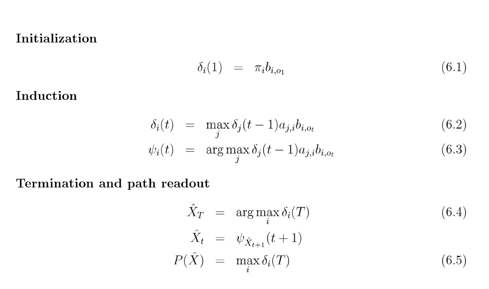

---

<div dir="rtl">בהינתן מאגר של סדרות תופעות ,)' קורפוס '( מהו המודל ההסתברותי המתאים ביותר . עבורו</div>

P(μ|O) argmax μ

<div dir="rtl">ובמילים , אחרות כיצד ' לאמן ' את המודל לאור כמות גדולה של תופעות שנצפו בעבר לאור ( פלט</div>

<div dir="rtl">גדול של .)' המכונה '</div>

<div dir="rtl">נשים , לב כי אם המידע במאגר היה כולל לא רק את התופעות / הפלט צבעי ( ) הדגלים אלא גם את</div>

<div dir="rtl">' הסבר ' ה , שלהם כלומר את עוצמת / המצב הרוח הכל יום (< , אדום ,> חזק , לבן < בינוני >, … .)</div>

<div dir="rtl">חישוב ההסתברויות עבור התאים במטריצות היה . פשוט</div>

```
a i,j = number of transitions from state i to state j / number of transitions from state i
b i,k = number of emitions of output-symbol k from state i / number of transitions of state
i
π i = number of times a sequence starts from sate i / number of sequences
```

<div dir="rtl">כינינו לימוד , שכזה על בסיס מאגר שבו יש גם הסבר , לתופעות לימוד מונחה .</div>

<div dir="rtl">, אנו , כזכור מעונינים במשימה מתאגרת יותר של לימוד לא מונחה – המאגר לאימון המודל כולל רק</div>

<div dir="rtl">את התופעות ללא ההסברים רק ( את צבעי הדגלים בדוגמא .) שלנו</div>

<div dir="rtl">לשם כך קיימת משפחה של אלגוריתמים המכונה Expectation-Maximization (EM .)</div>

<div dir="rtl">המבנה הכללי של אלגוריתמים : אלו</div>

<div dir="rtl">o התחלה ממודל כלשהו כמו ( אתחול אקראי של הפרמטרים של המודל או מאיתחול מושכל</div>

```
) יותר
```

<div dir="rtl">o כל עוד המודל מתעדכן משמעותית</div>

<div dir="rtl">▪קריאת מאגר הנתונים ופרשנותו לאור המודל הנוכחי ( Expectation )</div>

<div dir="rtl">▪עדכון המודל כך שיסביר טוב יותר את הנתונים ( Maximization )</div>

<div dir="rtl">עבור מודל , מרקוב קיים אלגוריתם EM , המכונה אלגוריתם , וולש - באום והמוגדר באופן : הבא</div>

```
a i,j = number of expected (according to current model) transitions from state i to state j /
number of expected (according to current model) transitions from state i
b i,k = number of expected (according to current model) emitions of symbol k from state i /
number of expected (according to current model) visits in state i
```

---

π i = number of expected (according to current model) times a sequence starts from sate i / number of sequences

```
משפט
איגון - באום (
1967 :)
=>
P(μ|O) P(μ’| O
)
```

<div dir="rtl">במילים , אחרות בכל סיבוב של קריאת המאגר ועדכון , המודל מקבלים מודל לא פחות טוב . מהקדום , כלומר</div>

<div dir="rtl">האלגוריתם . מתכנס</div>

<div dir="rtl">6.3 מודל מרקוב עבור בעיית תיוג חלקי הדיבר / מציאת הקטגוריה הלקסיקאלית של כל מילה</div>

<div dir="rtl">במשפט</div>

<div dir="rtl">, כזכור בהינתן , משפט אנו מעוניינים למצוא את הקטגוריה שם ( , עצם , פועל )... תואר של כל . מילה</div>

<div dir="rtl">כדי ללמוד זאת באופן אוטומטי ממאגר טקסט לא , מנותח בחרנו במודל . מרקוב</div>

<div dir="rtl">כיצד ניתן לייצג במודל מרקוב את הבעיה ? שלנו</div>

<div dir="rtl">נחשוב על המודל כמכונה שמייצרת . מילים כלומר כל סדרת פלט היא . משפט</div>

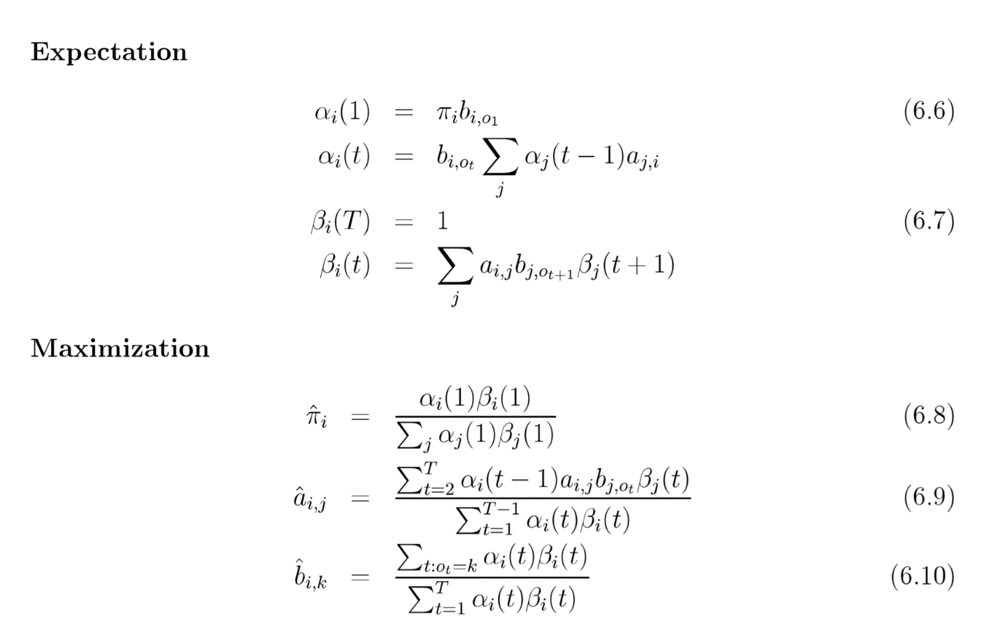

---

<div dir="rtl">מהם המצבים במכונה ? זו , כלומר מהם הגורמים היוצרים את המילים ?) התופעות (</div>

<div dir="rtl">🡨הקטגוריות . הלקסיקאליות</div>

<div dir="rtl">o המכונה בוחרת קטגוריה התחלתית , למשפט על פי הווקטורπשם [ ] עצם</div>

<div dir="rtl">o מכאן , ואילך עד סוף המשפט</div>

<div dir="rtl">▪המכונה מייצרת מילה פ " ע הקטגוריה הנוכחית ומטריצה B ] ילד [</div>

<div dir="rtl">▪המכונה עוברת לקטגוריה חדשה ] פועל [</div>

<div dir="rtl">דוגמא למודל : שכזה</div>

```
S שם {
, עצם , פועל } תואר
K
{
, ספר } עזר
```

: µ
A

<div dir="rtl">שם עצם פועל תואר</div>

<div dir="rtl">שם עצם 0.1 0.5 0.4</div>

<div dir="rtl">פועל 0.7 0.1 0.2</div>

<div dir="rtl">תואר 0.4 0.5 0.1</div>

B
Π
( 0.2 , 0.2 , 0.6 )

<div dir="rtl">כיצד נבחר את ההסתברויות ? בטבלאות</div>

<div dir="rtl">עזר ספר</div>

<div dir="rtl">0.1 0.9 שם עצם</div>

<div dir="rtl">0.4 0.6 פועל</div>

<div dir="rtl">1 0 תואר</div>

---

<div dir="rtl">נאתחל את , הטבלאות ונאמן אותן לאור מאגר גדול של , משפטים עם אלגוריתם . וולש - באום</div>

<div dir="rtl">בהינתן , משפט כיצד נבחר את הקטגוריות ? המתאימות</div>

<div dir="rtl">ספר ' ' עזר</div>

<div dir="rtl">יש למצוא את סדרת המצבים ) קטגוריות =( המסתברת ביותר שיצרה פלט זה המשפט =( ) הנתון –</div>

<div dir="rtl">אלגוריתם ויטרבי . לעיל</div>

<div dir="rtl">6.4 עיצוב אלגוריתם האימון בתבנית Map-Reduce</div>

<div dir="rtl">, מסתבר שאיכות אלגוריתם האימון במקרים רבים תלויה בגודל הקורפוס מאגר ( .) הטקסטים</div>

<div dir="rtl">🡨 יש לתמוך בהרצת האלגוריתם על big data , מאגר עצום של . טקסטים</div>

<div dir="rtl">🡨 יש לעצב את אלגוריתם האימון כתוכנית Map-Reduce</div>

<div dir="rtl">עיצוב</div>

<div dir="rtl">הנחות על הזיכרון : נניח כי ניתן לשמור את המודל ההסתברותי ( A,B, Π ) . בזיכרון כלומר ניתן להכיל בזיכרון</div>

<div dir="rtl">2 | S| + |S||K| + |S | . מספרים</div>

<div dir="rtl">משימת המאפר , קטגורית ( :) טבעית מקבל סדרות , פלט מבצע עליהן Expectation , ומחשב את חלק ה</div>

<div dir="rtl">Maximization האפשרי בקונטקסט הקיים - . המונים</div>

<div dir="rtl">משימת הרדיוסר :) קטגורית ( מקבל המונים מסדרות פלט , שונות כפי שחושבו י " ע הפעלות שונות של</div>

<div dir="rtl">מתודת ה map , ומשקלל אותם לכדי השלמת ה maximization .</div>

<div dir="rtl">מהן יחידות המידע עליהן עובדות מתודות ה map וה reduce ?</div>

<div dir="rtl">ובמילים , אחרות מה המפתח במתודת ה map ומה המפתח במתודת ה reduce ?</div>

<div dir="rtl">, נעצב כמו , תמיד את יחידות המידע של , הפונקציות כך שיהיו מינימאליות עבור ביצוע הפעולה כך ( נוכל</div>

<div dir="rtl">למקבל את הפעולות יותר פ " ע :) רצוננו</div>

<div dir="rtl">כדי לבצע expectation נדרשת סדרת פלט אחת משפט ( אחד ) לדוגמא 🡨 מתודת ה map תקבל סדרת</div>

<div dir="rtl">פלט . אחת</div>

<div dir="rtl">כדי לבצע maximization נדרשות כל התובנות עבור שורה אחת בטבלה ( A,B או כל הווקטורΠ ) 🡨 מתודת</div>

<div dir="rtl">ה reduce תקבל את כל המידע עבור שורה באחת . הטבלאות</div>

<div dir="rtl">עיצוב האלגוריתם</div>

Mapper

<div dir="rtl">- טוען באתחול את המודל ההסתברותי האחרון מהסיבוב ( ) הקודם</div>

---

<div dir="rtl">- בהינתן סדרת פלט במתודת ה map , בונה מודל חדש ( A,B, Π ) הכולל את המונים של נוסחאות ה</div>

<div dir="rtl">maximization לאור ה expectation של המשפט . הבודד</div>

<div dir="rtl">- שולח כל שורת מונים במודל החדש שנוצר , לרדיוסרים תחת מפתח . השורה</div>

Reducer

<div dir="rtl">- מקבל במתודת ה reduce רשימת מופעים של אותה שורה מאחת ( , הטבלאות אוΠ ,) כאשר כל</div>

<div dir="rtl">מופע מכיל את המונים של כל תא על ה פי maximization</div>

<div dir="rtl">- מיזוג י " ע ( ) סכימה המונים של כל תא מיזוג ( התובנות מכל סדרות הפלט ) במאגר</div>

<div dir="rtl">- אבחנה : בכל נוסחאות ה maximization , המכנה הוא סכום המונים בשורה🡨חישוב המכנה של כל</div>

<div dir="rtl">, התאים כסכום המונים של התאים . בשורה</div>

<div dir="rtl">- חישוב ההסתברות בכל תא במודל , החדש כחלוקת המונה שלו במכנה . ל " הנ</div>

Class Mapper
Method Initialize

```
<S,A,B, Π >
:= loadPrevModel
Method Map(seqId, seq)
// 1. calc expectation
alpha : = forward(seq, A,B, Π )
beta : = backward(seq, A,B, Π )
// 2. Create new Model
Π ’ := new Vector
A’ := new Table
B’ := new Table
```

// 3. Calc counters for (t := 1 to |seq|)
for s 1 in S

```
B’[s 1 ,seq t ] := B’[s 1 ,seq t ] + alpha[s 1 ,t] ∙ beta[s 1 ,t]
If (t=1)
```

Π ’[s 1 ] := alpha[s 1 ,1] ∙ beta[s 1 ,1] for s 2 in S

```
A[s 1 ,s 2 ]’ := A[s 1 ,s 2 ]’ + alpha[s 1 ,t] ∙ A[s 1, s 2 ] ∙ B[s 2, seq t+1 ] ∙ beta[s 2 ,t+1]
```

// 4. Send the counters to the reducers, line by line Emit(“pi”, Π ’) for s in S

---

```
Emit(“A:” + s, A[s])
Emit(“B:” + s, B[s])
```

Class Reducer

```
method Reduce(lineId, lineCounterss)
// 1. Merge line counters (as given by various output sequences)
// [ [1,2,3] [4,5,6] ] 🡪[5,7,9]
newLine := new Vector
for lineCounters in lineCounterss
add(newLine, lineCounters)
// 2. Calculate den (as the sum of the line counters)
// [5,7,9] 🡪21
den = 0
for counter in newLine
den := den + counter
```

// 3. Calc the probabilities of the line // [5,7,9] 🡪[5/21, 7/21, 9/21] for i := 1 to | newLine |

```
newLine [i] = newLine [i] / den
// 4. Export result (for next training iteration)
Emit(lineId, newline)
```

Class Combiner

```
method Reduce(lineId, lineCounterss)
```

mergedLine := new Vector for lineCounters in lineCounterss

```
add(mergedLine, lineCounters)
Emit(lineId, mergedLine)
```

<div dir="rtl">6.5 אתחול המודל</div>

<div dir="rtl">, ראינו כי אלגוריתם האימון מתחיל ממודל כלשהו ומשפר אותו שוב . ושוב</div>

---

<div dir="rtl">כיצד נאתחל את ? המודל</div>

<div dir="rtl">1. אקראי נזרוק מספרים , בתאים וננרמל כך שכל שורה שווה - ל 1.</div>

A

<div dir="rtl">שם עצם פועל תואר</div>

<div dir="rtl">שם עצם 0.1 0.5 0.4</div>

<div dir="rtl">פועל 0.7 0.1 0.2</div>

<div dir="rtl">תואר 0.4 0.5 0.1</div>

B

<div dir="rtl">עזר ספר</div>

<div dir="rtl">0.1 0.9 שם עצם</div>

<div dir="rtl">0.4 0.6 פועל</div>

<div dir="rtl">1 0 תואר</div>

Π
( 0.5 , 0.3 , 0.2 )

<div dir="rtl">2. התפלגות אחידה</div>

A

<div dir="rtl">שם עצם פועל תואר</div>

<div dir="rtl">שם עצם 0.333 0.333 0.333</div>

<div dir="rtl">פועל 0.333 0.333 0.333</div>

<div dir="rtl">תואר 0.333 0.333 0.333</div>

---

B
Π
( 0.333 , 0.333 , 0.333 )

<div dir="rtl">, מסתבר שאתחולים שכאלו נוטים להוביל את אלגוריתם האימון לנקודת מקסימום . מקומית , כלומר</div>

<div dir="rtl">אלגוריתם האימון של מודל מרקוב רגיש מאוד לתנאי ההתחלה לאתחול ( של .) המודל</div>

<div dir="rtl">אימון [ המודל מנקודת התחלה , זו נותן בעברית מודל עם - כ 80% ] דיוק</div>

<div dir="rtl">🡨ננסה לשפר את אתחול . המטריצות בפרט נתמקד באתחול טוב יותר של מטריצה B.</div>

<div dir="rtl">3. אתחול מטריצה B פ " ע מילון נתון</div>

<div dir="rtl">נתון , לקסיקון / מילון המגדיר עבור כל מילה את רשימת הקטגוריות המתאימות למילה . זו</div>

<div dir="rtl">: לדוגמא</div>

<div dir="rtl">: ספר שם [ , עצם ] פועל</div>

<div dir="rtl">: עזר שם [ , עצם , פועל ] תואר</div>

<div dir="rtl">לאחר : נרמול</div>

<div dir="rtl">עזר ספר</div>

<div dir="rtl">0.5 0.5 שם עצם</div>

<div dir="rtl">0.5 0.5 פועל</div>

<div dir="rtl">0.5 0.5 תואר</div>

<div dir="rtl">עזר ספר</div>

<div dir="rtl">1 1 שם עצם</div>

<div dir="rtl">1 1 פועל</div>

<div dir="rtl">1 0 תואר</div>

<div dir="rtl">עזר ספר</div>

---

<div dir="rtl">אימון המודל מנקודת התחלה , זו נותן בעברית מודל עם 87% . דיוק</div>

<div dir="rtl">ננסה לפתח שיטות אתחול טובות . יותר</div>

<div dir="rtl">4. אתחול מטריצה B על פי שכיחות המילים הדומות</div>

<div dir="rtl">דוגמא : המילה ' את '</div>

<div dir="rtl">המילון מציין 3 קטגוריות אפשריות למילה :' את '</div>

```
o שם
עצם , אֵת ( את '
)' חפירה
```

<div dir="rtl">o מילת יחס , אֶת ( ראיתי ' את )' יוסי</div>

<div dir="rtl">o מילת גוף , ַאת ( את ' באה )' לבקר</div>

<div dir="rtl">🡨אתחול פ " ע המילון ייתן הסתברות אחידה לשלוש , הקטגוריות והסתברות 0 לכל . השאר</div>

<div dir="rtl">המילה ' את ' לכשעצמה ללא ( הקשר של ) משפט מתפרשת ברוב המוחלט של המקרים כמילת , יחס</div>

<div dir="rtl">במספר מקרים קטן כמילת , גוף ובמספר אפסי כשם . עצם</div>

<div dir="rtl">🡨נמשקל את האפשרויות , במילון כך שכל קטגוריה תקבל הסתברות כללית לפגוש בטקסט</div>

<div dir="rtl">במילה תחת קטגוריה . זו</div>

<div dir="rtl">o שם עצם , אֵת ( כמו את ' )' חפירה [ 0.01 ]</div>

```
o מילת
יחס , אֶת ( כמו
ראיתי ' את )' יוסי [
0.9
]
o מילת
גוף , ַאת ( כמו
את ' באה )' לבקר [
0.09
]
```

<div dir="rtl">אם מאגר הטקסטים היה מנותח כך ( שלצד כל מילה מצוינת הקטגוריה ,) שלה אז היינו פשוט</div>

<div dir="rtl">סופרים כמה פעמים הופיעה המילה בכל קטגוריה . ומחלקים</div>

<div dir="rtl">כיצד נעשה , זאת כאשר המאגר אינו ? מנותח</div>

<div dir="rtl">אבחנה : כל אחת , מהקטגוריות גוזרת באופן שונה מילים דומות " ע . הטיות</div>

<div dir="rtl">: לדוגמא</div>

<div dir="rtl">אֵת כשם : עצם , את , אתים , האת , האתים ... אתי</div>

<div dir="rtl">ַאת כמילת : גוף , את , אתה , אתם ... אתן</div>

<div dir="rtl">אֶת כמילת : יחס , את , אותו [ , אותה , אותם , אותן , אתכם , אתכן ] אותנו</div>

<div dir="rtl">0.5 0.5 שם עצם</div>

<div dir="rtl">0.5 0.5 פועל</div>

<div dir="rtl">1 0 תואר</div>

---

<div dir="rtl">🡨 אם אֵת היא שם עצם באופן , כללי אנו מצפים לפגוש במאגר מילים : כמו , את , אתים , האת , האתים</div>

<div dir="rtl">. אתי</div>

<div dir="rtl">אם ַאת היא מילת גוף באופן , כללי אנו מצפים לפגוש במאגר מילים : כמו , את , אתה , אתם . אתן</div>

<div dir="rtl">אם אֶת היא מילת יחס באופן , כללי אנו מצפים לפגוש במאגר מילים : כמו . את</div>

<div dir="rtl">🡨נספור את מופעי המילים הדומות המצופות בכל , קטגוריה ונחשב את ההסתברות של קטגוריה</div>

<div dir="rtl">על פי השכיחות היחסית של המילים בכל . קטגוריה</div>

<div dir="rtl">אלגוריתם איתי - אורנן - לוינגר ( 1995 ) עושה , זאת עם כמה איטרציות : אימון</div>

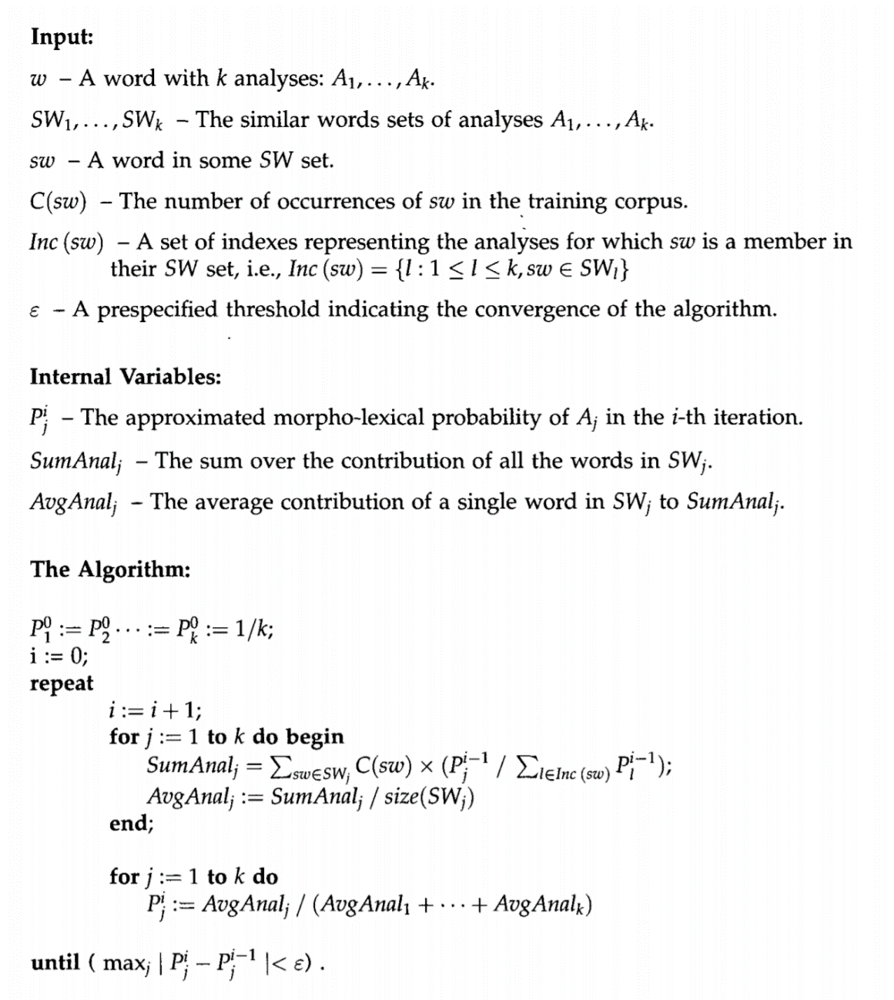

---

<div dir="rtl">אימון המודל לאחר אתחולו בשיטה זו נותן 91% דיוק בניתוח מורפולוגי מלא - כ ( 4000 ) קטגוריות</div>

<div dir="rtl">עבור טקסט , עברי ודיוק של 93% בתיוג של הקטגוריות - כ ( 40 ) קטגוריות</div>

<div dir="rtl">האם נדרש לממש את האלגוריתם בתבנית Map-Reduce ?</div>

<div dir="rtl">- האלגוריתם מבוסס על תשתית של ספירת מילים : בודדות טבלה המציינת כמה פעמים מופיעה</div>

<div dir="rtl">בקורפוס כל מילה . אפשרית</div>

<div dir="rtl">🡨הרצת תוכנית ה WordCount ב Map-Reduce מתחילת . הקורס</div>

<div dir="rtl">- האלגוריתם , עצמו עבור כל מילה , במילון עובר בכל איטרציה על כל אחד מהניתוחים שלה . במילון</div>

<div dir="rtl">יש - כ 100,000 מילים . במילון לכל מילה יש בממוצע שלושה . ניתוחים</div>

<div dir="rtl">האלגוריתם מתכנס די מהר אין ( הרבה ) איטרציות</div>

<div dir="rtl">🡨ניתן להריץ סדרתית</div>

<div dir="rtl">5. אתחול פ " ע הקשרי המילה</div>

<div dir="rtl">ניתן לזהות שני חסרון בגישה הקודמת המבוססת ( על ספירת ההטיות בכל :) קטגוריה</div>

<div dir="rtl">o השיטה מתאימה בעיקר לשפות עם מורפולוגיה עשירה כמו ( עברית ,) וערבית , כלומר</div>

<div dir="rtl">שפות בהן מילה משנה את צורתה בהתאם למאפייני הטיה שונים בכל , קטגוריה כמו , מין</div>

<div dir="rtl">, כמות זמן .' וכד השיטה לא תהיה אפקטיבית בשפות עם מורפולוגיה עניה כמו ( ,) אנגלית</div>

<div dir="rtl">כלומר שפות בהן המילה לא כל כך משנה את צורתה עם שינוי מאפייני , מין כמות .' וכד</div>

<div dir="rtl">o גם עבור שפות עם מורפולוגיה , עשירה לעתים ההטיות בקטגוריות השונות , זהות כך שלא</div>

<div dir="rtl">ניתן להסתמך על שכיחותן . היחסית</div>

<div dir="rtl">: לדוגמא המילה ' של '</div>

<div dir="rtl">, שֶ ל מילת : יחס , שלי , שלך , שלכם שלנו הטיות ( סיומת ) נומיטיב</div>

<div dir="rtl">, שָ ל שם : עצם , שַ ּלי , שלך , שלכם שלנו הטיות ( סיומת ) שייכות</div>

<div dir="rtl">נעריך את הסתברויות הקטגוריות השונות עבור מילה נתונה פ " ע ההקשרים שבהם המילה</div>

<div dir="rtl">מופיעה .</div>

<div dir="rtl">: לדוגמא המילה ' של '</div>

<div dir="rtl">מהם ההקשרים שבהם המילה ' של ' ? מופיעה</div>

<div dir="rtl">בית של בובות</div>

---

<div dir="rtl">הספר של יוסי</div>

<div dir="rtl">מעריב של שבת</div>

<div dir="rtl">לבשתי של ירוק</div>

<div dir="rtl">מצאתי של יפה</div>

<div dir="rtl">ניתן לראות הסביבה ' ש ' הטבעית של המילה ' של ' בשתי הקטגוריות . שונה בשני : הבטים</div>

<div dir="rtl">o מהן המילים משני צידי המילה ' של '</div>

<div dir="rtl">מילת : יחס</div>

<div dir="rtl">בית __ בובות הספר __ יוסי מעריב __ שבת</div>

<div dir="rtl">שם : עצם לבשתי ___ ירוק</div>

<div dir="rtl">מצאתי ___ יפה</div>

<div dir="rtl">o מהן הקטגוריות משני צידי המילה ' של '</div>

<div dir="rtl">מילת : יחס עצם - שם __ עצם - שם עצם - שם __ פרטי - שם פרטי - שם __ עצם - שם</div>

<div dir="rtl">שם : עצם פועל ___ תואר פועל ___ תואר</div>

<div dir="rtl">🡨נגדיר את ההסתברות של כל קטגוריה , למילה פ " ע תבניות המילים מסביבה , בקורפוס פ " וע</div>

<div dir="rtl">תבניות הקטגוריות סביבה בקורפוס ביחס ( לתבניות עבור הקטגוריות האחרות ) למילה</div>

<div dir="rtl">נגדיר את ההסתברות של קטגוריה מסוימת t, עבור הקשר מילים מסויים c</div>

```
p(t|c) = Σ w p(w|c) ∙ p(t|w)
p( מילת
יחס | בית __ בובות )
p( מילת
יחס | ראיתי __ ירוק )
p( שם
עצם | בית __ בובות )
```

---

```
p( שם
עצם | ראיתי __ ירוק )
...
```

<div dir="rtl">כיצד נדע מה ההסתברות של הקטגוריה עבור כל אחת ? מהמילים</div>

```
p(t|w) = Σ c p(c|w) ∙ p(t|c)
p( מילת
יחס | של )
p( שם
עצם | של )
...
בשתי
הנוסחאות , שהגדרנו
יש
ארבעה : ביטויים p(t|w), p(t|c), p(w|c), p(c|w
)
```

<div dir="rtl">נשים לב שהביטויים p(w|c), p(c|w ) ניתנים לחישוב באופן פשוט ( MLE ) על פי מאגר של . טקסט</div>

<div dir="rtl">נשים לב , גם כי ניתן לאתחל את הביטוי p(t|w ) פ " ע המילון בהתפלגות אחידה גישה ( ) ג או פ " ע</div>

<div dir="rtl">משקול המילון לפי שכיחות ההטיות גישה ( ) ד</div>

<div dir="rtl">🡨 o אתחול ▪נחשב את p(w|c), p(c|w ) פ " ע הקורפוס</div>

```
▪נאתחל
את p(t|w
) לפי
אחת
הגישות
הקודמות ) ד , ג (
```

<div dir="rtl">o לולאת אימון מספר [ , פעמים או עד שאין שינוי ] משמעותי</div>

```
▪נחשב ] מחדש [ את p(t|c
) על
פי
הנוסחה
ולאור ]
p(t|w
)
] החדש
```

<div dir="rtl">▪נחשב מחדש את p(t|w ) על פי הנוסחה ולאור ] p(t|c ) ] החדש</div>

<div dir="rtl">תוצאות ניסויות : אתחול מודל מרקוב על פי גישה , זו נתן עבור אנגלית תוצאה שאינה פחותה</div>

<div dir="rtl">ממודלים מורכבים הרבה יותר לאימון מונחה - לא בעברית ( זה לא כל כך , שינה כי ההסתמכות על</div>

<div dir="rtl">ההטיות בגישה ד אפקטיבית .) ביותר</div>

<div dir="rtl">הערה : בגישה , זו האלגוריתם עשוי לתת הסתברויות גדולות - מ 0 קטגוריות / לניתוחים שלא הופיעו</div>

<div dir="rtl">המילון עבור מילה . נתונה</div>

<div dir="rtl">, לדוגמא נניח כי במילון אין אפשרות של שם ' ' פרטי שם [ של בן ] אדם עבור המילה .' אביב ' כלומר</div>

<div dir="rtl">ההסתברות של אפשרות זו תאותחל - ל 0:</div>

<div dir="rtl">p( שם ) אביב | פרטי = 0</div>

<div dir="rtl">אם בתרבות , הנוכחית המאוחרת לכתיבת זמן , המילון כפי שהיא משתקפת בקורפוס , העדכני</div>

<div dir="rtl">' אביב ' הינו שם של , אדם ההקשרים בהם מופיע מילה זו יתאימו לתבנית של שמות . פרטיים כך</div>

<div dir="rtl">שההסתברות המחודשת שתחושב לאפשרות הניתוח שם ' ' פרטי ' אביב ' ל , תגדל ובפועל תתווסף</div>

<div dir="rtl">עבורו אפשרות ניתוח . חדשה</div>

---

<div dir="rtl">מצד אחד זה , טוב מצד שני עשוי להיות פרוע נוסף ( ניתוח חדש , למילה ובעקבות כך נוסף ניתוח</div>

<div dir="rtl">חדש להקשרים שבהם היא , מופיע וחוזר ) חלילה</div>

<div dir="rtl">עיצוב ב Map-Reduce</div>

<div dir="rtl">האלגוריתם מבוסס על מעבר חוזר ונשנה של כל קומבינציות , קטגוריה - הקשר / מילה ולכן מומלץ</div>

<div dir="rtl">לבצעו באופן . מבוזר</div>

<div dir="rtl">אתחול</div>

<div dir="rtl">o חישוב p(w|c), p(c|w ) – פ " ע הפרק בו חישבנו הסתברויות MLE</div>

```
o איתחול p(t|w
) לפי
אחת
הגישות
הקודמות ) ד , ג (
```

<div dir="rtl">לולאה</div>

```
o חישוב p(t|c
) כמשימת Map-Reduce
o חישוב p(t|w
) כמשימת Map-Reduce
```

<div dir="rtl">הקלט למשימות הלולאה</div>

wc.txt

```
word context p(w|c) p(c|w)
```

tw.txt

```
word category p(t|w)
חישוב p(t|c
)
```

Class Mapper1

```
method Map(<c,w,t>, <p tw ,p wc >)
Emit(<t,c>, p tw ∙ p wc )
```

Class Reducer1

```
method Reduce(<t,c>, values)
```

sum := 0 for value in values

```
sum := sum + value
Emit(<t,c>, sum)
```

tc.txt

---

```
context category p(t|c)
חישוב p(t|w
)
```

Class Mapper2

```
method Map(<c,w,t>, <p tc ,p cw >)
Emit(<t,w>, p tc ∙ p cw )
```

Class Reducer2

```
method Reduce(<t,w>, values)
```

sum := 0 for value in values

```
sum := sum + value
Emit(<t,w>, sum)
```

<div dir="rtl">כיצד נדאג לכך ש Mapper1, Mapper2 יקבלו את הקלט המתאים למתודת ה map ?</div>

<div dir="rtl">נשים , לב כי המידע שמגיע למתודת ה map מבוסס על נתונים בשני : קבצים</div>

Mapper1: tw.txt, wc.txt
Mapper2: tc.txt, wc.txt

<div dir="rtl">, כלומר נדרש שידוך של רשומות בקבצים , שונים פ " ע מפתח ' ' זר ( w,c,t )</div>

🡨

<div dir="rtl">- אפשרות : א נניח כי ניתן לאחסן בזיכרון את שני הקבצים הנדרשים בכל סיבוב לא ( ) סקלבילי</div>

<div dir="rtl">- אפשרות : ב נניח כי הקובץ ' ' הקטן ( tw בסיבוב , הראשון tc בסיבוב ) השני נכנס לזיכרון . כלומר</div>

<div dir="rtl">נדרש סיבוב מקדים לפני כל משימה בלולאה של MapperSideJoin</div>

<div dir="rtl">- אפשרות : ג נבצע סיבוב מקדים לפני כל משימה בלולאה של ReducerSideJoin</div>

```
7. ניתוח
תחבירי (
Syntactic Parsing
)
```

<div dir="rtl">7.1 מבנה תחבירי</div>

<div dir="rtl">עד , כה זיהינו את הקטגוריה של כל מילה במשפט , פועל ( , שם .)... תואר</div>

<div dir="rtl">קיימים מקרים שבהם זיהוי הקטגוריות אינו . מספיק : לדוגמא</div>

<div dir="rtl">דני אכל פיצה עם עגבניות</div>

<div dir="rtl">דני אכל פיצה עם חברים</div>

---

<div dir="rtl">למילים בשני המשפטים יש את אותן , קטגוריות אך המבנה של המשפטים ) ומובנם ( : שונה</div>

<div dir="rtl">דני שם [ ] פרטי אכל ] פועל [ פיצה שם [ ] עצם עם מילת [ ] יחס עגבניות שם [ ] עצם</div>

<div dir="rtl">דני שם [ ] פרטי אכל ] פועל [ פיצה שם [ ] עצם עם מילת [ ] יחס חברים שם [ ] עצם</div>

<div dir="rtl">במשפט , הראשון מילת היחס ' עם ' מתייחסת ' עגבניות ' ל</div>

<div dir="rtl">במשפט , השני מילת היחס ' עם ' מתייחסת ' אכל ' ל</div>

<div dir="rtl">🡨 מלבד מציאת הקטגוריות של , המילים יש למצוא גם את היחסים בין המילים במשפט , כלומר מהו מבנה</div>

<div dir="rtl">המשפט – ניתוח תחבירי .</div>

<div dir="rtl">כיצד נמדל / נייצג את המבנה של המשפטים ? בשפה</div>

<div dir="rtl">קיימות שתי : גישות</div>

```
1. מבנה
פסוקיות (
constituency structure
)
```

<div dir="rtl">המשפט מאורגן במבנה של , עץ כאשר המילים הן , העלים והקודקודים השונים מייצגים את הקטגוריות</div>

<div dir="rtl">של חלקי המשפט . השונים</div>

<div dir="rtl">: לדוגמא דני אכל פיצה עם , עגבניות דני אכל פיצה עם חברים</div>

S
NP VP PP
N V N PREP N

<div dir="rtl">דני אכל פיצה עם עגבניות</div>

S
NP VP NP PP
N V N PREP N

<div dir="rtl">דני אכל פיצה עם חברים</div>


---

<div dir="rtl">במודל , זה הגרף מתאר מצד אחד מלמטה '( )' למעלה את היררכיית הקטגוריות של כל , מילה ומצד שני</div>

<div dir="rtl">מלמעלה '( )' למטה את תהליך הגזירה של של , המשפט כלומר את האופן שבו נוצר המשפט</div>

<div dir="rtl">מהקטגוריה הכללית S.</div>

<div dir="rtl">היצירה של המשפט במודל , זה הינה תוצר תהליך מרקובי המבוסס על דקדוק חסר . הקשר</div>

<div dir="rtl">דקדוק זה מגדיר את ההסתברויות לעבור מקטגוריה אחת לסדרת קטגוריות אחרות המטריצה '( A ,)'</div>

<div dir="rtl">וכן את ההסתברויות לעבור מקטגוריה למילה מטריצה '( B )'</div>

<div dir="rtl">: לדוגמא</div>

S 🡪NP VP PP [0.6] S 🡪NP VP NP PP [0.4] NP 🡪N [1] VP 🡪V [1] PP 🡪N PREP N [0.5] PP 🡪PREP N [0.5]

<div dir="rtl">N 🡪 דני [ 0.4 ] N 🡪 פיצה [ 0.4 ] N 🡪 עגבניות [ 0.1 ] N 🡪 חברים [ 0.1 ] V 🡪 אכל [ 1 ] PREP 🡪 עם [ 1 ]</div>

```
2. מבנה
תלויות (
dependency structure
)
```

<div dir="rtl">המשפט מאורגן במבנה של : עץ הקודקודים הם , המילים וצלע בין שתי מילים מציינת קשר תחבירי . ביניהן</div>

<div dir="rtl">: לדוגמא</div>

<div dir="rtl">אכל</div>

<div dir="rtl">דני פיצה</div>

<div dir="rtl">עם</div>


---

<div dir="rtl">עגבניות</div>

<div dir="rtl">אכל</div>

<div dir="rtl">דני פיצה עם</div>

<div dir="rtl">חברים</div>

<div dir="rtl">במודל , זה המידע המרכזי המיוצג הוא לא הקטגוריות של המילים בדרך ( כלל מציינים אותן בקודקוד לצד</div>

<div dir="rtl">,) המילה ולא האופן שבו נוצר , המשפט אלא היחסים בין המילים .</div>

<div dir="rtl">7.2 בעיית הניתוח התחבירי</div>

<div dir="rtl">נתון : משפט</div>

<div dir="rtl">יש למצוא את המבנה התחבירי שלו פ " ע ( אחת ) הגישות</div>

<div dir="rtl">7.2.1 אפליקציות</div>

<div dir="rtl">1. מציאת קבוצות מילים בעלות מכנה משותף על פי הסביבה התחבירית שלהם . בקורפוס</div>

<div dir="rtl">: לדוגמא</div>

<div dir="rtl">הלך</div>

<div dir="rtl">נסע הגיע</div>

<div dir="rtl">דני לחיפה</div>

<div dir="rtl">יוסי לתל אביב</div>

<div dir="rtl">האיש הביתה</div>

<div dir="rtl">האישה</div>


---

<div dir="rtl">2. מענה לשאלות</div>

<div dir="rtl">מי היה בתל אביב בשנה ? שעברה</div>

<div dir="rtl">דני נסע לתל אביב לפני חודש</div>

<div dir="rtl">יוסי ילך לתל אביב מחר</div>

- Information Extraction

<div dir="rtl">חילוץ תובנות של , מידע , עובדות ממאגר עצום של . טקסט</div>

<div dir="rtl">כמו : לדוגמא חילוץ שלשות של , נושא , נשוא . מושא</div>

CIA train exiles, agent, fighter, army use building, missile … provide lists, prof … .

<div dir="rtl">4. פישוט משפטים</div>

<div dir="rtl">ראיתי ילד שנוסע לאט</div>

<div dir="rtl">ראיתי . ילד הילד נוסע לאט</div>

- <span dir="rtl">תרגום</span>

Fruit flies like a banana

<div dir="rtl">6. גרירה טקסטואלית</div>

<div dir="rtl">נתונים שני , משפטים יש לקבוע האם ניתן להסיק ממשפט אחד את המשפט . השני</div>

<div dir="rtl">: לדוגמא דני נסע ביום שלישי בשבוע שעבר לחיפה🡨ישראלי הגיע בשבוע שעבר לצפון</div>

<div dir="rtl">7.2.2 שיטות</div>

<div dir="rtl">כיצד נקבע מהו המבנה התחבירי של משפט ? נתון</div>

<div dir="rtl">1. מבנה פסוקיות</div>

---

<div dir="rtl">, כזכור המשפט במודל זה הינו תוצר של תהליך מרקובי המבוסס על דקדוק הסתברותי מטריצה '( A ,'</div>

<div dir="rtl">מטריצה ' B .)'</div>

🡨

<div dir="rtl">- יש ללמוד את הדקדוק . ההסתברותי הרחבה של אלגוריתם , וולש - באום EM .</div>

<div dir="rtl">- בהינתן דקדוק הסתברותי , ומשפט נשחזר את התהליך שיצר משפט זה סדרת '( ,' המצבים החוקים</div>

<div dir="rtl">שנבחרו ) בתהליך עם אלגוריתם . ויטרבי</div>

<div dir="rtl">ראינו . כבר לא . מעניין גם לא עובד הכי . טוב והמידע גם לא הכי אפקטיבי לא ( ניתן לדוגמא לענות על שאלה</div>

<div dir="rtl">פשוטה : חשובה - וסופר מי הנושא של ) המשפט</div>

<div dir="rtl">2. מבנה תלויות</div>

<div dir="rtl">ניתן לחשוב על הניתוח התחבירי במודל זה כ בעיית סיווג :</div>

<div dir="rtl">- נתון , משפט וכל העצים האפשריים עבורו כל ( העצים האפשריים עבור גרף שהקודקודים שלו הם</div>

```
) המילים
```

<div dir="rtl">- יש לבחור את העץ המתאים ביותר . למשפט</div>

<div dir="rtl">דיברנו כבר בתחילת הקורס על בעיות . סיווג</div>

<div dir="rtl">בבעיות , הסיווג נתון אובייקט ושאלה לאן הוא הוא . שייך המסווג הינו פונקציה המוצאת עבור כל אובייקט</div>

<div dir="rtl">את מחלקת הסיווג . שלו המסווג נבנה בתהליך של אימון פ " ע דוגמאות , מוכנות בתהליך זה נמצא הקשר</div>

<div dir="rtl">בין מאפייני האובייקטים למחלקת הסיווג . שלהם</div>

<div dir="rtl">: לדוגמא סיווג . פירות</div>

<div dir="rtl">נרחיב מעט על בעיה . זו</div>

<div dir="rtl">7.2.2 בעיית הסיווג</div>

<div dir="rtl">, כזכור דיברנו על כך שבעיית הסיווג מבוססת על שלושה : שלבים</div>

<div dir="rtl">1. ייצוג האובייקטים</div>

<div dir="rtl">מהם אוסף המאפיינים המתארים כל ? אובייקט</div>

<div dir="rtl">, לדוגמא עבור : פרי , קוטר , משקל , מרקם צבע</div>

<div dir="rtl">מאפיינים אלו מיוצגים על ידי ווקטור ( 0.3 , 2.3 , 17 , 3 )</div>

---

<div dir="rtl">נסמן את הפונקציה ההופכת אובייקט לווקטור מאפיינים על ידיφ</div>

<div dir="rtl">2. הכנת אוסף דוגמאות</div>

<div dir="rtl">יש להכין אוסף של זוגות של אובייקט המיוצג ( על ידי ווקטור ) מאפיינים ומחלקת הסיווג : שלו</div>

```
{
<
φ (obj), class
}>
```

<div dir="rtl">3. אלגוריתם אימון</div>

<div dir="rtl">האלגוריתם מקבל את אוסף , הדוגמאות והוא לומד פונקציה המקבלת ווקטור מאפיינים של אובייקט</div>

<div dir="rtl">ומחזירה את מחלקת הסיווג המסתברת ביותר . עבורו</div>

<div dir="rtl">יש בעולם אינסוף ... פונקציות</div>

<div dir="rtl">נצטמצם ללימוד פונקציות . לינאריות</div>

<div dir="rtl">יתרה , מכך נצטמצם לפונקציה : מהצורה f(x) = wx</div>

<div dir="rtl">כאשר x הוא ווקטור , מאפיינים ו w הוא ווקטור המציין את המשקל של כל מאפיין</div>

```
f(x) = wx = w 1 x 1 + … + w n x n
```

<div dir="rtl">🡨 אלגוריתם האימון צריך ללמוד רק את ווקטור , המשקולות כלומר את דרגת החשיבות של כל מאפיינם</div>

<div dir="rtl">בשקלול . הכולל כמו כן האלגוריתם צריך ללמוד את ערכי הסף של תוצאת הפונקציית עבור כל מחלקת</div>

<div dir="rtl">. סיווג</div>

<div dir="rtl">7.2.3 הניתוח התחבירי של ( מבנה ) תלויות כבעיית סיווג</div>

<div dir="rtl">ציינו כבר קודם : נתון , משפט וכל העצים . האפשריים יש לקבוע לאיזה עץ מחלקת '( )' סיווג שייך . המשפט</div>

<div dir="rtl">דומה לסיווג , פירות אך : שונה</div>

<div dir="rtl">- כמות מחלקות הסיווג במקרה שלנו עצומה מספר ( העצים האפשרי מול מספר סוגי הפירות</div>

```
) השונים
```

<div dir="rtl">- האובייקט עצמו - המילים במשפט – דל במאפיינים פוטנציאליים בניגוד ( למאפיינים הרבים של</div>

```
.) הפרי
```

<div dir="rtl">האלגוריתם שנציג ( , קולינס 2004 ) מתמודד עם שתי נקודות : אלו</div>

<div dir="rtl">- נראה להלן</div>

<div dir="rtl">- המאפיינים של משפט יכללו גם את מאפייני מחלקת הסיווג שלו כלומר ( מאפייני אחד ) העצים</div>

---

<div dir="rtl">הרעיון הכללי :</div>

<div dir="rtl">- אתחול o ווקטור משקולות 0</div>

<div dir="rtl">o ייצור כל העצים האפשריים עבור כל משפט באוסף , הדוגמאות וייצוג כל עץ כווקטור</div>

<div dir="rtl">. מאפיינים</div>

<div dir="rtl">- בכל איטרציית אימון</div>

<div dir="rtl">o עבור כל דוגמת אימון , משפט ( כל העצים האפשריים , עבורו העץ שנבחר עבורו ) ידנית</div>

<div dir="rtl">▪בחירת העץ המתאים למשפט פ " ע ווקטור המשקולות הנוכחי</div>

<div dir="rtl">●עוברים על כל העצים האפשריים עבור משפט זה</div>

<div dir="rtl">●מחשבים את הפונקציה f(x) = wx עבור ווקטור המאפיינים הנוכחי x</div>

<div dir="rtl">●בחירת העץ שנתן את הערך הגבוה ביותר לפונקציה</div>

<div dir="rtl">▪השוואת הבחירה פ " ע המודל הנוכחי לעץ הנבחר ידנית</div>

<div dir="rtl">●אם הוא שונה – תיקון ווקטור המשקולות בהתאם</div>

```
Perceptron( { <X t , Y t > } (
w 0 = (0, … ,0)
k = 0
// the current version of w
for n : 1 … N // N training iterations
```

for t : 1 … T // T training examples

```
y’ := argmax y’ w k φ (x t ,y’) // select the tree which maximizes the function according to W
if (y’ != y t ) // the correct tree was not selected
```

w k+1

```
= w k + φ (x t ,y t ) - φ (x t ,y’)
k := k +1
```

<div dir="rtl">בתום , התהליך יש ווקטור משקולות w .</div>

<div dir="rtl">בהינתן משפט חדש לניתוח x, נחשב את הפונקציה w φ (x,y )’ עבור כל העצים האפשריים y’ , למשפט</div>

<div dir="rtl">ונבחר את העץ שנותן ערך מקסימלי . לפונקציה</div>

<div dir="rtl">דוגמא :</div>

<div dir="rtl">נתונות שתי דוגמאות בקלט עבור תהליך : האימון</div>

<div dir="rtl">X1 : ילדה אכלה תפוח</div>

<div dir="rtl">Y1 : ילדה אכלה תפוח</div>


---

<div dir="rtl">X2 : ספר עזר</div>

<div dir="rtl">Y2 : ספר עזר</div>

<div dir="rtl">קביעת המאפיינים</div>

<div dir="rtl">נניח כי לכל מילה במשפט מצוינת בעץ גם הקטגוריה שלה</div>

<div dir="rtl">X1 : ילדה אכלה תפוח</div>

<div dir="rtl">Y1 : ילדה אכלה תפוח</div>

noun verb noun

<div dir="rtl">X2 : ספר עזר</div>

<div dir="rtl">Y2 : ספר עזר</div>

noun adj

<div dir="rtl">נגדיר את המאפיינים , הבאים על בסיס category X {head, child }</div>

<div dir="rtl">המונחים ( head, child קשורים לתאוריה בלשנית על דבר יחסי ' ' הכוח בין , המילים איזו מילה ' שולטת ' ואיזו</div>

<div dir="rtl">,' נשלטת ' כפי שבא לידי ביטוי בכיוון של הצלע המכוונת ) ביניהן</div>

head-noun head-verb head-adj child-noun child-verb child-adj

<div dir="rtl">נייצר את כל העצים האפשריים לכל , דוגמא ונבנה כבר כעת את ווקטור המאפיינים עבור כל : אחד</div>

<div dir="rtl">X1 : הילדה אכלה תפוח</div>

<div dir="rtl">Y11 : ילדה אכלה תפוח ( 0,1,0,2,0,0 )</div>

<div dir="rtl">Y12 : ילדה אכלה תפוח ( 1,1,0,1,0,0 )</div>

<div dir="rtl">Y13 : ילדה אכלה תפוח ( 2,0,0,1,1,0 )</div>

<div dir="rtl">X2 : ספר עזר</div>

```
Y21
: ספר
עזר (
1,0,0,0,0,1
)
Y22
: ספר
עזר (
0,0,1,1,0,0
)
```

<div dir="rtl">נאתחל את ווקטור : המשקולות</div>


---

```
W 0 = (0,0,0,0,0,0)
```

<div dir="rtl">איטרציות האימון</div>

```
N = 1
t=1
```

<div dir="rtl">יש , לבחור על פי ווקטור המשקולות , הקיים את העץ שנותן הערך הגבוה ביותר עבור : הפונקציה</div>

```
w 0 φ (x 1 ,y 11 ) = (0,0,0,0,0,0) ∙ (0,1,0,2,0,0) = 0
w 0 φ (x 1 ,y 12 ) = (0,0,0,0,0,0) ∙ (1,1,0,1,0,0) = 0
w 0 φ (x 1 ,y 13 ) = (0,0,0,0,0,0) ∙ (2,0,0,1,1,0) = 0
```

<div dir="rtl">בפעם הראשונה כל העצים שווים כי ווקטור המשקולות 0. נניח כי נבחר אקראית העץ השלישי Y13</div>

<div dir="rtl">העץ הנבחר Y13 שונה מהעץ שתויג ידנית עבור הדוגמא Y1 🡨 יש לתקן את וקטור : המשקולות</div>

w 1

```
= w 0 + φ (x 1 ,y 1 ) - φ (x 1 ,y 13 ) = (0,0,0,0,0,0)+ - (0,1,0,2,0,0) (2,0,0,1,1,0) = (-2,1,0,1,-1,0)
t=2
w 1 φ (x 2 ,y 21 ) = (-2,1,0,1,-1,0) ∙ (1,0,0,0,0,1) = -2 + 0 +0 + 0 +0 + 0 = -2
w 1 φ (x 2 ,y 22 ) = (-2,1,0,1,-1,0) ∙ (0,0,1,1,0,0) = 0 + 0 + 0 +1 + 0 + 0 = 1
```

<div dir="rtl">העץ הנבחר Y22 שונה מהעץ שתויג ידנית עבור הדוגמא Y2 🡨 יש לתקן את וקטור : המשקולות</div>

w 2

```
= w 1 + φ (x 2 ,y 2 ) - φ (x 2 ,y 22 ) = (-2,1,0,1,-1,0) + - (1,0,0,0,0,1) (0,0,1,1,0,0) = (-1,1,-1,0,-1,1)
N=2
```

...

<div dir="rtl">בעיה חישובית : קיים עצום של עצים אפשריים למשפט .) אקספוננציאלי ( לא ניתן באמת חישובית לבצע</div>

<div dir="rtl">זאת שוב . ושוב</div>

<div dir="rtl">פיתרון : נבחר את העץ המתאים ביותר בגישה : אחרת העץ הנבחר הוא העץ ששילוב איכות הצלעות שלו</div>

<div dir="rtl">, בנפרד נותן את הערך הגבוה . ביותר</div>

<div dir="rtl">בגישה , זו המאפיינים הינם מאפיינים של צלע בודדת ולא של עץ שלם .</div>

---

<div dir="rtl">, כלומר נחליף את השורה</div>

```
y’ := argmax y’ w k φ (x t ,y’)
```

<div dir="rtl">: בשורה</div>

```
y’ := argmax E in VXV Σ e in E w k φ (e)
```

<div dir="rtl">בנוסחה , זו עוברים על כל קבוצות הצלעות האפשריות ומגדירים את האיכות של הקבוצה פ " ע סכום ערכי</div>

<div dir="rtl">הפונקציה על כל מאפייני צלע בודדת . בנפרד</div>

<div dir="rtl">מדובר למעשה במציאת עץ פורש מקסימלי לגרף ממושקל נדגים ( ) מיד – ניתן לבצע אותה ב O(n 3 ,) עבור n</div>

<div dir="rtl">. קודקודים</div>

<div dir="rtl">: דוגמא</div>

<div dir="rtl">: המשפט הילדה אכלה תפוח</div>

```
ווקטור : המשקולות (
1,0,0,2,3,0
)
```

<div dir="rtl">יש למצוא את העץ המסתבר ביותר על פי ווקטור המשקולות . הנוכחי</div>

<div dir="rtl">נבנה תחילה את הגרף המלא עבור : המשפט ילדה</div>

<div dir="rtl">אכלה</div>

<div dir="rtl">תפוח</div>

<div dir="rtl">נבנה לכל צלע בנפרד ווקטור , מאפיינים ונמשקל את הצלע פ " ע ערך הפונקציה עם ווקטור המשקולות</div>

<div dir="rtl">: הנוכחי</div>

```
ילדה 🡨 אכלה (
1,0,0,0,1,0
)
w φ (e 1 ) =
(1,0,0,2,3,0) ∙ (1,0,0,0,1,0) = 4
ילדה 🡨 תפוח (
1,0,0,1,0,0
)
w φ (e 2 ) =
(1,0,0,2,3,0) ∙ (1,0,0,1,0,0) = 1
אכלה 🡨 ילדה (
0,1,0,1,0,0
)
w φ (e 3 ) =
(1,0,0,2,3,0) ∙ (0,1,0,1,0,0) = 2
אכלה 🡨 תפוח (
0,1,0,1,0,0
)
w φ (e 4 ) =
(1,0,0,2,3,0) ∙ (0,1,0,1,0,0) = 2
תפוח 🡨 ילדה (
1,0,0,1,0,0
)
```


---

```
w φ (e 5 ) =
(1,0,0,2,3,0) ∙ (1,0,0,1,0,0) = 3
תפוח 🡨 אכלה (
1,0,0,0,1,0
)
w φ (e 6 ) =
(1,0,0,2,3,0) ∙ (1,0,0,0,1,0) = 4
```

<div dir="rtl">נמצא את העץ הפורש המקסימאלי עבור הגרף הממושקל המלא . שיצרנו</div>

<div dir="rtl">חיסרון : ווקטור המאפיינים מבוסס כל פעם רק על צלע , אחת ולא על כל . העץ מצמצם מאוד את אפיון</div>

<div dir="rtl">. המשפט לא ניתן לדוגמא להגדיר מאפיין של לכמה ' קודקודים יש בן מסוג שם עצם ובן מסוג ' תואר יהיה (</div>

<div dir="rtl">קשה יותר להבחין בין אכל ' פיצה עם ' חברים ל אכל ' פיצה עם )' עגבניות</div>

<div dir="rtl">🡨 נחזור להערכה הקודמת על בסיס כל העצים , האפשריים ונבצע את האלגוריתם בתבנית map-reduce ,</div>

<div dir="rtl">כך שרמת המקבול יכולה להגיע למחשב אחד מעבד דוגמא אחת בלבד באיטרציה . אחת</div>

<div dir="rtl">נשים לב , לכך כי המקבול נדרש כאן לא בשל הכמות העצומה של המידע בקלט אין ( הרבה ,) דוגמאות אלא</div>

<div dir="rtl">בשל סיבוכיות . האלגוריתם</div>

<div dir="rtl">עיצוב Map-Reduce עבור אלגוריתם Perceptron ללימוד ווקטור משקולות עבור הניתוח התחבירי</div>

<div dir="rtl">הרעיון הכללי :</div>

<div dir="rtl">- כל איטרציית אימון היא סיבוב אחד של M-R</div>

<div dir="rtl">- כל Mapper מקבל רק חלק מהדוגמאות ברמת ( המקבול הגבוהה , היותר על Mapper מקבל</div>

<div dir="rtl">דוגמא אחת , בלבד כחומר ספליט הכולל דוגמא .) אחת</div>

<div dir="rtl">- בשלב , האתחול ה Mapper קורא את ווקטור המשקולות האחרון מהאיטרציה ( ) הקודמת</div>

<div dir="rtl">- מתודת ה map מקבלת דוגמא , משפט ( והעץ הנכון ,) עבורו מריצה את העיבוד של הדוגמא פ " ע</div>

<div dir="rtl">האלגוריתם מציאת ( העץ המתאים מבין האפשריים והשוואתו לעץ ,) הנכון ומעדכנת מקומית את</div>

<div dir="rtl">ווקטור . המשקולות</div>

<div dir="rtl">- בסוף משימת ה Mapper , ווקטור המשקולות , המקומי שעודכן פ " ע הדוגמאות שהגיעו למשימה , זו</div>

<div dir="rtl">יישלח . לרדיוסר</div>

<div dir="rtl">- הרדיוסר ) היחיד ( יימזג את כל ווקטורי המשקולות שהוא , קיבל מקבוצות הדוגמאות . השונות וכותב</div>

<div dir="rtl">את ווקטור המשקולות לסיבוב . הבא</div>

Class Mapper
Method Initialize

```
w 0 := loadLastW()
k: = 0
```

---

```
Method Map(x t ,y t )
y’ := argmax y’ w k φ (x t ,y’)
if (y’ != y t )
```

w k+1

```
= w k + φ (x t ,y t ) - φ (x t ,y’)
k := k + 1
Method Close()
Emit(“w”, w k )
```

Class Reducer

```
Method Reduce(key, Ws)
```

Wsum := (0, … ,0) for W in Ws

```
Wsum := Wsum + W
Emit(“W”, Wsum)
```

<div dir="rtl">מה אנחנו מפסידים בעיצוב המקבילי ? הזה</div>

<div dir="rtl">באלגוריתם , המקבילי נקודת הבסיס לעיבוד דוגמא מסויימת היא ווקטור המשקולות מהאיטרציה . הקודמת</div>

<div dir="rtl">בעוד שבאלגוריתם , הסדרתי ווקטור המשקולות הבסיסי לכל דוגמא היה הווקטור שנלמד על ידי הדוגמא</div>

<div dir="rtl">הקודמת באיטרציה . הנוכחית</div>

<div dir="rtl">האם זה ? משנה עד ? כמה</div>

<div dir="rtl">Mc Donald et al. 2010 בדקו שאלה זו במסגרת ( הצעת עיצוב ה M-R שראינו זה ) עתה ומצאו כי ' הפסד ' ה</div>

<div dir="rtl">אינו : מרובה</div>

<div dir="rtl">אחוזי הדיוק של מסווג שאומן באלגוריתם : הסדרתי 84.7%</div>

<div dir="rtl">אחוזי הדיוק של מסווג שאומן באלגוריתם : המקבילי 84.5%</div>

<div dir="rtl">בניסוי , שלהם רמת המקבול לא היתה דוגמא אחת ל Mapper , אחד אלא כל מאפר קיבל קבוצת . דוגמאות</div>

<div dir="rtl">מעניין יהיה , לבדוק מה יהיו התוצאות ברמת המקבול המקסימאלית משפט ( פר .) מאפר</div>

<div dir="rtl">הערה : מודל גנרטיבי מול מודל דיסקרימינטיבי</div>

<div dir="rtl">בשתי הבעיות האחרונות פגשנו שני סוגים של . מודלים</div>

<div dir="rtl">בעיית התיוג מציאות ( הקטגוריות של ) המילים – מודל : מרקוב מודל גנרטיבי</div>

<div dir="rtl">- ראינו את הטקסט כתוצר של , תהליך פלט של מכונה</div>

<div dir="rtl">- : אימון מציאת הפרמטרים הסמויים של המכונה / המודל המטריצות ( A,B )</div>

<div dir="rtl">הפונקציה הנלמדת היא פונקציית הסתברות יצירת , הפלט כלומר פונקציית ה joint :</div>

100

---

```
P(X,Y) = P(Y|X)P(X)
```

<div dir="rtl">במודל מרקוב נדרשנו לדוגמא ללמוד את הסתברות המצב ואת ההסתברות לייצר ממנו . פלט</div>

<div dir="rtl">- : ניתוח שחזור התהליך שייצר את , הטקסט מה קרה במכונה מהי ( סדר הקטגוריות / המצבים</div>

<div dir="rtl">שמסבירה הכי טוב את המשפט ) שנוצר</div>

<div dir="rtl">בעיית הניתוח התחבירי – : מסווג מודל דיסקרימינטיבי</div>

<div dir="rtl">- הטקסט הוא לא פלט של , מכונה אלא קלט שצריך למצוא את תכונותיו במקרה ( , שלנו צלעות בין</div>

```
.) מילים
```

<div dir="rtl">- : אימון מציאת פונקציה הקושרת בין הטקסט / הקלט הסיווג - למחלקת / לתכונותיו העץ ( ) המתאים</div>

<div dir="rtl">הפונקציה הנלמדת היא פונקציית ההסתברות המותנית P(Y|X .) בהינתן אלמנט X מה ההסתברות</div>

<div dir="rtl">שמאפייניו הם Y. בדרך כלל בוחרים פונקציה כלשהי ' מקובלת ' ולומדים מהדאטה את הפרמטרים</div>

<div dir="rtl">. שלה כלומר ממקסמים באימון את P(Y|X .)</div>

<div dir="rtl">באימון המנתח התחבירי לדוגמא בחרנו בפונקציה הלינארית f(x)=wx ולמדנו את פרמטר</div>

<div dir="rtl">המשקולות w .</div>

<div dir="rtl">- : ניתוח הפעלת הפונקציה שנלמדה על הקלט ) הטקסט ( לשם קבלת תכונותיו ) העץ (</div>

<div dir="rtl">8. סיווג מסמכים</div>

<div dir="rtl">בפרק , זה נבחן מספר שיטות לחלוקת קבוצות מסמכים , לקבוצות כאשר לכל קבוצת מסמכים יש מאפיין</div>

<div dir="rtl">. דומה ואף ננסה לאפיין את ' נושא ' ה שבו עוסקת כל קבוצת . מסמכים</div>

<div dir="rtl">שימושים :</div>

<div dir="rtl">- מנוע חיפוש המאפשר חיפוש פ " ע . נושאים במנוע , שכזה התוצאות יהיו מסמכים העוסקים</div>

<div dir="rtl">בנושאים העולים . מהשאילתא</div>

<div dir="rtl">- יצירת מאגר הומוגני ללמידה . בהמשך קיימים אלגוריתמי למידה העובדים טוב יותר כאשר הקלט</div>

<div dir="rtl">מורכב ממסכמים בעלי מאפיינים דומים אולי ( נראה כזה .) בהמשך</div>

- ....

<div dir="rtl">שיטות :</div>

<div dir="rtl">- האם מסמך שייך לנושא אחד בלבד ( hard ,) או שהוא תמהיל של נושאים ( soft )</div>

<div dir="rtl">- האם יש מידול של הנושאים ( topic modeling ) או רק חלוקה לקבוצות ( clustering )</div>

<div dir="rtl">- האם הלימוד הוא מונחה ( supervised , לימוד מדוגמאות מנותחות ) ידנית או שהוא אינו מונחה</div>

```
(
unsupervised
, לימוד
מהטקסט
הנתון ) לכשעצמו
```

<div dir="rtl">- מודל גנרטיבי או מודל דיסקרימינטיבי</div>

<div dir="rtl">אנו נתמקד בכמה שיטות : קונקרטיות</div>

- <span dir="rtl">אלגוריתם K-means: hard, clustering, unsupervised</span>
- <span dir="rtl">אלגוריתם LSI: soft, unsuprevised, clustering</span>

101

---

- <span dir="rtl">אלגוריתם LDA: soft, topic modeling, unsupervised</span>
- <span dir="rtl">רשת : נוירונים soft, topic modeling, supervised</span>

8.1 K-Means

<div dir="rtl">אלגוריתם K-means מחלק קבוצת מסמכים נתונה ל K קבוצות כאשר ( ה K הוא פרמטר הנבחר י " ע</div>

<div dir="rtl">,) המשתמש כאשר כל מסמך שייך לקבוצה . אחת</div>

<div dir="rtl">הרעיון הכללי :</div>

<div dir="rtl">o מסמך מיוצג י " ע וקטור מאפיינים</div>

<div dir="rtl">▪המאפיינים הפשוטים ביותר יהיו מספר מופעי המילים השונות בשפה במסמך</div>

<div dir="rtl">. הנתון</div>

<div dir="rtl">▪ניתן לכלול במאפיינים גם את הקטגוריות של המילים , פועל ( שם ) עצם</div>

<div dir="rtl">▪ניתן לכלול במאפיינים גם קשרים תחביריים , נושא ( )..., מושא</div>

<div dir="rtl">▪ניתן לכלול גם מאפיינים שהם שילובים של : מאפיינים זוגות , מילים</div>

<div dir="rtl">... קטגוריה - מילה</div>

<div dir="rtl">o קבוצת מסמכים מיוצגת י " ע ווקטור בגודל ( של ווקטור ,) המאפיינים כאשר הווקטורים של</div>

<div dir="rtl">המסמכים השייכים לקבוצה זו קרובים אליו אלגברית הוא ( נמצא ,' מרכזם ' ב ועל כן הוא</div>

<div dir="rtl">מכונה centroid )</div>

<div dir="rtl">o האלגוריתם ▪נבחר אקראית K ווקטורי מרכז ,) צנטרואידים ( כאשר כל אחד מהווקטורים מייצג</div>

<div dir="rtl">קבוצת . מסמכים</div>

<div dir="rtl">▪משייכים לכל צנטרואיד את המסמכים הקרובים , אליו פ " ע המרחק ביניהם מרחק (</div>

```
) ווקטורי
```

<div dir="rtl">▪נגדיר מחדש את הקורדינטות של כל , צנטרואיד כך שהוא יעמוד במרכז של קבוצת</div>

<div dir="rtl">המסמכים ששויכה . לו</div>

<div dir="rtl">▪וחוזר , חלילה עד שאין שינוי</div>

<div dir="rtl">אלגוריתם Lloyd</div>

<div dir="rtl">- נתונים n אובייקטים , לקלסטור המיוצגים י " ע ווקטורי : מאפיינים x 1 … x n</div>

<div dir="rtl">- : אתחול בחירה אקראית של k צנטרואידים m 0 1 … m 0</div>

k

- <span dir="rtl">לולאה</span>

<div dir="rtl">o שיוך כל מסמך לצנטרואיד הקרוב אליו ביותר אלגברית S t</div>

```
i = { x p : argmin i distance(x p , m t
i ) }
```

<div dir="rtl">o חישוב מחדש של קורדינטות , הצנטרואידים כך שיעמדו במרכז המסמכים שלהם</div>

𝑚 𝑖

```
𝑡+1 =
```

𝑥 𝑗 ∈𝑆 𝑖
𝑡 ∑𝑋 𝑗

|𝑆 𝑖

𝑡 |
102

---

<div dir="rtl">עיצוב ב M-R</div>

<div dir="rtl">o כל איטרציית אימון היא סיבוב של M-R</div>

<div dir="rtl">o המאפר מבצע את השלב הראשון – שיוך מסמך לצנטרואיד</div>

<div dir="rtl">▪מקבל מסמך ובודק למי הוא , שייך ושולח את הזוג , קבוצה < < מסמך לרדיוסר</div>

<div dir="rtl">o הרדיוסר יקבל עבור קבוצה מסוימת את כל המסמכים השייכים , לה ויכייל מחדש את</div>

<div dir="rtl">קורדינטת הקבוצה . בהתאם</div>

Class Mapper
Method Initialize

```
centroids := getLastCentroids()
Method Map(docId, docVect)
centroidId := -1
min := infinity
for centroid in centroids
dist := distance(docVext, centroid)
if (dist < min)
min := dist
centroidId := centroid.id
Emit(centroidId, docVect)
```

Class Reducer

```
method Reduce(centId, docVects)
size := 0
newCentroid := (0, … ,0)
for docVect in docVects
newCentroid := newCentroid + docVect
size := size +1
for i :=1 to newCentroid.length
newCentroid i := newCentroid i / size
Emit(centId, newCentroid)
8.2
Latent Semantic Indexing (LSI
)
```

<div dir="rtl">בגישה זו נבצע soft-clustering של מאגר טקסטים ל K נושאים / קבוצות מבלי ( לאפיין את הנושא של כל</div>

<div dir="rtl">.) קבוצה , כלומר כמו K-Means רק שמסמך , שייך בהסתברות , שונה לכל . הנושאים</div>

103

---

<div dir="rtl">נקודת : המוצא מטריצה C הקובעת את מידת השייכות של כל מילה במאגר לכל אחד מהמסמכים קיימות (</div>

<div dir="rtl">גישות שונות לקביעת מידת שייכות , זו נראה בפרק הבא את המדד הקלאסי tf-idf הקובע את מידת</div>

<div dir="rtl">ההתאמה של מילה , למסמך על פי השכיחות היחסית של מילה זו ) במסמך</div>

C

<div dir="rtl">a.txt b.txt c.txt קניה 0.2 0.4 0.1 מכירה 0.5 0.4 0.1 כיסא 0.1 0 0.7 שולחן 0.2 0.2 0.1</div>

<div dir="rtl">ברצוננו להגדיר מטריצה קטנה , יותר עם פחות שורות למעשה ( עם K ,) שורות בה המידע במטריצה</div>

<div dir="rtl">המקורית ' מהודק ' . יותר , כלומר מידת ההתאמה של מילים שונות , למסמכים ייהפכו למידת ההתאמה של</div>

<div dir="rtl">' נושאים ' למסמכים . אלו</div>

<div dir="rtl">a.txt b.txt c.txt [' מסחר '] 0.7 0.8 0.2 [' ריהוט '] 0.3 0.2 0.8</div>

<div dir="rtl">בגישת LSI פעולה זו נעשית באמצעים אלגבריים : טהורים</div>

<div dir="rtl">פורמאלית</div>

<div dir="rtl">נתון מאגר של d , מסמכים ו v מילים שונות בדוגמא ( שלנו d=3, v=4 )</div>

<div dir="rtl">נגדיר את המטריצה C, בגודל vXd , כמייצגת את מידת ההתאמה בין כל מילה i לכל מסמך j: C i,j</div>

```
(
tf-idf או
כל
מדד ) אחר
```

<div dir="rtl">קיימת פעולה אלגברית המכונה Singular Vector Decomposition (SVD ,) המפרקת מטריצה נתונה</div>

<div dir="rtl">לשלוש , מטריצות באופן : הבא</div>

```
C = U 0 Σ o V o
```

<div dir="rtl">: כאשר</div>

<div dir="rtl">U 0 היא מטריצה בגודל vXv</div>

<div dir="rtl">Σ o מטריצה מלבנית אלכסונית בגודל vXd מחוץ ( לאלכסון הכל 0, ) עמודות / שורות</div>

<div dir="rtl">V o היא מטריצה בגודל dXd</div>

<div dir="rtl">Σ o כוללת את כל הערכים העצמיים של C בסדר יורד ( C i,j > C j,i לכל i>j)</div>

<div dir="rtl">U 0, V o : אורתוגונאליות</div>

V o
T V o = I U o

```
T U o = I
```

104

---

<div dir="rtl">מה [ ששורה באחת זו עמודה ] בשניה</div>

<div dir="rtl">מתודת LSI בונה את המטריצה המבוקשת C’ ממטריצות אלו באופן : הבא</div>

<div dir="rtl">- לוקחים את k הערכים העצמיים הגבוהים ביותר מΣ o ומאפסים את . השאר</div>

<div dir="rtl">o כך שיהיו v-k שורות עם אפסים בשל ( האלכסוניּות שלΣ o ) המקורית ו d-k עמודות עם</div>

```
אפסים
עקב ( בחירת k ערכים
עצמיים ) בלבד
```

<div dir="rtl">- זה יגרום לאיפוס השורות והעמודות המקבילות ב U 0, V o מה ( שהיה מתאפס אם היינו מכפילים</div>

<div dir="rtl">אותן בΣ o :) החדשה</div>

<div dir="rtl">o במטריצה U יתאפסו v-k עמודות o במטריצה V יתאפסו d-k שורות</div>

<div dir="rtl">- לאחר מחיקת שורות ועמודות שכולן אפסים : מקבלים מטריצה U בגודל vXk , מטריצהΣבגודל</div>

<div dir="rtl">kXk , מטריצה V בגודל kXd</div>

<div dir="rtl">- נגדיר את C’ : להיות C’ = U Σ V .</div>

<div dir="rtl">C’ היא בגודל vXd כמו C , המקורית אך דרגתה היא k. כלומר יש בה רק k ווקטורים שאינם תלויים . ליניארית</div>

<div dir="rtl">על פי משפט , יונג - אקרט C’ היא הקרוב הטוב ביותר של מטריצות מדרגה k למטריצה C.</div>

<div dir="rtl">, ניסויית בהתאם לשיפוט , אנושי התגלה כי C’ מייצגת טוב יותר דמיון בין מסמכים המרחק ( בין הייצוג</div>

<div dir="rtl">הווקטורי שלהם כטור ) בטבלה ובין מילים המרחק ( הייצוג הווקטורי שלהן כשורה ) בטבלה</div>

<div dir="rtl">ניתן להגדיר באופן מפורש מטריצות עם k עמודות / שורות באופן : הבא</div>

<div dir="rtl">D = Σ V , בגודל kXd</div>

<div dir="rtl">W = U Σ , בגודל vXk</div>

<div dir="rtl">- המטריצה D נותנת למעשה soft-clustering של כל מסמך - ל k ,' נושאים ' המוטיבציה שלנו בפרק</div>

<div dir="rtl">. זה</div>

<div dir="rtl">- מלבד , זאת ניתן להשתמש - ב D כדי להעריך את מידת הדמיון בין שני מסמכים על פי ווקטורח</div>

<div dir="rtl">' הנושאים ' . שלהם</div>

D

<div dir="rtl">a.txt b.txt c.txt [' מסחר '] 0.7 0.8 0.2 [' ריהוט '] 0.3 0.2 0.8</div>

<div dir="rtl">- המטריצה W מתארת למעשה soft-clustering של כל מילה - ל k .' נושאים '</div>

<div dir="rtl">מלבד , זאת ניתן להשתמש - ב W כדי להעריך את מידת הדמיון בין שתי מילים על פי ווקטור</div>

<div dir="rtl">' הנושאים ' . שלהם</div>

105

---

<div dir="rtl">בניגוד למודל הסטנדרטי של distributional similarity , בו מיוצגת כל מילה על ידי וקטור דליל עם</div>

<div dir="rtl">מאפיינים רבים המילה ( , לפניה המילה , לאחריה קומבינציות ) שונות כאן הווקטור קטן בסדרי גודל</div>

<div dir="rtl">– המאפיינים הם K .' נושאים ' ה יואב גולדברג ורועי לוי הראו כי גישה זו משיגה את אותן תוצאות</div>

<div dir="rtl">של word embedding .) להלן ( W</div>

<div dir="rtl">[' מסחר '] [' ריהוט '] קניה 0.8 0.2 מכירה 0.9 0.1 כיסא 0.3 0.7 שולחן 0.4 0.6</div>

<div dir="rtl">- חיפוש מילה מבוסס ' נושאים '</div>

<div dir="rtl">בהינתן מילה לחיפוש w i , השורה W i מגדירה את התפלגות הנושאים . למילה מידת ההתאמה של</div>

<div dir="rtl">כל נושא לכל מסמך מוגדרת י " ע המטריצה D . כלומר מידת ההתאמה של המילה i למסמך j : היא</div>

𝑘 ∑𝑊 𝑖,𝑘 𝐷 𝑘,𝑗

<div dir="rtl">בעיה : פעולת ה SVD כבדה , מאוד בפרט עבור מטריצות גדולות , דאטה - ביג ( הרבה , מסמכים הרבה ) מילים</div>

<div dir="rtl">🡨 נמקבל אותה</div>

<div dir="rtl">בעיה : לא ידוע על אלגוריתם מקבילי לבעיה . זו</div>

<div dir="rtl">בלי קשר לשאלת , המקבול Gao & Zhung (2005 ) כי שיטת LSI אפקטיבית הרבה יותר אם הקורפוס</div>

<div dir="rtl">המקורי הומוגני יותר המסמכים ( סובבים סביב מספר קטן של .) נושאים</div>

<div dir="rtl">במידה והקורפוס המקורי מגוון , מדי הם מציעים תחילה לבצע קלאסטרינג קשיח שלו לקבוצות נניח ( עם</div>

<div dir="rtl">k-means ) ואחר כך להפעיל את LSI בנפרד על כל . קבוצה</div>

<div dir="rtl">באופן , זה מסמך קשור תחילה לקבוצה , אחת ובתוך קבוצה זו להתפלגות של .' נושאים '</div>

<div dir="rtl">ניתן להמשיך כיוון , זה ולפתור בעזרתו גם את הבעייה החישובית של חוסר : המקבול</div>

<div dir="rtl">- נחלק את הקורפוס ל K קבוצות עם K-means בעזרת Map-Reduce</div>

<div dir="rtl">- נפעיל את LSI סדרתית על כל , קבוצה במקביל לא ( , קריטי אין big data של .) קבוצות באופן זה</div>

<div dir="rtl">כאשר אוסף המסמכים קטן יותר וה SVD פחות . כבד</div>

```
8.3
Latent Dirichlet Allocation (LDA
)
```

<div dir="rtl">Topic modeling : למעשה מבוצע soft clustering כל ( מסמך ישויך בהתפלגות לכמה ,) קבוצות תוך אפיון</div>

<div dir="rtl">הנושא של כל . קבוצה</div>

<div dir="rtl">המודל הפעם גנרטיבי ומכאן ( גם unsupervised , נלמד רק .) מהטקסטים פ " ע מודל , זה המסמכים במאגר</div>

<div dir="rtl">נוצרו י " ע התהליך : הבא</div>

106

---

<div dir="rtl">בהינתן שיש K : נושאים</div>

<div dir="rtl">- עבור כל נושא</div>

<div dir="rtl">o בחר את תמהיל המילים בנושא , זה כלומר התפלגות הקובעת מה ההסתברות של כל</div>

<div dir="rtl">מילה להיות שייכת לנושא מה ( ההסתברות ' כסא ' ש שייך ,' ספורט ' ל מה ההסתברות</div>

<div dir="rtl">' שולחן ' ש שייך .)' ספורט ' ל פ " ע התפלגות דריכלה המייצרת ( התפלגות של התפלגויות</div>

<div dir="rtl">,) מולטינומיות ( ובמקרה שלנו התפלגות מילים לכל אחד מ K ) הנושאים</div>

<div dir="rtl">- עבור כל מסמך לייצור</div>

<div dir="rtl">o בחירת תמהיל הנושאים , במסמך כלומר התפלגות הקובעת מה ההסתברות של כל נושא</div>

<div dir="rtl">במסמך זה עד ( כמה המסמך עוסק ,' ספורט ' ב עד כמה הוא הוא עוסק ,)' כלכלה ' ב פ " ע</div>

<div dir="rtl">התפלגות דריכלה המייצרת ( התפלגות של התפלגויות ,) מולטינומית ( ובמקרה שלנו</div>

<div dir="rtl">התפלגות נושאים לכל אחד מ M ) המסמכים</div>

<div dir="rtl">o בחירת כמות המילים במסמך פ " ע ( התפלגות ) פואסון</div>

<div dir="rtl">o עבור כל מילה במסמך</div>

<div dir="rtl">▪בחירת נושא למילה פ " ע תמהיל הנושאים של המסמך</div>

<div dir="rtl">▪בחירת מילה עבור הנושא הנבחר מתוך תמהיל המילים לנושא זה</div>

<div dir="rtl">ניתן לתאר זאת , סכמטית כך ( alpha, beta הם פרמטרים של :) הדריכלה</div>

<div dir="rtl">אימון המודל</div>

<div dir="rtl">בשורה : התחתונה יש ללמוד מה הנושא של כל מילה בכל מסמך - המטריצה Z = {z d,w }</div>

107

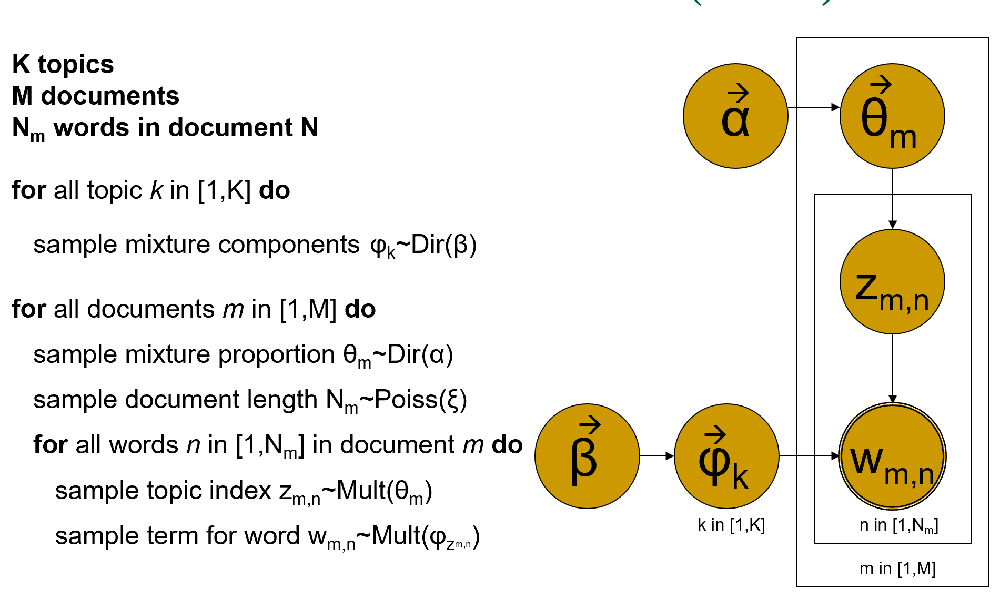

---

<div dir="rtl">Gibbs Sampling היא טכניקה לאימון . שכזה</div>

<div dir="rtl">מבנה נתונים : נתחזק את טבלאות המונים : הבאות</div>

<div dir="rtl">N w,k מספר הפעמים בהם נגזרה המילה w מהנושא k</div>

<div dir="rtl">N d,k מספר הפעמים בהם נושא k הופיע ) כמילה ( במסמך d</div>

<div dir="rtl">N k מספר המילים הכולל בנושא k כלומר ( מספר הפעמים בהם הופיע הנושא k במסמכים ) השונים</div>

<div dir="rtl">אתחול :</div>

<div dir="rtl">o בחירה רנדומית של מטריצה Z הצבות ( הנושאים השונים לכל מילה בכל ,) מסמך ואתחול</div>

<div dir="rtl">המונים . בהתאם</div>

<div dir="rtl">▪למעשה מדובר בבחירת נושא לכל מילה במסמך פ " ע ה Z הראשוני ) הרנדומי (</div>

<div dir="rtl">לולאת האימון :</div>

<div dir="rtl">o לכל איטרציית אימון</div>

<div dir="rtl">▪לכל מסמך d</div>

<div dir="rtl">●לכל מילה במסמך w</div>

<div dir="rtl">o הקטנה - ב 1 של המונים עבור המילה והנושא שלה פ " ע Z הנוכחי</div>

```
(
Z d,w
.)
, כלומר
אם
נושא
המילה
הוא k כלומר (
Z d,w =k
,) אז
נקטין
```

<div dir="rtl">- ב 1 את : המונים , N d,k ,N w,k N k</div>

<div dir="rtl">o בחירת נושא חדש k’ למילה w במסמך d, פ " ע התפלגות</div>

<div dir="rtl">הנושאים למילה הנתונה , במסמך כאשר ההסתברות לכל נושא</div>

<div dir="rtl">ניתנת י " ע נוסחה , הבאה בהתאם לטבלאות המונים המעודכנות</div>

```
(
W הוא
מספר
המילים :) השונות
[**] 𝑃𝑘
( ) = 𝑛 𝑑,𝑘 + α 𝑘
(
)
```

𝑛 𝑘,𝑤 +β 𝑤 𝑛 𝑘 +β∙𝑊

<div dir="rtl">o השמת הנושא החדש k’ של המילה במטריצה Z: Z d,w :=k ’</div>

<div dir="rtl">o העלאת המונים של k’ - ב 1: N d,k’ ,N w,k’, N k ’</div>

<div dir="rtl">עיצוב מקבילי של אלגוריתם האימון בתבנית M-R</div>

<div dir="rtl">מתודת map : מקבלת מסמך ומפעילה עליו את גוף . האלגוריתם בסוף המשימה נשלחים . המונים</div>

<div dir="rtl">מתודת reduce : מקבלת את ערכי המונים בעקבות העיבוד של כל אחד מהמסמכים ומחברת . אותם</div>

<div dir="rtl">כמו באימון , המסווג החיסרון הוא שנקודת המוצא של כל מסמך מתייחסת לעיבוד של המונים באותו ה</div>

<div dir="rtl">Mapper על בסיס האיטרציה . הקודמת</div>

<div dir="rtl">הנחות על : הזיכרון</div>

<div dir="rtl">- לא ניתן לאחסן בזיכרון את מטריצה Z כולה גודלה ( הוא כגודל ) הקורפוס</div>

<div dir="rtl">- מצד , שני אם כל Mapper עובד על אוסף קבצים , אחר הוא צריך רק את העמודות במטריצה</div>

<div dir="rtl">הנוגעות לקבצים . שלו</div>

108

---

<div dir="rtl">- ניתן להימנע מלהשתמש במטריצה Z כמבנה נתונים ולהסתפק רק : במונים כאשר נדרש לדעת מה</div>

<div dir="rtl">הנושא של מילה , במסמך נגריל על פי ערכי המונים את הנושא כפי ( שזה נעשה כאשר משימים את</div>

<div dir="rtl">הנושא .) למטריצה אלגוריתם זה שונה מהאלגוריתם המקורי : הנושא של כל מילה בכל קובץ נקבע</div>

<div dir="rtl">באופן דינאמי בהתאם לערכי המונים , כעת ולא על פי ערכי המונים בסוף איטרציית האימון</div>

<div dir="rtl">האחרונה כמו באלגוריתם . המקורי</div>

<div dir="rtl">- באופן זה כל Mapper ישמור בזיכרון</div>

<div dir="rtl">o NK: K מספרים</div>

<div dir="rtl">o NWK: W*K מספרים ( W הוא מספר המילים , השונות לא מספר מופעי המילים ) הכולל</div>

<div dir="rtl">o NDK: D m *K , מספרים כאשר D m הוא מספר המסמכים בספליט של המאפר הנתון</div>

Class Mapper
method Initialize

```
load last ND m K (only for the files of this mapper split) ,NWK,NK
method Map(docId, doc)
```

for word in doc

```
topic := pick topic according to counters [**]
NDK doc,topic --; NWK word,topic --; NK topic --;
topic’ := re-pick topic according to updated counters [**]
NDK doc,topic’ ++; NWK word,topic’ ++; NK topic’ ++;
method Close()
```

Emit(“k”, NK) for each word w
Emit(“w-”+w, NWK w ) for each document d

```
Emit(“d-”+d, NDK d )|
```

Class Reducer

```
method reduce(key, vectors)
```

merged = new Vector() for v in vectors

```
add(merged,v)
Emit(key,merged)
```

<div dir="rtl">אפיון הנושא פ " ע המילים הבולטות בו</div>

<div dir="rtl">הנושא מאופיין סתם י " ע אינדקס מספר ( מ 1 עד K .) ניתן לאפיין את הנושא על ידי המילים השכיחות בו</div>

<div dir="rtl">ביותר נניח ( 5 המילים השכיחות בו .) ביותר מסתבר שזה די . אפקטיבי</div>

<div dir="rtl">, לדוגמא הרצה של אלגוריתם על משנה תורה , ם " לרמב נתנה בין היתר את ' נושאים ' ה : הבאים</div>

109

---

<div dir="rtl">אותו מבנה , נתונים מאפשר גם לממש מנוע חיפוש . נושאים - מונחה במנוע חיפוש , שכזה לא מחפשים את</div>

<div dir="rtl">המסמכים הכוללים את המילים , בשאילתא אלא את המסמכים העוסקים במילים בשאילתא גם ( אם אינן</div>

<div dir="rtl">מופיעות ,) בו או חלוקת המסמכים הכוללים את מילות החיפוש על פי הנושאים . שלהם</div>

<div dir="rtl">, לדוגמא חיפוש המילה ' שור ' , ם " ברמב מניב את התוצאות : הבאות</div>

110

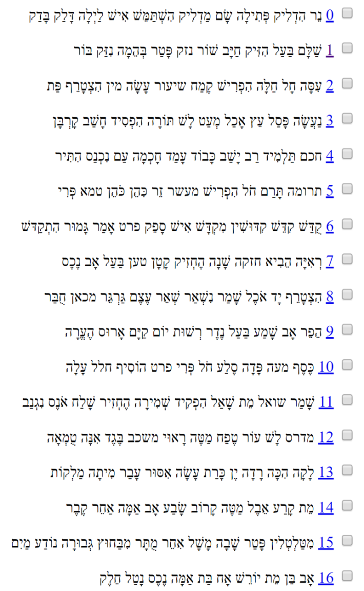

---

<div dir="rtl">8.4 רשת נוירונים</div>

```
הלימוד
הפעם
מונחה , כלומר ( הקלט
הוא
זוגות
של , מסמך <
)> ים / נושא
```

<div dir="rtl">8.4.1 מבוא</div>

<div dir="rtl">אם הקלט , מתויג כלומר אנו יודעים מה ים / הנושא של כל , מסמך ניתן ללמוד מסווג כמו ( בפרק .) הקודם</div>

<div dir="rtl">- נייצג כל מסמך כווקטור מאפיינים נניח ( מה המילים המופיעות , בו או גם הקטגוריות , שלהן )' וכו</div>

<div dir="rtl">- נריץ אלגוריתם אימון מסווג , כלשהו שילמד פונקציית . סיווג</div>

<div dir="rtl">- בהינתן מסמך , חדש נייצג אותו כווקטור על פי . מאפייניו ונפעיל את פונקציית המסווג כדי לקבל התפלגות</div>

<div dir="rtl">נושאים עבור מסמך . זה</div>

<div dir="rtl">: חסרונות</div>

<div dir="rtl">- לא ניתן להרכיב מאפיינים</div>

<div dir="rtl">: לדוגמא</div>

<div dir="rtl">o אם המאפיינים הם , המילים המודל לא יודע להרכיב זוגות ושלשות של . מילים / מאפיינים</div>

<div dir="rtl">כדי לעשות , זאת אנו צריכים להגדיר בעצמנו מאפיינים נוספים עם הקומבינציות כל (</div>

<div dir="rtl">המילים , הבודדות כל זוגות , המילים כל שלשות המילים – ווקטור מאפיינים ) עצום</div>

<div dir="rtl">o אם המאפיינים הם המילים , וקטגוריות המודל לא יודע להרכיב מילים . וקטגוריות כדי</div>

<div dir="rtl">לעשות , זאת אנו צריכים להגדיר בעצמנו מאפיינים נוספים עם הקומבינציות כל ( המילים</div>

<div dir="rtl">, הבודדות כל הקטגוריות , הבודדות כל שילוב של ) קטגוריה - מילה</div>

<div dir="rtl">- יש רק פונקציית סיווג , אחת לא ניתן לשלב יחדיו מספר . פונקציות</div>

<div dir="rtl">- יש לשפר את איכות המסווג</div>

<div dir="rtl">🡨רשתות נוירוניות</div>

111

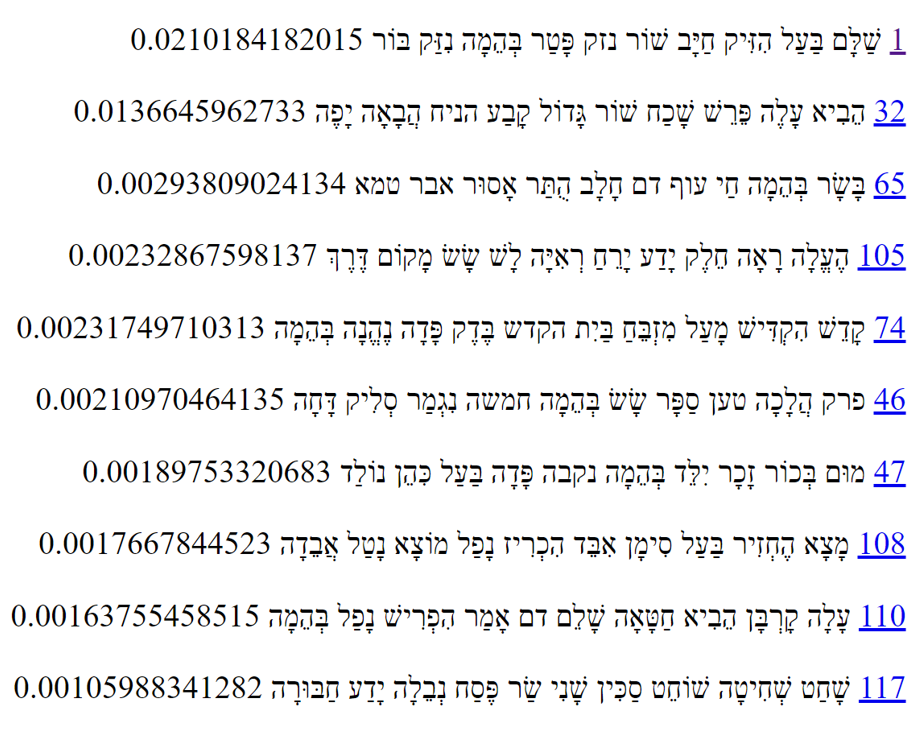

---

<div dir="rtl">8.4.2 תאור המודל</div>

<div dir="rtl">כללי : רשת נוירונים הינו מודל המתאר את הקשר בין אובייקט , הקלט המיוצג כסדרה של , ווקטורים לבין</div>

<div dir="rtl">הפלט המתאים , לו המיוצג אף הוא כסדרה של , ווקטורים על ידי רשת של פונקציות המקבלות כפרמטר</div>

<div dir="rtl">. מטריצות</div>

<div dir="rtl">, כלומר המודל עשיר מבחינת ייצוג הקלט , והפלט וכן מבחינת הפונקציה המקשרת . ביניהם רשת</div>

<div dir="rtl">הפונקציות והפרמטרים , ביניהם מאפשרים לתאר טוב יותר הן את הייצוג של הקלט והפלט והן את הקשר</div>

<div dir="rtl">. ביניהם</div>

<div dir="rtl">ייצוג : כל מאפיין הינו ווקטור בניגוד ( למסווג , הרגיל בו כל מאפיין היה ערך אחד בווקטור .) המאפיינים גודל</div>

<div dir="rtl">הווקטור נקבע על ידי מעצב . הרשת</div>

<div dir="rtl">: לדוגמא כל מילה במסמך תיוצג י " ע ווקטור . שלם מסמך ייוצג על ידי הווקטורי של כל המילים המופיעות . בו</div>

<div dir="rtl">, בפרט ניתן לקבוע שווקטור המאפיינים של מילה במסמך : כולל 1 ) קבוצת מספרים המייצגים את ; המילה</div>

<div dir="rtl">2 ) קבוצת מספרים המייצגים את הקטגוריה שלה שם ( , עצם ;) פועל 3 ) קבוצת מספרים המייצגים את</div>

```
התפקיד
התחבירי
שלה , נושא (
, נשוא .) מושא
```

<div dir="rtl">המחשת הייתרון של הייצוג הווקטורי של כל : מאפיין Word Embedding</div>

<div dir="rtl">מודל זה מייצג כל מילה בקורפוס הנתון י " ע ווקטור שהערכים נגזרים על פי המופעים השונים של המילה</div>

<div dir="rtl">, בקורפוס בהקשרים , שונים ובפרט על פי היחסים השונים של המילה עם מילים . אחרות</div>

<div dir="rtl">במאמר המפורסם שהציג מודל , זה הומחשה עוצמתו של הייצוג הווקטורי החדש של המילים לא ( כסימן</div>

<div dir="rtl">, בשפה ,' מילה ' כ אלא כווקטור שערכיו נלמדו מתוך ) הקורפוס על מציאת קשרים ' מדהימים ' בין הייצוג</div>

<div dir="rtl">הווקטורי של מילים בעלות קשר : סמנטי</div>

```
מלך – זכר + נקבה =~ מלכה
לונדון – אנגליה + צרפת =~ פריז
```

<div dir="rtl">הפונקציות : במקום פונקציה , אחת ניתן להגדיר רשת של פונקציות המאורגנות בשכבות</div>

112

---

<div dir="rtl">קביעת הארכיטקטורה של הרשת</div>

<div dir="rtl">- כמה שכבות ברשת</div>

<div dir="rtl">- כמה פונקציות בכל שכבה</div>

<div dir="rtl">- לאן הולך כל פלט של פונקציה בשכבה שמעליה</div>

<div dir="rtl">- מה כל אחת מהפונקציות</div>

<div dir="rtl">- מה ' מקדמים ' ה של כל פונקציה</div>

<div dir="rtl">... מסובך</div>

<div dir="rtl">יש ארכיטקטורות ' מקובלות ' בעקבות ( ניסוי .) וטעיה : לדוגמא</div>

<div dir="rtl">- פונקציה אחת בכל שכבה</div>

<div dir="rtl">- הפונקציה מהצורה f(Wx + b .) כלומר בהינתן ווקטור הקלט x, מכפילים אותו במטריצה W</div>

<div dir="rtl">ומוסיפים את הווקטור ,b ומפעילים על המתקבל את הפונקציה f דומה ( למקרה הפרטי של</div>

```
הפונקציה
הליאנרית
הקלאסית f(x) = ax + b
)
- פונקציות f או (
g בציור
למטה ) מימין
שהתגלו : כיעילות sigmoid, tanh, hard tanh, rectified
```

linear unit
113

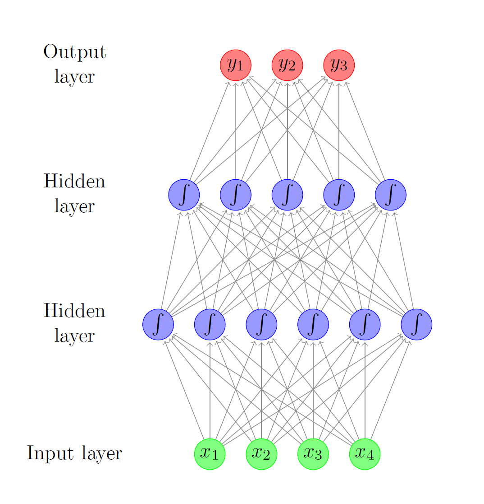

---

<div dir="rtl">g1,g2,g3 ייבחרו מתוך ספריית הפונקציות , המומלצות ומטריצות ה W ווקטורי ה b הפרמטרים (</div>

<div dir="rtl">הקבועים של ) הפונקציות יילמדו במהלך . האימון</div>

<div dir="rtl">ארכיטקטורה פשוטה זו מכונה MLP .</div>

<div dir="rtl">בארכיטקטורה , זו מלבד האימון האוטומטי על בסיס , הדוגמאות מעצב הרשת רק בוחר את מספר</div>

<div dir="rtl">השכבות ואת סוג הפונקציה ניסוי ( .) וטעיה</div>

<div dir="rtl">לאחר שהרשת , מאומנת כלומר יש את המטריצות של הפרמטרים הקבועים של , הפונקציות ניתן</div>

<div dir="rtl">להפעיל על אובייקטים : חדשים</div>

<div dir="rtl">o ייצוג האובייקט כסדרה של ווקטורי מאפיינים</div>

<div dir="rtl">o הפעלת הרשת על הקלט</div>

<div dir="rtl">o הפלט של כל פונקציה מועבר , הלאה עד השכבה הסופית</div>

<div dir="rtl">o המרת הייצוג הווקטורי של הפלט למושגי הבעיה</div>

<div dir="rtl">, לדוגמא עבור סיווג : המסמכים</div>

<div dir="rtl">o ייצוג המסמך כסדרה של ווקטורי מאפייני המילים</div>

<div dir="rtl">o הפעלת הרשת על הווקטורים המייצגים את המסמך</div>

<div dir="rtl">o : פלט ווקטור אחד שגודלו ( כמספר ) הנושאים המגדיר את התפלגות הנושאים עבור מסמך</div>

<div dir="rtl">זה כניסה ( 3 בווקטור מתארת את מידת השייכות של המסמך בקלט לנושא מספר 3 .)</div>

<div dir="rtl">בעיה : בארכיטקטורה הפשוטה של MLP יש קלט עם ווקטור אחד . בלבד אך גם אם היו ברשת מספר</div>

<div dir="rtl">, ווקטורים המספר חייב להיות קבוע מראש לא ( בונים רשת שונה לכל , מסמך אלא רשת גנרית עבור סיווג</div>

<div dir="rtl">מסמכים באשר ,) הם בעוד שבמקרה שלנו מסמך מיוצג על ידי מערך של ווקטורים בגודל משתנה כמספר (</div>

```
) המילים
```

114

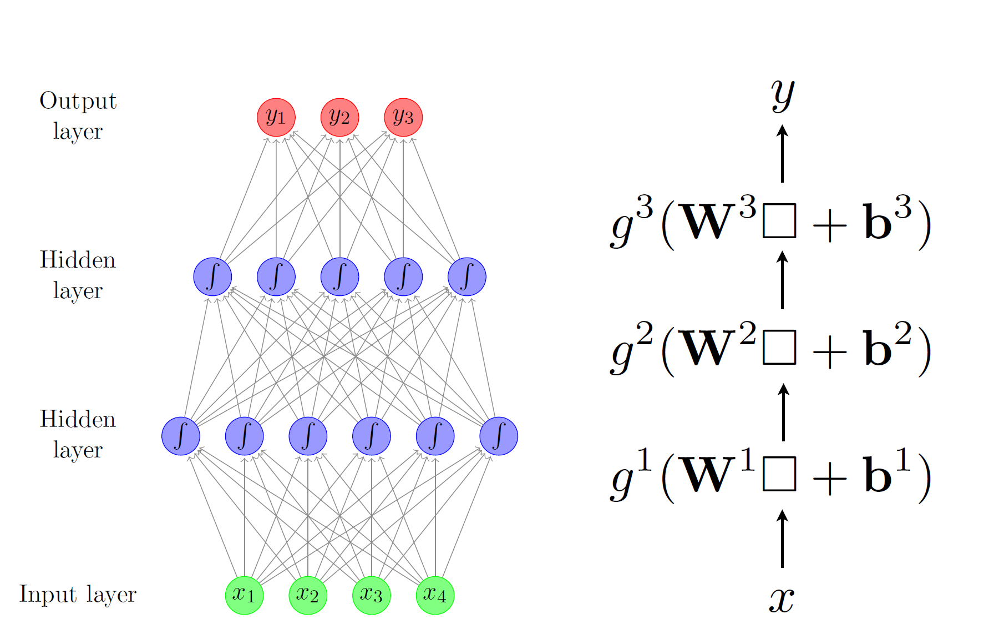

---

<div dir="rtl">🡨 נמזג יחדיו את כל מערך ווקטורי המאפיינים לווקטור : אחד שרשור אחד אחרי , השני או סכימה , שלהם</div>

<div dir="rtl">כלומר חישוב הממוצע של כל קורדינטה זה ( , הזוי אך זה .) עובד</div>

<div dir="rtl">הסכימה של הווקטור מכונה Bag Of Words (BOW .) היא מתוארת בנוסחה הבאה סכימת ( הווקטורים</div>

```
f 1 … f k לווקטור :) אחד
𝐶𝐵𝑂𝑊𝑓 1 , …, 𝑓 𝑘
(
) = 1
𝑘𝑖=1
```

𝑘 ∑𝑓 𝑖

<div dir="rtl">בעיה : במקרה שלנו סיווג ( ,) מסמכים הפלט הוא התפלגות , הנושאים ההסתברות שהמסמך שייך לכל אחד</div>

<div dir="rtl">, מהנושאים בעוד השרשת מוציאה ווקטור שאינו בהכרח . התפלגות</div>

<div dir="rtl">🡨 נהפוך את המידע בווקטור . להתפלגות שיטה : מקובלת softmax . הנוסחה הבאה מגדירה כיצד הופכים</div>

<div dir="rtl">באופן זה ווקטור כללי x לווקטור המייצג : התפלגות</div>

```
𝑥= 𝑥 1 , …, 𝑥 𝑘 𝑠𝑜𝑓𝑡𝑚𝑎𝑥𝑥 𝑖
( ) =
𝑒
```

𝑋 𝑖
𝑗−1
𝑘 ∑𝑒
𝑥 𝑗

<div dir="rtl">אימון</div>

<div dir="rtl">נקודת : מוצא ארכיטקטורה מסוימת שנבחרה בניסוי : וטעיה כמה , שכבות מה . הפונקציה</div>

<div dir="rtl">בהינתן אוסף גדול של זוגות פלט - קלט מסמך ( ותמהיל ,) נושאים תהליך האימון : לומד</div>

<div dir="rtl">- כיצד לייצג ווקטורית טוב יותר את הקלט והפלט</div>

<div dir="rtl">- מהם הפרמטרים של הפונקציות ברשת מטריצות ( W ווקטורי b במקרה ) שלנו</div>

<div dir="rtl">תבנית : כללית</div>

<div dir="rtl">- עבור כל איטרציית אימון</div>

<div dir="rtl">o עבור כל דוגמא מסמך ( ותמהיל ) נושאים</div>

<div dir="rtl">▪ייצוג הקלט באופן ווקטורי ממוצע ( ווקטורי המילים בממסך פ " ע CBOW )</div>

<div dir="rtl">▪הפעלת הרשת על ווקטור הקלט [ forward ]</div>

<div dir="rtl">▪השוואת פלט הרשת ווקטור ( , הנושאים לאחר המרת הפלט לווקטור התפלגות י " ע</div>

<div dir="rtl">softmax ) לפלט הנתון בדוגמא תמהיל ( הנושאים )' הנכון ' וחישוב הפער ביניהם</div>

<div dir="rtl">[ loss ] פונקציות loss : מקובלות hinge, log, cross entropy, ranking</div>

<div dir="rtl">▪עדכון ייצוג הקלט והפרמטרים של הפונקציות בהתאם לפער זה [ update ]</div>

<div dir="rtl">פונקציות תיקון : מקובלות Stochastic Gradient, Nesterov Momentum</div>

<div dir="rtl">ב Stochastic Gradient , לדוגמא מפעילים ה על loss את הגרדיאנט של הפונקציה</div>

<div dir="rtl">, הנוכחית כלומר על וקטור הנגזרות החלקיות כל ( פעם על פרמטר ) אחר</div>

115

---

<div dir="rtl">מאחר שמדובר במטריצות , גדולות עבור מאפיינים רבים לעתים ( ,) מיליארדים בניית</div>

<div dir="rtl">הגרדיאנט לאחר כל דוגמא כבדה . ביותר אפשרויות : מקבול</div>

- Batch normalization

<div dir="rtl">במקום להזין דוגמא אחת כל פעם , לרשת מזינים כאחד קבוצה של , דוגמאות כלומר מטריצה</div>

<div dir="rtl">במקום . ווקטור לשם כך יש להוסיף מימד למטריצה W ולווקטור B של כל . פונקציה מעבדי GPU</div>

<div dir="rtl">ממקבלים ברמת החומרה את החישוב של טנסורים . שכאלה</div>

<div dir="rtl">- עיבוד מקבילי של קבוצות דוגמאות שונות</div>

<div dir="rtl">כאשר המטריצות גדולות , מאוד נרמול ' הבאטץ אינו . מספיק במקרה , זה נפצל את אוסף הדוגמאות</div>

<div dir="rtl">לקבוצות אימון , שונות נריץ כל קבוצה על מחשב נפרד ( Map ,) ונמזג את כל התיקונים בסוף כל</div>

```
איטרציה (
Reduce
:)
```

[ Chu et al., Map-Reduce for ML on multi-core, NIPS 2006 ]
Class Mapper
method Initialize

```
nn := load prev model
method Map(exampleId, <x,y>)
y’ := forward(x)
ls := loss(y,y’)
backward(ls)
method Close()
```

for parameter in nn.parameters // for each matrix W i or vector b i

```
Emit(parameter.id,parameter)
```

class Reducer

```
method Reduce(parameterId, values)
sum := new Matrix // with one or more columns
size = 0
for value in values
sum 🡨 add value // add each cell of matrix value to the corresponding cell in sum
size := size + 1
newParameter = sum / size
// div the value of each cell in sum by size
Emit(parameterId, newParameter)
```

<div dir="rtl">ניתן כמובן להגדיר ארכיטקטורות מורכבות יותר - מ MLP , וכך אכן עושים .) והרבה (</div>

<div dir="rtl">עבור בעיית התיוג מציאת ( הקטגוריות של מילים ,) בטקסט בה עסקנו , בהרחבה , לדוגמא ניתן להשתמש</div>

116

---

<div dir="rtl">בארכיטקטורה המכונה LSTM . בארכיטקטורה , זו כל רכיב שהוא ( MLP ) בעצמו משפיע על הרכיב המקביל</div>

<div dir="rtl">, הקודם על הרכיב המקביל , הבא על השכבה , מתחתיו ועל השכבה . מעליו</div>

<div dir="rtl">כך נראית הרשת בארכיטקטורה זו עבור בעיית : התיוג</div>

<div dir="rtl">כיום מקובל מאוד לעבוד עם ארכיטקטורת - ה transformer הכוללת ( attention :)</div>

117

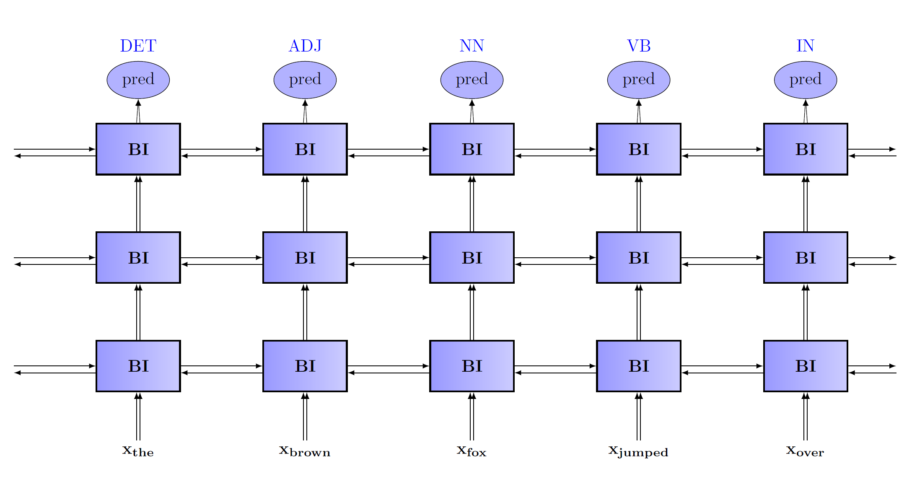

---

118

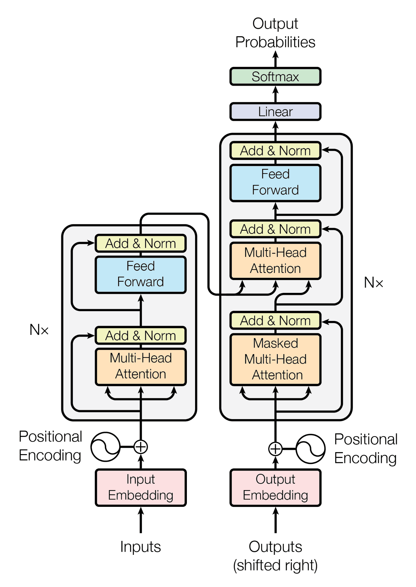

---

<div dir="rtl">9. הוספת שכבת caching ל Hadoop</div>

<div dir="rtl">מוטיבציה</div>

<div dir="rtl">ראינו מספר אלגוריתמי למידה כמדומני ( .) שבעה המשותף לכל האלגוריתמים היה המעבר החוזר ונשנה</div>

<div dir="rtl">על הקלט , לשם למידה ושיפור . המודל בעיצוב ה M-R של , האלגוריתמים ה Mappers בכל איטרציה קיבלו</div>

<div dir="rtl">את אותו קלט מהאיטרציה , הקודמת אך לא היתה בהכרח השמה של אותו split לאותו mapper .</div>

<div dir="rtl">ניתן ליעל את קריאת הקלט הקורפוס ( ,) הקבוע על ידי מנגנון שייתן לכל Mapper , , בשאיפה split שהוא</div>

<div dir="rtl">קרא כבר באיטרציות . קודמות באופן , זה ניתן לחסוך את קריאת הקלט ממערכת הקבצים , המבוזרת</div>

<div dir="rtl">ולקרוא אותו מקומית מהדיסק או . מהזיכרון</div>

<div dir="rtl">עיצוב</div>

<div dir="rtl">- אחסון מקומי של split בזיכרון ( או ) בדיסק שימוש חוזר ב split מקומי</div>

<div dir="rtl">נגדיר שתי גרסאות של RecordReader : גנרי</div>

o CacheLoaderRecordReader

<div dir="rtl">RecordReader זה מיועד לפעם הראשונה שבה ה split . נקרא כל < K,V > שה</div>

<div dir="rtl">RecordReader קורא במתודת ( nextKeyValue ) יישמר בנוסף לוקאלית על המחשב</div>

<div dir="rtl">, הנוכחי בדיסק או , בזיכרון במימוש שלנו הוא יישמר בזיכרון משותף לא ( סתם ב Heap של</div>

<div dir="rtl">התהליך ה של Mapper , כך שהוא יהיה נגיש באיטרציות הבאות לכל Task Tracker שרץ</div>

<div dir="rtl">על מחשב .) זה</div>

o CacheRecordReader

<div dir="rtl">RecordReader זה מיועד פעמים ' ל ' הבאות שבהם נדרש לקרוא את ה split באיטרציות (</div>

<div dir="rtl">הבאות של אלגוריתם ) האימון – הקריאה במתודה ( nextKeyValue ) לא תתבצע ממערכת</div>

<div dir="rtl">הקבצים המבוזרת אלא מהמידע שנשמר לוקאלית בזיכרון ( , המשותף במימוש ) שלנו</div>

<div dir="rtl">שני ה RecordReader ימומשו באופן , גנרי כלומר הם לא קובעים כיצד מנתחים את ה split</div>

```
כרשימת <
K,V
> זה ( ייעשה
י " ע RecordReader פנימי
שיינתן .) כפרמטר
ה InputFormat ייקבע
איזו RecordReader מתאים
במתודה (
createRecordReader
,) לאור
```

<div dir="rtl">המידע האם ה split קיים כבר מקומית במחשב ה של Task Tracker . הנתון</div>

<div dir="rtl">- ניהול מבנה נתונים ברמת , וב ' הג הממפה Task Tracker לרשימת ה splits המאוחסנים לוקאלית</div>

<div dir="rtl">במחשב . שלו</div>

<div dir="rtl">- עדכון הקוד בסביבת Hadoop הקובע איזה split לתת ל Task Tracker . פנוי , כלומר הוספת</div>

<div dir="rtl">השיקול של איזה splits מאוחסנים לוקאלית במחשב ה של Task Tracker הפנוי על ( פי מבנה</div>

<div dir="rtl">הנתונים ) ל " הנ למערכת שיקולי . ההשמה</div>

<div dir="rtl">מימוש</div>

```
class CacheInputFormat<K extends Writable, V extends Writable> extends InputFormat<K, V> {
```

…

```
private InputFormat<K, V> delegateInputFormat = null;
private NodeCacheManager cacheManager;
```

119

---

…

```
public RecordReader<K, V> createRecordReader
(InputSplit split, TaskAttemptContext context) throws IOException, InterruptedException {
```

… // If the split was already cached if ( cacheManager.contains(splitId) ) {

```
CacheRecordReader<K, V> cacheRecordReader = new CacheRecordReader<K, V>();
cacheRecordReader.initialize(split, context);
return cacheRecordReader;
} else {
CacheLoaderRecordReader<K, V> cacheLoaderRecordReader =
new CacheLoaderRecordReader<K, V>();
cacheLoaderRecordReader. setDelegateRecordReader (
this.delegateInputFormat.createRecordReader(split, context));
cacheLoaderRecordReader.initialize(split, context);
return cacheLoaderRecordReader;
}
}
}
class CacheLoaderRecordReader<KEYIN extends Writable, VALUEIN extends Writable> extends
RecordReader<KEYIN, VALUEIN> {
private RecordReader<KEYIN, VALUEIN> delegateRecordReader = null;
private SharedMemory sm;
private AdjustableDataOutput preliminaryOutpt ;
…
public boolean nextKeyValue () throws IOException, InterruptedException {
boolean delegateNext = this.delegateRecordReader.nextKeyValue();
/* If there is something to read, we need to remember to store it in the cache */
if (delegateNext) {
curKey = this.delegateRecordReader.getCurrentKey();
curValue = this.delegateRecordReader.getCurrentValue();
// Read the data into an adjustable data output
curKey.write(preliminaryOutpt);
curValue.write(preliminaryOutpt);
…
}
return delegateNext;
}
```

120

---

```
public void close () throws IOException {
this.delegateRecordReader.close();
// If no records are stored, just enter a dummy entry in the cache table
if (recordsStored == 0) {
CacheDataEntry entry =
new CacheDataEntry (cacheLocation, 0, recordsStored, "", "");
// Add the entry to the node's cache manager
NodeCacheManager .INSTANCE.add( splitId , entry );
…
sm = new SharedMemory (cacheLocation, preliminaryOutpt .getSize(), true);
…
}
}
}
class CacheRecordReader<KEYIN extends Writable, VALUEIN extends Writable> extends
RecordReader<KEYIN, VALUEIN> {
private SharedMemory sm;
private DataInput cacheInput ;
public void initialize (InputSplit split, TaskAttemptContext context)
throws IOException, InterruptedException {
String cacheId = conf.get(CacheInputFormat.DELEGATE_INPUT_FORMAT_ID);
CacheInputFormatId splitId = new CacheInputFormatId(split, cacheId);
CacheDataEntry entry = NodeCacheManager .INSTANCE. get ( splitId );
…
sm = new SharedMemory (entry.getLocation().toString(), entry.getSize().get(), false);
…
cacheInput = new CacheBufferedDataInput(sm);
…
}
public boolean nextKeyValue () throws IOException, InterruptedException {
boolean hasNext = (recordsNum - recordsRead) > 0;
if (hasNext) {
curKey. readFields ( cacheInput );
curValue. readFields ( cacheInput );
recordsRead++;
}
return hasNext;
}
```

121

---

```
}
```

<div dir="rtl">בגרסה הקודמת של Hadoop , המחלקה JobInProgress ייצגה Job , שרץ וכן המחלקה TaskInProgress</div>

<div dir="rtl">ייצגה TaskTracker , שרץ ו TaskTrackerStatus ייצגה משימה . לביצוע במחלקת ה JobInProgress קיימת</div>

<div dir="rtl">מתודה הבוחרת איזה split לתת לעיבוד במשימת Mapper עבור TaskTracker . פנוי במתודה זאת</div>

<div dir="rtl">ממומשת למעשה מדיניות ההקצאה של , הסביבה בפרט העדפה לתת ל TaskTracker ספליט ' קרוב ' ה אליו</div>

<div dir="rtl">מבחינת . תקשורת</div>

<div dir="rtl">🡸 נעדכן מתודה , זו כך שתקודם כל תבדוק האם אחד הספליטים האפשריים עבור ה TaskTracker הפנוי</div>

<div dir="rtl">הנתון מאוחסן בזיכרון המשותף של המחשב , שלו עקב מעבר קודם על ספליט זה י " ע TaskTracker כלשהו</div>

<div dir="rtl">במחשב . זה</div>

class JobInProgress { …

```
private synchronized int findNewMapTask ( TaskTrackerStatus tts, … ) {
…
// @HC-BEGIN
tip = findCachedFromList (cacheForLevel, tts);
if (tip != null) {
scheduleMap(tip);
return tip.getIdWithinJob();
}
…
}
}
private TaskInProgress findCachedFromList(List<TaskInProgress> tips, TaskTrackerStatus tts) {
…
return CacheState .INSTANCE. getBestTip (conf, tips, tts. getHost ());
}
```

<div dir="rtl">אם רוצים לעבדו עם מנגנון ה Caching יש לציין בהגדרת ה Job :</div>

```
job.setInputFormatClass(DBInputFormat.class);
🡺
job.setInputFormatClass( CacheInputFormat .class);
CacheInputFormat. setDelegateInputFormatData (job,
DBInputFormat .class, connString + "|" + queryString);
```

<div dir="rtl">בבדיקה ניסויית התגלה כי המעבר הראשון על הקורפוס דרש 10% זמן יותר בשל ( ניהול השמירה של כל</div>

<div dir="rtl">< K,V > שנקראו מה Split לזיכרוןה cache ,) אך המעברים הבאים חסכו 90% . מהזמן</div>

122

---

<div dir="rtl">10 . מנוע חיפוש</div>

<div dir="rtl">10.1 מבוא – הארכיטקטורה של מנוע החיפוש גוגל</div>

```
10.2 מפתוח (
Indexing
)
```

<div dir="rtl">ה indexer בונה ממאגר קבצי , הרשת מבנה נתונים הממפה מילה לרשימות הקבצים שבהם היא . מופיעה</div>

<div dir="rtl">נשים לב , לכך שפעולת ה indexer למעשה הופכת מיפוי של קובץ 🡨 , מילים למבנה של מילה 🡨 . קבצים</div>

<div dir="rtl">שחלוף שכזה הינו קלאסי לתוכנית Map-Reduce .</div>

Class Mapper

```
method Map(docId, doc)
```

words := new Set for w in doc

```
words.add(w)
```

For w : words

```
Emit(w,docId)
```

123

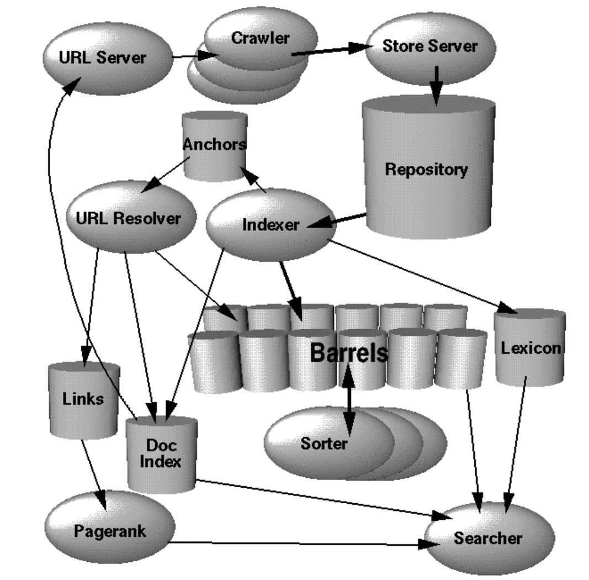

---

Class Reducer

```
method Reduce(word, docIds)
```

for docId in docIds

```
Emit(word, docId)
```

<div dir="rtl">בייצוג , זה המידע עבור כל מילה הוא רק מספר הקובץ שבו היא . מופיעה</div>

<div dir="rtl">אפשר כמובן להרחיב מידע , זה בפרט אפשר להעשיר אותו במאפיינים שיעזרו לדרג את תוצאות : החיפוש</div>

<div dir="rtl">- היכן המילה מופיעה במסמך</div>

<div dir="rtl">- האם המילה מופיעה , בכותרת בתיאור של , תמונה בטקסט של , קישור ' וכד</div>

Class Mapper

```
method Map(docId, doc)
```

word2properties := new Table for w in doc

```
updateWordProperties(w, getWordDocProperties(), word2properties )
for <w, props> : word2properties
Emit(w,>docId, props >)
```

Class Reducer

```
method Reduce(word, values)
for <docId, wordDocProperty > in values // sorted by wordDocProperties!
Emit(word, docId)
```

<div dir="rtl">10.3 חיפוש</div>

<div dir="rtl">בהינתן , שאילתא המורכבת ממספר מילות , חיפוש ניתן לחלץ את רשימת הקבצים בהם מילים אלו</div>

<div dir="rtl">מופיעות בעזרת lookup פשוט על המפתח שנוצר בשלב האינדוקס .) לעיל (</div>

<div dir="rtl">השאלה המרכזית : היא כיצד לדרג תוצאות אלו , כך שהמסמכים הרלבנטיים ביותר יופיעו ? בהתחלה</div>

<div dir="rtl">, קטגורית קיימות שתי גישות : מרכזיות דירוג מונחה , שאילתא דירוג מונחה מסמך</div>

<div dir="rtl">דירוג מונחה שאילתא</div>

<div dir="rtl">הדירוג של כל מסמך מבוסס על מידת ההתאמה בין השאילתא . למסמך , כלומר תוכן המסמך הכי מתאים</div>

<div dir="rtl">. לשאילתא</div>

<div dir="rtl">אחד המדדים הבסיסיים והקלאסיים עבור תאימות תוכן זו היא tf-idf .</div>

124

---

<div dir="rtl">מדד זה מבוסס על ההנחה האינטואיטיבית , והפשוטה כי מסמך שמכיל פעמים רבות את מילות החיפוש</div>

<div dir="rtl">בשאילתא תואם . לשאילתא</div>

<div dir="rtl">Term Frequency – השכיחות היחסית של מילה i במסמך j: מספר הפעמים בהם מופיעה המילה i</div>

<div dir="rtl">במסמך j, חלקי מספר המילים . במסמך</div>

```
tf i,j = n i,j / |d j |
```

<div dir="rtl">בעיה : , לעתים שכיחותה היחסית של מילה במסמך לא מלמדת על מידת ההתאמה של השאילתה . למסמך</div>

<div dir="rtl">, לדוגמא השאילתא את ' .' חפירה המילה ' את ' מופיעה רבות בכל , מסמך כך שפערי השכיחות בין מסמכים</div>

<div dir="rtl">המתייחסים ' את ' ל כשם עצם ובין כאלה שלא אינם גדולים כל . כך</div>

<div dir="rtl">🡨 ננסה להקטין את המשקל של מילים , אלו י " ע הוספת רכיב ' מובהקות ' . למדד</div>

<div dir="rtl">Document Frequency – עד כמה מילה מסוימת i שכיחה בכלל המסמכים . במאגר</div>

```
df i = | { d : t i in d} | / |D|
```

<div dir="rtl">ככל שמילה נדירה יותר מופיעה ( במעט ,) מסמכים רמת המובהקות שלה גדולה יותר , כלומר ( נרצה לחזק</div>

<div dir="rtl">מאוד מסמכים המכילים אותה בכל .) זאת</div>

<div dir="rtl">ככל שהמילה שכיחה יותר מופיעה ( כמעט בכל ,) מסמך רמת המובהקות קטנה יותר , כלומר ( לא ניקח</div>

<div dir="rtl">ברצחנות את העובדה שהיא מופיעה במסמך .) מסויים</div>

<div dir="rtl">בעיה : טכנית ערך ה df גבוה כאשר רמת המובהקות , נמוכה . ולהפך יוצר בעיה בשילוב המדדים – נהפוך</div>

<div dir="rtl">אותו : טכנית</div>

```
idf i = |D| / | { d : t i in d} |
```

<div dir="rtl">🡨 המדד המשקולל tf=idf</div>

```
Tf-idf i,j = tf i,j ּ idf i
```

<div dir="rtl">ניתן , לחשב בעיבוד , מקדים את הערך Tf-idf i,j עבור כל מילה i במאגר ועבור כל מסמך j במאגר – משימה</div>

```
קלאסית
ל M-R דומה ( לתרגיל 2
)
```

<div dir="rtl">באופן , זה כל מסמך מיוצג י " ע ווקטור המציין בכל קורדינטה את מידת ההתאמה של כל אחת מהמילים</div>

<div dir="rtl">במאגר למסמך . זה</div>

<div dir="rtl">בהינתן , שאילתא נבנה ווקטור דומה עבור ' מסמך ' המכיל את המילים בשאילתא רובו ( המוחלט יהיה 0 ,)</div>

<div dir="rtl">ונמדוד את המרחק בין הווקטור המייצג את השאילתא ובין הווקטורים המייצגים את המסמכים , השונים</div>

<div dir="rtl">ונדרך על פי מרחק זה קיימות ( מגוון גישות למדוד מרחק בין ) וקטורים</div>

<div dir="rtl">עבור [ שאילתות עם מילה , בודדת ניתן מראש לכלול במבנה wordDocProperty שהאינדקסר בנה עבור כל</div>

<div dir="rtl">מילה בכל , מסמך את ציון ה tf-idf של המילה במסמך , זה ולכלול אותו בקריטריון המיון לצד ( מידע כמו</div>

125

---

<div dir="rtl">האם היא מופיע בכותרת )' וכו של המסמכים במתודת ה reduce של , האינדקסר כך שהם יישמרו מראש</div>

<div dir="rtl">במפתח על פי מידת התאמתם ] למילה</div>

<div dir="rtl">דירוג מונחה מסמך</div>

<div dir="rtl">בגישה , זו אנו מדרגים מראש את כל המסמכים על פי מידת חשיבותם , במאגר ללא קשר לשאילתא</div>

<div dir="rtl">. מסוימת</div>

<div dir="rtl">כיצד נקבע האם מסמך הוא , חשוב ועד ? כמה</div>

<div dir="rtl">' פייג : וברין מסמך חשוב הוא מסמך שההסתברות להגיע אליו בשיטוט אקראי ברשת . גבוהה , בפרט מסמך</div>

<div dir="rtl">חשוב הוא מסמך שיש אליו קישורים ממסמכים חשובים . אחרים</div>

<div dir="rtl">כיצד מגיעים לדף ברשת n בשיטוט ? אקראי</div>

<div dir="rtl">- י " ע בחירת דף זה מבין כל G הדפים ברשת בהסתברות ( של 1 / | G )|</div>

<div dir="rtl">- דרך קישור מדף אחר m שאנו נמצאים בו כעת בהסתברות ( ההימצאות בדף m , חלקי מספר</div>

<div dir="rtl">הקישורים לדפים אחרים מדף m )</div>

<div dir="rtl">: כאשר</div>

<div dir="rtl">L(n ) קבוצת הדפים הכוללת קישור לדף n</div>

```
C(m
) מספר
הקישורים
הכולל
בדף m
```

<div dir="rtl">כדי לאזן ולשלוט על מידת ההסתמכות על הקירטריון הראשון בחירה ( מכוונת של ) הדף ועל הקריטריון</div>

```
השני
הגעה ( מדף ,) אחר
נגדיר
פרמטר alpha בין 0 ל 1 ברירת ( המחדל
בזמנו
של
גוגל
היתה alpha = 0.2
)
נתמקד
במימוש
הקריטריון
השני (
alpha = 0
)
```

<div dir="rtl">עיצוב ב M-R</div>

<div dir="rtl">הרעיון : הכללי</div>

<div dir="rtl">- קיים מאגר דאטה - ביג המתאר את הדפים השונים ואת הקשר , ביניהם באופן : הבא pageId [out pages ids] rank</div>

<div dir="rtl">- מתודת ה map מקבלת תיאור של אחד , הקודקודים ' שולחת ' ו את הדרגה הנוכחית שלו לקודקודיו</div>

<div dir="rtl">השכנים ביחס ( , למספרם כלומר נחלק את הדרגה .) במספרם</div>

<div dir="rtl">- מתודת ה reduce מקבלת עבור קודקוד את הדרגות של כל הקודקודים המובילים , אליו ומחשבת</div>

<div dir="rtl">את הדרגה שלו . מחדש</div>

<div dir="rtl">- כל סיבוב של M-R הוא איטרציה אחת של חישוב הדרגה</div>

<div dir="rtl">- , ממשיכים עד שהדרגות לא משתנות</div>

126

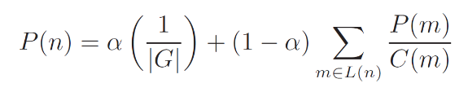

---

Class Mapper

```
method Map(pageId, page)
```

for pid in page.out

```
Emit(pid, page.rank / | page.out |)
```

Class Reducer

```
method Reduce(pageId, values)
newRank: = 0
for (value in valuse)
newRank := rank + value
Emit(pageId, newRank)
```

<div dir="rtl">בעיה טכנית : בתום סיבוב ה M-R איבדנו את נתוני הקודקודים ונשארנו רק עם הדאטה שלהם – . הדרגה</div>

<div dir="rtl">בעוד שבסיבוב הבא נדרש מידע זה בפרט ( מי הקודקודים היוצאים ) ממנו</div>

<div dir="rtl">- ניתן לבצע join תיאור הקודקודים עם הדרגה , החדשה כפעולה מקדימה לסיבוב . הבא</div>

<div dir="rtl">- נבחר בדרך נוחה , יותר נדאג לכך שה Mapper שולח גם את הגדרת הקודקוד עצמו ל Reducer</div>

Class Mapper

```
method Map(pageId, page)
```

Emit (pageId, page) for pid in page.out

```
Emit(pid, page.rank / | page.out |)
```

Class Reducer

```
method Reduce(pageId, values)
myPage := null
newRank : = 0
for (value in valuse)
if (isPage(value))
```

myPage := value else

```
newRank := newRank + value
```

127

---

```
myPage.rank = newRank
Emit(pageId, myPage )
```

128

---

<div dir="rtl">דוגמא :</div>

A B
C D

```
P)A) = P(B) = P(C) = P(D) = 0.25
Map
<A, <A, [B,C], 0.25>> 🡪<A, <A, [B,C], 0.25>> >B,0.125 < <C,0.125>
<B, <B, [C,D], 0.25>> 🡪<B, <B, [C,D], 0.25>> <C, 0.125> <D, 0.125>
<C, <C,[D],0.25>> 🡪<C, <C,[D],0.25>> <D, 0.25>
<D, [A], 0,25>> 🡪<D, <D, [A], 0,25>> <A, 0.25>
Reduce
A [0.25, <A, [B,C], 0.25>] 🡪<A, <A, [B,C], 0.25 >>
B [0.125, <B, [C,D], 0.25> ] 🡪<B, <B, [C,D], 0.125 >>
C [0.125, 0.125, <C,[D],0.25>] 🡪<C, <C,[D], 0.25 >>
D [0.125, 0.25, < D, [A], 0.25>] 🡪<D, <D, [A], 0.375 >>
```

<div dir="rtl">בניסוי הראשון של גוגל ( 322 מיליון ,) מסמכים האלגוריתם התתכנס פחות או יותר אחרי 52 . איטרציות</div>

<div dir="rtl">נשים , לב כי מדובר ב תבנית כללית של עיבוד גרף מבוזר :</div>

Initialize nodes data _________
Class Mapper

```
method Map(nodeId, node)
Emit (nodeId, node)
```

129

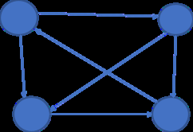

---

```
for (nid in node.out)
Emit(nid, node.data _________ )
```

Class Reducer

```
method Reduce(nodeId, values)
myNode := null
newData : = ____ // initialization
for (value in valuse)
if (isNode(value))
```

myNode := value else

```
newData := newData _________ value
myNode.data = newData ________
Emit(nodeId, myNode)
```

<div dir="rtl">עבור האלגוריתם שלנו לדירוג : הדפים</div>

Initialize nodes 1/|G| for each of the G nodes
Class Mapper

```
method Map(nodeId, node)
Emit (nodeId, node)
for (nid in node.out)
Emit(nid, node.data / |node.out| )
```

Class Reducer

```
method Reduce(nodeId, values)
myNode := null
newData : = 0 // initialization
for (value in valuse)
if (isNode(value))
```

myNode := value else

```
newData := newData + value
```

130

---

```
myNode.data = newData
Emit(nodeId, myNode)
```

<div dir="rtl">נשתמש לדוגמא בתבנית , זו כדי לחשב את המרחק של כל הקודקודים מקודקוד נתון אלגוריתם (</div>

```
דיאקסטרה ) הסדרתי
```

<div dir="rtl">נתון גרף מבוזר של , קודקודים כאשר השדה data מייצג את המרחק של כל קודקוד מהקודקוד . מסוים</div>

<div dir="rtl">, בהתחלה הערך data של הקודקוד המסוים הוא 0, ושל כל השאר . אינסוף</div>

Initialize nodes data 0 for the target node, Infinity for each other
Class Mapper

```
method Map(nodeId, node)
Emit (nodeId, node)
for (nid in node.out)
Emit(nid, node.data + 1 )
```

Class Reducer

```
method Reduce(nodeId, values)
myNode := null
newData : = infinity
for (value in valuse)
if (isNode(value))
```

myNode := value else

```
newData := Min(newData, value)
myNode.data = Min(newData ,myNode.data)
Emit(nodeId, myNode)
```

131
